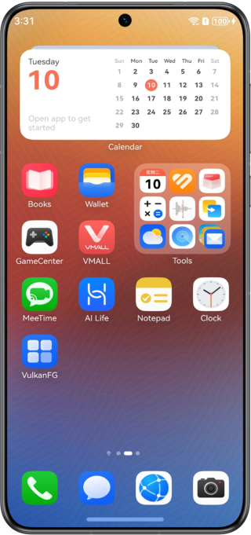
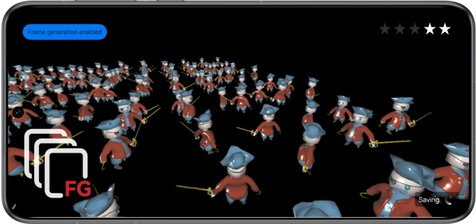

# Frame Generation

## Overview

This sample code illustrates how to implement the frame generation capability of Graphics Accelerate Kit in graphics rendering scenes based on the Vulkan graphics API.

You need to compile the dependency on the dynamic library **libframegeneration.so**.

## Preview

|            **Home screen**            |                 **App UI**                |
|:-----------------------------:|:---------------------------------------:|
|  |  |

Instructions

1. On the home screen of a mobile phone, tap **VulkanFG** to start the app.
2. Tap the button in the upper left corner to manually enable or disable the frame generation capability. If **Frame generation enabled** is displayed, the capability is enabled. If **Frame generation disabled** is displayed, the capability is disabled.
3. When you exit the app, the frame generation capability is automatically disabled.

## Project Directory

```
└── entry/src/main                          // Code area
    ├── cpp
    │    ├── types/libentry
    │    │     └── index.d.ts               // API registration file at the native layer
    │    ├── napi_init.cpp                  // Functions of APIs at the native layer
    │    ├── CMakeLists.txt                 // Compilation configurations at the native layer
    │    ├── Asset                          // Implementation of shaders and asset loading classes
    │    ├── Begin                          // Program entry
    │    │    ├── core.cpp                  // Core entry for lifecycle management
    │    │    ├── hellovk.cpp               // Vulkan rendering process and frame generation calls
    │    │    └── ...
    │    ├── Common                         // Common classes
    │    ├── third_party                    // Third-party libraries
    │    ├── vulkan_utils                   // Vulkan utility class implementation
    ├── ets
    │    ├── entryability 
    │    │     └── EntryAbility.ets         // Entry point class for setting the frame generation mode
    │    ├── pages 
    │    │     └── Index.ets                // App UI
    └── resources
    │    ├── base/media                     // Image resources
    │    │   └── ...
    │    ├── rawfile                        // Models, UI resources, and binary shader files
    │    │    └── ...                       
```


## How to Implement

The sample code uses the following APIs defined for frame generation:

* FG_Context_VK* HMS_FG_CreateContext_VK(const FG_ContextDescription_VK* contextDescription);
* FG_ErrorCode HMS_FG_SetAlgorithmMode_VK(FG_Context_VK* context, const FG_AlgorithmModeInfo* predictionModeInfo);
* FG_ErrorCode HMS_FG_SetResolution_VK(FG_Context_VK* context, const FG_ResolutionInfo* resolutionInfo);
* FG_ErrorCode HMS_FG_SetCvvZSemantic_VK(FG_Context_VK* context, FG_CvvZSemantic semantic);
* FG_ErrorCode HMS_FG_SetImageFormat_VK(FG_Context_VK* context, const FG_ImageFormat_VK* format);
* FG_Image_VK* HMS_FG_CreateImage_VK(FG_Context_VK* context, VkImage image, VkImageView view);
* FG_ErrorCode HMS_FG_DestroyImage_VK(FG_Context_VK* context, FG_Image_VK* image);
* FG_ErrorCode HMS_FG_Activate_VK(FG_Context_VK* context);
* FG_ErrorCode HMS_FG_Deactivate_VK(FG_Context_VK* context);
* FG_ErrorCode HMS_FG_Dispatch_VK(FG_Context_VK* context, const FG_DispatchDescription_VK* desc);
* FG_ErrorCode HMS_FG_DestroyContext_VK(FG_Context_VK** context);

In the scene initialization phase, call the APIs such as **HMS_FG_CreateContext_VK**, **HMS_FG_SetAlgorithmMode_VK**, **HMS_FG_SetResolution_VK**, and **HMS_FG_Activate_VK** to create a frame generation context instance, set attributes, and activate the frame generation context instance. After the activation, call the **HMS_FG_CreateImage_VK** API to create input and output image instances for frame generation. In the frame loop phase, call the **HMS_FG_Dispatch_VK** API to generate predicted frames. Send the predicted frames and real frames for display alternately.

## Required Permissions

None

## Dependencies

None

## Constraints

1. The sample app is only supported on Huawei phones and tablets with standard systems.
2. The HarmonyOS version must be HarmonyOS Next Developer Beta2 or later.
3. The DevEco Studio version must be DevEco Studio Next Developer Beta2 or later.
4. The HarmonyOS SDK version must be HarmonyOS Next Developer Beta2 or later.
5. Vulkan supports AI frame generation and vertex marking features in HarmonyOS 6.0 or later.