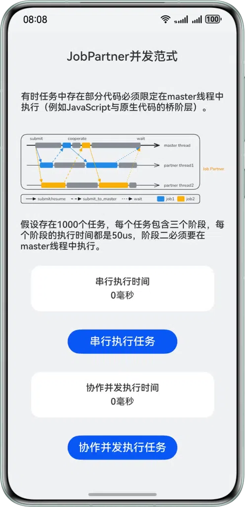
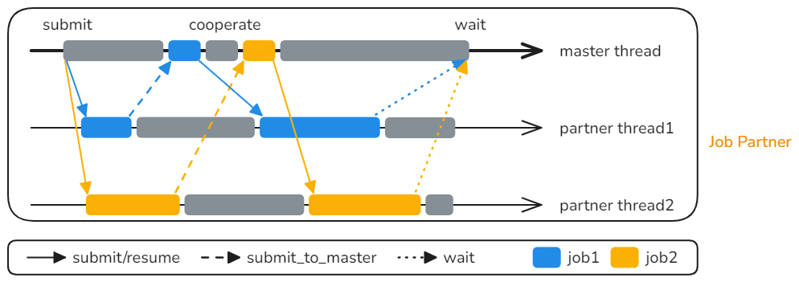
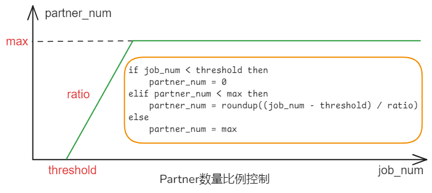
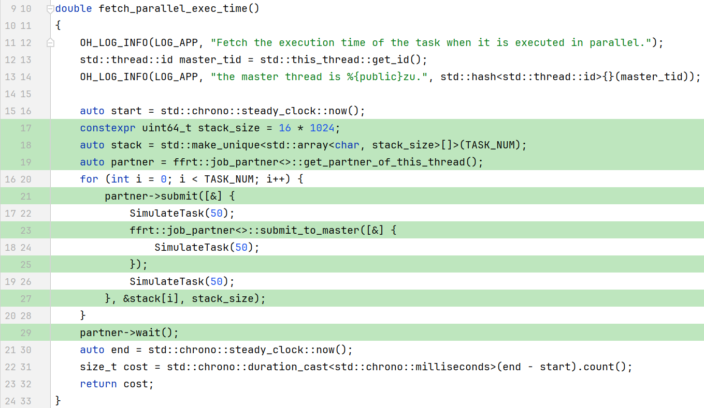

# 基于 FFRT Job Partner 并发范式实现高效并行化

## 项目简介

本示例基于**FFRT**提供的 Job Partner 并行范式，实现了一个可视化对比**串行任务**与**并行任务**执行时间的应用。

- **功能**：用户可以在 UI 界面上点击按钮，分别运行串行和并行模式的任务，并直观地看到性能上的差异。
- **优势**：开发者可以学习如何以**低侵入式**的方式，对现有串行代码进行改造，以获得并行化带来的性能提升。

## 效果预览

|         应用效果（图片）          |
| :-------------------------------: |
|  |

_界面展示串行执行与并行执行的耗时对比。点击按钮即可触发对应模式的任务运行。_

## 功能特性

在实际中，可能会遇到某一个线程（比如 UI 绘制线程）耗时很长，难以充分利用 CPU 多核能力的情况。此时，将原有线程的大任务拆分为多个小任务交给其他线程去执行是解决该问题的有效方法。但是，在实践中，会遇到两个阻碍：

- **特定线程依赖**：任务中的某些部分必须在特定线程上执行（例如，访问 UI 或 JS 虚拟机变量）。
- **调度开销大**：小任务的执行时间（微秒级）远小于线程唤醒开销（几十微秒级），导致并发收益不明显。

这便是 Job Partner 并发范式产生的原因。



_Job Partner 范式的工作原理：master 线程与 partner 线程协同工作，实现任务的动态调度与执行。_

Job Partner 中定义原先的线程为 master 线程，并支持动态管理 partner 线程（伙伴线程），它巧妙地利用了两个核心特性：

- **伙伴线程协作**：将原始线程定义为 master 线程，并引入可动态管理的 partner 线程。如果 partner 线程在执行任务时遇到必须在 master 线程上执行的片段，它会暂停并请求 master 线程执行该片段，待 master 线程完成后再继续执行。
- **批量任务合并**：通过动态合并多个微小的任务，形成粒度更大的 FFRT 任务，从而均摊了单次任务的调度开销，提升了并发效率。

Job Partner 还能根据任务负载动态调整工作线程数量，进一步优化性能并减少调度开销。



_Job Partner 范式根据任务负载动态调整工作线程数量，以优化性能。_

## 使用说明

1. 打开应用，界面显示两个测试区块（串行任务 & 并行任务）
2. 点击 **"串行执行任务"** 按钮
    - 调用 C++ 串行实现
    - 显示总耗时（ms）
3. 点击 **"协作并发执行任务"** 按钮
    - 调用 C++ 并行实现（Job Partner）
    - 显示总耗时（通常显著小于串行）

## 非侵入式修改

该范式的一大亮点在于其非侵入式的特性。并行执行的代码与串行代码相比，其结构基本保持不变。这意味着开发者可以在不大幅修改现有代码结构的前提下，轻松地将应用并行化，从而提高性能。



## 工程目录

```plain
├──entry/src
├──common
│  └──CommonConstants.ets         // 常量定义
├──cpp
│  ├──types/libentry
│  │  ├──index.d.ts               // NAPI 接口声明
│  │  └──oh-package.json5         // 接口注册配置
│  ├──CMakeLists.txt              // CMake 配置
│  ├──napi_init.cpp               // NAPI 接口实现
│  ├──parallel.cpp                // 并行任务实现
│  ├──serial.cpp                  // 串行任务实现
│  └──task.h                      // 模拟任务函数
├──ets
│  ├──entryability
│  │  └──EntryAbility.ets         // 程序入口
│  └──pages
│     └──Index.ets                // UI 主界面
└──resources                      // 资源文件
```

## 具体实现

### 1. C++ 并行任务调度

使用 **FFRT `job_partner`** 模式管理伙伴线程，支持任务在 **partner 线程执行** 时切回 **master 线程** 再继续执行，动态分配任务栈，控制并发执行。

### 2. NAPI 模块封装

`napi_init.cpp` 中实现 NAPI 接口注册，ArkTS 调用 `testNapi.fetch_exec_time(true|false)` 时触发 C++ 串行/并行计算。

### 3. HarmonyOS UI

使用 ArkTS + Declarative UI 组件布局，`CommonConstants` 管理样式常量，按钮触发任务执行，结果实时更新到界面。

### 4. 工程化与可移植性

采用 CMake 构建 C++ 模块，OpenHarmony 三方库依赖管理 (`@ppd/ffrt` v1.1.0+)，清晰的目录结构便于扩展。

## 相关权限

不涉及。

## 约束与限制

1. 本示例仅支持标准系统上运行，支持设备：华为手机、平板。
2. HarmonyOS系统：HarmonyOS 6.0.0 Release及以上。
3. DevEco Studio版本：DevEco Studio 6.0.0 Release及以上。
4. HarmonyOS SDK版本：HarmonyOS 6.0.0 Release SDK及以上。

## 依赖

1. OpenHarmony三方库`@ppd/ffrt`版本：1.1.0及以上。