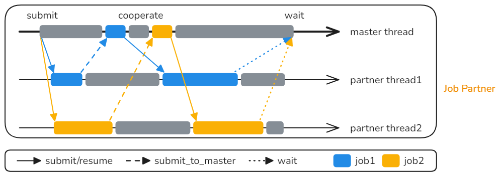

# Efficient Parallelization Based on the FFRT Job Partner Concurrency Paradigm

## Project Overview

This sample demonstrates an application that visually compares the execution times of **serial tasks** and **parallel tasks**, implemented using the Job Partner parallel paradigm provided by **FFRT**.

- **Functionality**: Users can click buttons on the UI interface to run tasks in either serial or parallel mode and intuitively observe the performance differences.
- **Advantage**: Developers can learn how to transform existing serial code in a **low-intrusive** manner to achieve performance gains through parallelization.

## Preview

|    Application Effect (Image)     |
|:---------------------------------:|
|  |

_The interface displays the time consumption comparison between serial and parallel execution. Click the buttons to trigger task execution in the corresponding mode._

## Key Features

In practice, situations may arise where a single thread (e.g., the UI rendering thread) has long execution times, making it difficult to fully utilize the multi-core capabilities of the CPU. A common solution is to break down the large task of the original thread into smaller subtasks and assign them to other threads for execution. However, two main challenges are encountered:

- **Specific Thread Dependency**: Certain parts of the task must be executed on a specific thread (e.g., accessing UI elements or JS VM variables).
- **High Scheduling Overhead**: The execution time of small tasks (microsecond level) is much shorter than the thread wake-up overhead (tens of microseconds), resulting in negligible concurrency benefits.

This is the rationale behind the Job Partner concurrency paradigm.



_How the Job Partner paradigm works: the master thread collaborates with partner threads to achieve dynamic task scheduling and execution._

In Job Partner, the original thread is defined as the master thread, and it supports the dynamic management of partner threads (buddy threads). It cleverly utilizes two core features:

- **Partner Thread Collaboration**: The original thread is designated as the master thread, and dynamically managed partner threads are introduced. If a partner thread encounters a code segment during task execution that must run on the master thread, it pauses and requests the master thread to execute that segment. After the master thread completes it, the partner thread continues.
- **Batch Task Merging**: Multiple tiny tasks are dynamically merged into larger-grained FFRT tasks, thereby amortizing the scheduling overhead per task and improving concurrency efficiency.

Job Partner can also dynamically adjust the number of worker threads based on the task load, further optimizing performance and reducing scheduling overhead.


_The Job Partner paradigm dynamically adjusts the number of worker threads based on task load to optimize performance._

## Usage Instructions

1.  Open the application. The interface displays two test sections (Serial Task & Parallel Task).
2.  Click the **"Execute Serially"** button.
   -   Invokes the C++ serial implementation.
   -   Displays the total time consumed (ms).
3.  Click the **"Execute with Collaborative Concurrency"** button.
   -   Invokes the C++ parallel implementation (Job Partner).
   -   Displays the total time consumed (usually significantly less than serial execution).

## Non-Intrusive Modification

A major highlight of this paradigm is its non-intrusive nature. The structure of the code for parallel execution remains largely unchanged compared to the serial code. This means developers can easily parallelize their applications to improve performance without significantly altering the existing codebase.


## Project Structure

```plain
├──entry/src
├──common
│  └──CommonConstants.ets         // Constant definitions
├──cpp
│  ├──types/libentry
│  │  ├──index.d.ts               // NAPI interface declarations
│  │  └──oh-package.json5         // Interface registration configuration
│  ├──CMakeLists.txt              // CMake configuration
│  ├──napi_init.cpp               // NAPI interface implementation
│  ├──parallel.cpp                // Parallel task implementation
│  ├──serial.cpp                  // Serial task implementation
│  └──task.h                      // Simulated task functions
├──ets
│  ├──entryability
│  │  └──EntryAbility.ets         // Application entry point
│  └──pages
│     └──Index.ets                // Main UI interface
└──resources                      // Resource files
```

## Implementation Details

### 1. C++ Parallel Task Scheduling

Uses the **FFRT `job_partner`** mode to manage partner threads. Supports pausing task execution on a **partner thread** to switch back to the **master thread** for specific code segments before continuing. Dynamically allocates task stacks and controls concurrent execution.

### 2. NAPI Module Encapsulation

NAPI interface registration is implemented in `napi_init.cpp`. When ArkTS calls `testNapi.fetch_exec_time(true|false)`, it triggers C++ serial or parallel computation.

### 3. HarmonyOS UI

Uses ArkTS + Declarative UI components for layout. `CommonConstants` manages style constants. Buttons trigger task execution, and results are updated on the interface in real time.

### 4. Project Engineering and Portability

Uses CMake to build the C++ module. Employs OpenHarmony third-party library dependency management (`@ppd/ffrt` v1.1.0+). The clear directory structure facilitates extensibility.

## Required Permissions

None involved.

## Constraints and Limitations

1.  This sample only runs on standard systems. Supported devices: Huawei phones and tablets.
2.  HarmonyOS version: HarmonyOS 6.0.0 Release or later.
3.  DevEco Studio version: DevEco Studio 6.0.0 Release or later.
4.  HarmonyOS SDK version: HarmonyOS 6.0.0 Release SDK or later.

## Dependencies

1.  OpenHarmony third-party library `@ppd/ffrt` version: 1.1.0 or later.