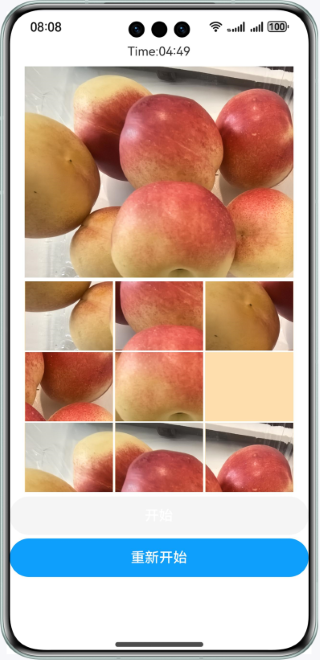
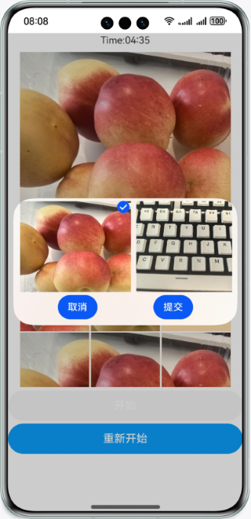

# 实现图片裁剪的功能

### 介绍

本示例通过@ohos.multimedia.image和@ohos.file.photoAccessHelper接口，实现一个类似“华容道游戏”的小游戏。
通过这个游戏，使得开发者学会如何获取系统相册资源文件，图片如何裁剪，运用到自己的业务当中。

### 效果预览
| 首页                                        | 运行                                       |
|-------------------------------------------|------------------------------------------|
|  |  |

### 使用说明：
1. 使用预置相机拍照后启动应用，应用首页会读取设备内的图片文件并展示获取到的第一个图片，没有图片时图片位置显示空白；由于规格限制，请勿选择过大图片，避免无法加载；
2. 点击开始按钮开始后，时间开始倒计时，在规定时间内未完成拼图则游戏结束。在游戏中，玩家点击重新开始进行游戏重置；
3. 点击开始游戏后，玩家可以根据上方的大图，点击黄格周围的图片移动，点击后图片和黄格交换位置,最终拼成完整的图片；
4. 不在游戏中时，玩家可以点击上方大图，选择自定义图片来进行拼图游戏。

### 工程目录
```
├──entry/src/main/ets                         // 代码区
│  ├──application
│  │  └──AbilityStage.ets
│  ├──common
│  │  ├──CommonConstants.ets                  // 常量类 
│  │  └──ImagePicker.ets                      // 图片选择
│  ├──entryability
│  │  └──EntryAbility.ets 
│  ├──model
│  │  ├──GameRules.ets                        // 游戏规则
│  │  ├──ImageModel.ets                       // 图片操作
│  │  ├──Logger.ets                           // 日志
│  │  └──PictureItem.ets                      // 分解的图片
│  └──pages
│     └──Index.ets                            // 首页
└──entry/src/main/resources                   // 应用资源目录
```
### 具体实现
+ 游戏中图片裁剪分割的效果实现在ImageModel中，源码参考[ImageModel](entry/src/main/ets/model/ImageModel.ets):
  + 获取本地图片：首先使用getPhotoAccessHelper获取相册管理模块实例，然后使用getAssets方法获取文件资源，最后使用getAllObjects获取检索结果中的所有文件资产方便展示；
  + 裁剪图片准备：裁剪图片需要使用@ohos.multimedia.image接口，裁剪前需要申请图片编辑权限，使用requestPermissionsFromUser申请，源码参考[Index.ets](entry/src/main/ets/pages/Index.ets);
  + 图片编辑：首先使用createImagePacker创建ImagePacker实例，然后使用fs.open打开文件，调用createImageSource接口创建图片源实例方便操作图片，接下来使用getImageInfo方法获取图片大小便于分割，最后使用createPixelMap方法传入每一份的尺寸参数完成图片裁剪。

### 相关权限

读取图片及视频权限：ohos.permission.READ_IMAGEVIDEO

### 依赖

不涉及。

### 约束与限制

1.本示例仅支持标准系统上运行，支持设备：华为手机。

2.HarmonyOS系统：HarmonyOS 5.0.5 Release及以上。

3.DevEco Studio版本：DevEco Studio 5.0.5 Release及以上。

4.HarmonyOS SDK版本：HarmonyOS 5.0.5 Release SDK及以上。