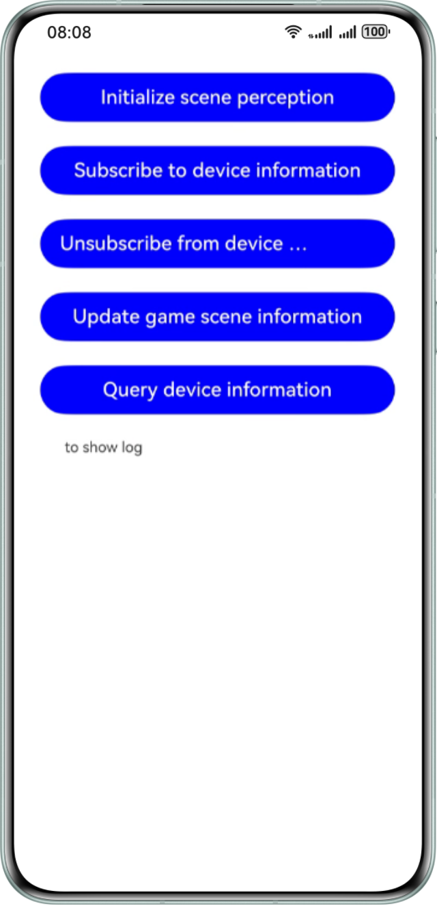

# Interaction Between the Game and the System Based on Scene Perception (ArkTS)

## Overview

This sample integrates Game Service Kit to implement a simple scene perception function for your reference. Please note that subscribing to and unsubscribing from device information are only examples of how to call APIs.

## Preview


## Project Directory
```
├──entry/src/main/ets	                   // Code area.   
│  ├──entryability    
│  │  └──EntryAbility.ts	               // Entry point class.   
│  └──pages     
│     └──Index.ets		                   // Home screen.      
│        ├──gamePerformanceInit()          // Initialization API.     
│        ├──subscribeDeviceState()         // API for subscribing to device information.   
│        ├──unSubscribeDeviceState()       // API for unsubscribing from device information.   
│        ├──updateGameSceneInfo()          // API for updating the game scene information. 
│        └──queryDeviceInfo()              // API for querying device information.     
└──entry/src/main/resources                // Directory of resource files.   
```

## How to Use
1. Use DevEco Studio to open the project directory.
2. Replace **bundleName** in the **app.json5** and **Index.ets** files in **AppScope** with the actual value.
3. Configure the signing information in **signingConfigs** of **build-profile.json5**.
4. Run the sample code on a HarmonyOS device.

## Constraints
1. This sample is only supported on Huawei phones, tablets, and PCs/2-in-1 devices with standard systems.
2. The HarmonyOS version must be HarmonyOS 5.0.2 Release or later.
3. The DevEco Studio version must be DevEco Studio 5.0.2 Release or later.
4. The HarmonyOS SDK version must be HarmonyOS 5.0.2 Release SDK or later.
