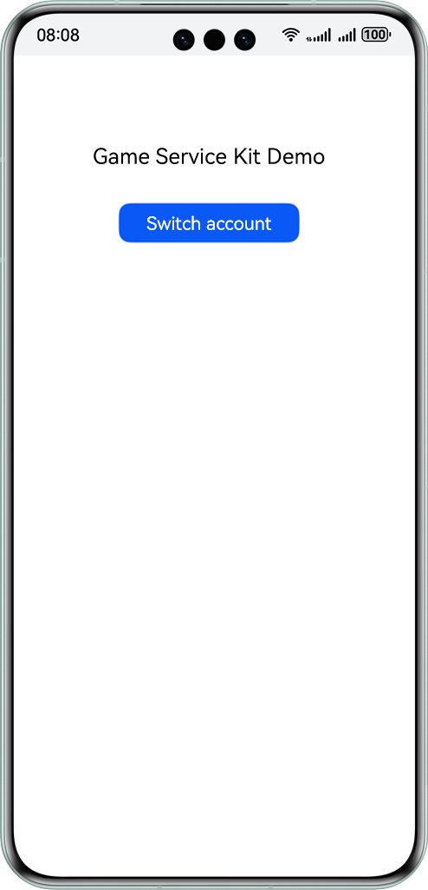

# Game Service Kit (ArKTS)

## Overview
This sample illustrates how to integrate Game Service Kit to implement a simple game sign-in and account switching function.

## Preview


## Project Directory
```
├─entry/src/main/ets                // Code area.   
│  ├─common                          // API implementation.   
│  │  └─GameApi.ets  
│  ├─entryability  
│  │  └─EntryAbility.ets              // Entry point class.   
│  ├─entrybackupability  
│  │  └─EntryBackupAbility.ets  
│  └─pages                           // Directory for storing app UI files.   
│      └─Index.ets                     // Home screen, which is used for game sign-in and game account switching.   
└─entry/src/main/resources          // App resource directory. 
```

## How to Use
1. Use DevEco Studio to open the project directory.
2. Replace **bundleName** in the **app.json5** file in **AppScope** with the actual value.
3. Configure the signing information in **signingConfigs** of **build-profile.json5** and configure the signing certificate fingerprint in AppGallery Connect.
4. Replace **client_id** and **app_id** in the **entry/src/main/module.json5** file with the actual values.
5. Run the sample code on a HarmonyOS device.

## Required Permissions
This sample needs to access the network when calling APIs such as those for game initialization and multi-provider sign-in. The network permission **ohos.permission.INTERNET** has been added to the **module.json5** file.

## Constraints
1. This sample is only supported on Huawei phones, tablets, 2-in-1 and TV devices with standard systems.
2. The HarmonyOS version must be HarmonyOS NEXT Developer Beta1 or later.
3. The DevEco Studio version must be DevEco Studio NEXT Developer Beta1 or later.
4. The HarmonyOS SDK version must be HarmonyOS NEXT Developer Beta1 SDK or later.
