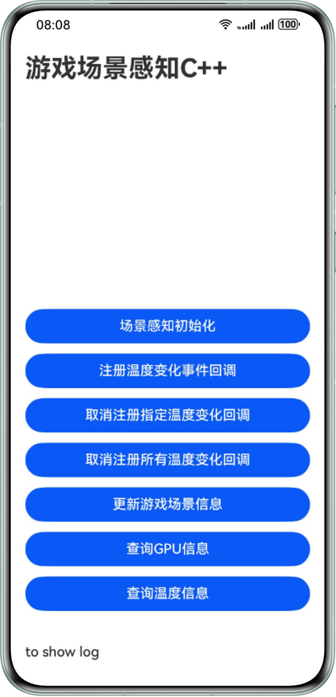

# 基于场景感知实现游戏与系统交互（C++）

## 简介
本示例基于GameServiceKit，展示了一个简单的场景感知功能，供您参考使用：游戏场景感知初始化、更新游戏网络和场景等信息、注册和取消设备温度变化事件、查询设备gpu信息、查询设备温度信息。
开发者可以结合业务场景，通过向系统上报游戏信息，以及主动查询或是监听回调的方式感知设备的实时状态，以便于在游戏过程中进行性能调节。

## 预览图


## 工程目录
```
└──entry/src/main                      // 代码区
   ├──cpp
   │  ├──types/libentry
   │  │  └──Index.d.ts                 // native层接口注册文件
   │  ├──napi_init.cpp                 // native api层接口的具体实现函数
   │  ├──CMakeLists.txt                // native层编译配置
   │  ├──include                       // 头文件
   │  │  └──game_performance_sample.h  // 接口定义
   │  └──src                           // C++代码区
   │     ├──init.cpp                   // 初始化类的实现
   │     ├──thermallevel_callback.cpp  // 订阅温度变化事件类的实现
   │     ├──update_gameinfo.cpp        // 上报游戏信息类的实现
   │     ├──query_gpuinfo.cpp          // 查询设备GPU信息类的实现
   │     └──query_thermalinfo.cpp      // 查询设备温度信息类的实现
   ├──ets
   │  ├──entryability 
   │  │  └──EntryAbility.ets           // 程序入口类
   │  │──entrybackupability 
   │  │  └──EntryBackupAbility.ets     // 应用提供扩展的备份恢复能力     
   │  └──pages 
   │     └──Index.ets                  // 主界面
   └──resources                        // 资源文件目录
```

## 使用说明
1. 使用DevEco Studio打开工程目录；
2. 替换AppScope中app.json5文件的bundleName；
3. 在build-profile.json5的signingConfigs中配置签名信息；
4. 在HarmonyOS设备上运行示例代码。


## 约束与限制
1. 本示例仅支持标准系统上运行，支持设备：华为手机、平板和PC/2in1。
2. HarmonyOS系统：HarmonyOS 5.0.2 Beta1及以上。
3. DevEco Studio版本：DevEco Studio 5.0.2 Beta1及以上。
4. HarmonyOS SDK版本：HarmonyOS 5.0.2 Beta1 SDK及以上。 