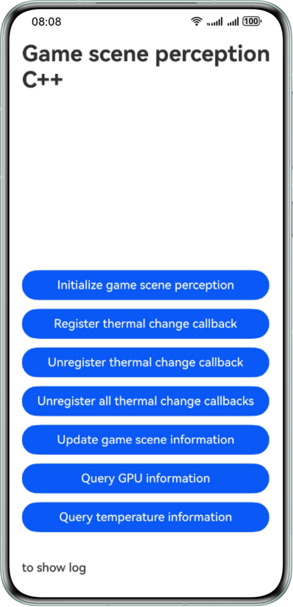

# Interaction Between the Game and the System Based on Scene Perception (C++)

## Overview
This sample, based on Game Service Kit, demonstrates a scene perception function for your reference. It includes initializing game scene perception, updating game network and scene information, registering and canceling device temperature change events, querying device GPU information, and querying device temperature information.
Based on the scenarios, your game can report game information to the system and actively query or listen for callbacks to monitor the device's real-time status. This allows for performance adjustments during gameplay.

## Preview


## Project Directory
```
└──entry/src/main                      // Code area.
   ├──cpp
   │  ├──types/libentry
   │  │  └──Index.d.ts                 // API registration file at the native layer.
   │  ├──napi_init.cpp                 // Functions of APIs at the native API layer.
   │  ├──CMakeLists.txt                // Compilation configurations at the native layer.
   │  ├──include                       // Header files.
   │  │  └──game_performance_sample.h  // Interface definition.
   │  └──src                           // C++ code area.
   │     ├──init.cpp                   // Implementation of the initialization class.
   │     ├──thermallevel_callback.cpp  // Implementation of the class for subscribing to temperature change events.
   │     ├──update_gameinfo.cpp        // Implementation of the class for reporting game information.
   │     ├──query_gpuinfo.cpp          // Implementation of the class for querying device GPU information.
   │     └──query_thermalinfo.cpp      // Implementation of the class for querying device temperature information.
   ├──ets
   │  ├──entryability 
   │  │  └──EntryAbility.ets            // Entry point class.
   │  │──entrybackupability 
   │  │  └──EntryBackupAbility.ets     // Applications provide extended backup and restoration capabilities.
   │  └──pages 
   │     └──Index.ets                  // Home screen.
   └──resources                        // Directory for storing resource files.
   

```

## How to Use
1. Use DevEco Studio to open the project directory.
2. Replace **bundleName** in the **app.json5** files in **AppScope** with the actual value.
3. Configure the signing information in **signingConfigs** of **build-profile.json5**.
4. Run the sample code on a HarmonyOS device.

## Constraints
1. This sample is only supported on Huawei phones, tablets, and PCs/2-in-1 devices with standard systems.
2. The HarmonyOS version must be HarmonyOS 5.0.2 Beta1 or later.
3. The DevEco Studio version must be DevEco Studio 5.0.2 Beta1 or later.
4. The HarmonyOS SDK version must be HarmonyOS 5.0.2 Beta1 SDK or later.
