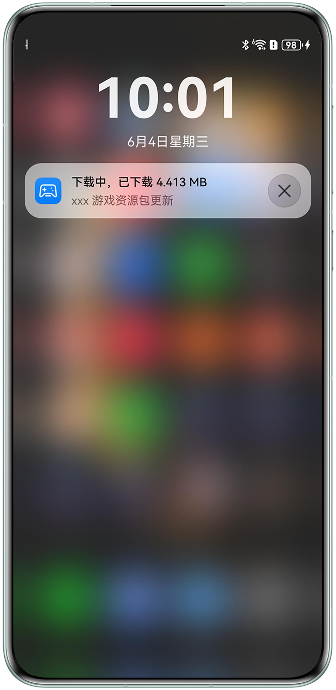

# 资源包后台下载

## 介绍

本示例展示了基于Graphics Accelerate Kit提供的资源包后台下载能力，实现系统后台下载游戏资源（例如关卡包、3D角色模型、纹理等）到用户设备中，解决游戏启动慢的问题，为用户提供即开即玩的游戏体验。

## 效果预览

|             **通知栏**             |
|:------------------------------:|
|  |

操作说明：

1. 安装游戏应用，系统自动下载游戏资源。
2. 查看手机通知栏的游戏资源下载进度。
3. 等待游戏资源下载完成后，在手机的主屏幕点“资源预下载“，启动应用，查看游戏资源下载状态。

## 工程目录
```
└──entry/src/main                                   // 代码区
    ├──ets
    │    ├──common
    │    │    ├──AssetAccelManifest.ets             // 资源加速清单处理类
    │    │    └──CommonConstants.ets                // 常量定义类
    │    ├──entryability 
    │    │    └──EntryAbility.ets                   // 主程序入口类
    │    ├──extensionability 
    │    │    └──AssetAccelExtAbility.ets           // 资源加速扩展能力类
    │    ├──pages 
    │    │    └──Index.ets                          // 应用主页面
    │    ├──session 
    │    │    └──AssetSessionStorage.ets            // 存储类
    │    └──task
    │         ├──GameStepBase.ets                   // 游戏资源基类
    │         └──GameStepDetect.ets                 // 游戏资源检测类
    ├──resources                                    // 资源文件目录
    └──module.json5                                 // 模块的配置文件
```

## 使用说明
1. 使用DevEco Studio打开工程目录；
2. 替换AppScope中app.json5文件的bundleName；
3. 在build-profile.json5的signingConfigs中配置签名信息；
4. 在HarmonyOS NEXT设备上运行示例代码。更多内容请参见[Graphics Accelerate Kit（图形加速服务）](https://developer.huawei.com/consumer/cn/doc/harmonyos-guides/graphics-accelerate-kit-guide)。

## 相关权限
在module.json5文件中添加网络权限"ohos.permission.INTERNET"。


## 约束与限制
1. 本示例仅支持标准系统上运行，支持设备：华为手机、平板。
2. HarmonyOS系统：HarmonyOS 5.1.0 Release及以上。
3. DevEco Studio版本：DevEco Studio 5.1.0 Release及以上。
4. HarmonyOS SDK版本：HarmonyOS 5.1.0 Release SDK及以上。

