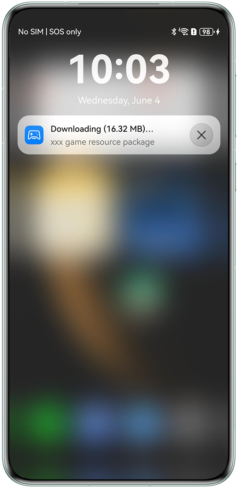

# Resource Package Background Download

## Overview

This sample demonstrates how to utilize the system background download function of Graphics Accelerate Kit to download game resources (such as level packages, 3D character models, and textures) to user devices. It reduces the game launch time, ensuring a seamless and instant play experience for users.

## Preview

|    **Notification panel**     |
| :---------------------------: |
|  |

Operation description:

1. Install the game app. The system automatically downloads game resources in the background.
2. View the resource download progress on the notification panel of the phone.
3. Wait until the game resource download is complete. Then, tap **ResDownload** on the phone's home screen to start the app and view the resource download status.

## Project Directory
```
└──entry/src/main                                   // Code area.
    ├──ets
    │    ├──common
    │    │    ├──AssetAccelManifest.ets             // Resource acceleration list processing class.
    │    │    └──CommonConstants.ets                // Constant definition class.
    │    ├──entryability 
    │    │    └──EntryAbility.ets                   // Entry point class.
    │    ├──extensionability 
    │    │    └──AssetAccelExtAbility.ets           // Resource acceleration extension capability class.
    │    ├──pages 
    │    │    └──Index.ets                          // App home screen.
    │    ├──session 
    │    │    └──AssetSessionStorage.ets            // Storage class.
    │    └──task
    │         ├──GameStepBase.ets                   // Game resource base class.
    │         └──GameStepDetect.ets                 // Game resource detection class.
    ├──resources                                    // Directory of resource files.
    └──module.json5                                 // Module configuration file.
```

## Instructions
1. Use DevEco Studio to open the project directory.
2. Replace **bundleName** in the **app.json5** file in **AppScope** with the actual value.
3. Configure the signing information in **signingConfigs** of **build-profile.json5**.
4. Run the sample code on a HarmonyOS NEXT device. For more details, please refer to [Graphics Accelerate Kit](https://developer.huawei.com/consumer/en/doc/harmonyos-guides/graphics-accelerate-kit-guide).

## Required Permissions
Add the network permission **ohos.permission.INTERNET** to the **module.json5** file.


## Constraints
1. This sample app is only supported on Huawei phones and tablets with standard systems.
2. The HarmonyOS version must be HarmonyOS 5.1.0 Release or later.
3. The DevEco Studio version must be DevEco Studio 5.1.0 Release or later.
4. The HarmonyOS SDK version must be HarmonyOS 5.1.0 Release SDK or later.
