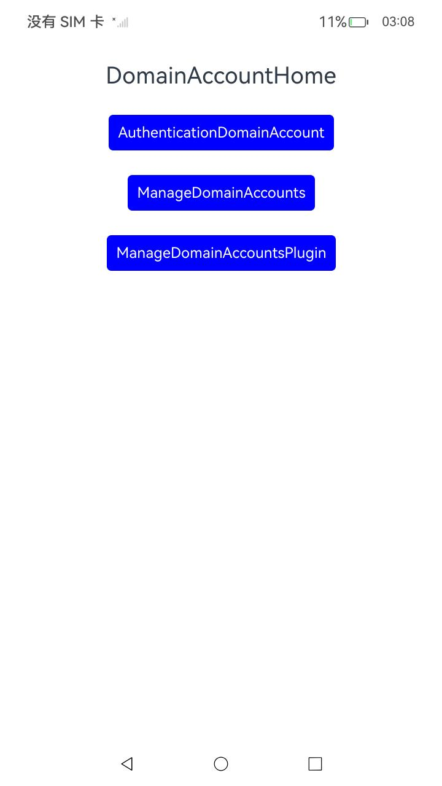

# DomainAccount

### 介绍

用户可以在系统中添加域账号，后续可以使用该账号登录、使用系统。

当需要验证域账号身份（比如屏幕解锁、登录会话失效等场景）时，可以使用系统提供的接口对域账号进行身份认证。

OEM厂商可以采用插件方式定制化域账号管理能力，系统提供了域账号插件注册和注销能能力。

实现对以下指南文件中[管理域账号](https://gitee.com/openharmony/docs/blob/master/zh-cn/application-dev/basic-services/account/manage-domain-account.md)  [域账号](https://gitee.com/openharmony/docs/blob/master/zh-cn/application-dev/basic-services/account/auth-domain-account.md)  [管理域账号插件](https://gitee.com/openharmony/docs/blob/master/zh-cn/application-dev/basic-services/account/manage-domain-plugin.md) 示例代码片段的工程化。保证指南中示例代码与sample工程文件同源。

### 效果预览

|                             首页                             |                      域账号插件管理页面                      | 注册插件及结果                                               |
| :----------------------------------------------------------: | :----------------------------------------------------------: | ------------------------------------------------------------ |
|  |  |  |
|                        注销插件及结果                        |                        域账号管理页面                        | 判断指定域账号是否存在及结果                                 |
|  |  |  |
|                       添加域账号及结果                       |                       删除域账号及结果                       | 查询域账号信息和认证结果                                     |
|  |  |  |
|                        域账号认证页面                        |                   使用密码认证域账号及结果                   | 弹窗验证域账号及结果                                         |
|  |  |  |

### 使用说明

1. 在主界面，点击ManageDomainAccountsPlugin，进入域账号插件管理页面。
2. 点击注册插件按钮，进行插件注册。
3. 进入管理域账号管理页面。
4. 点击判断指定域账号是否存在。
5. 点击添加域账号。
6. 点击删除域账号。
7. 点击查询域账号信息。
8. 进入认证域账号界面。
9. 点击使用密码认证域账号。
10. 点击使用弹窗验证域账号。
11. 回到域账号插件管理页面。
12. 点击注销插件按钮，进行注销插件。

### 工程目录

```
entry/src/
 ├── main
 │   ├── ets
 │   │   ├── entryability
 │   │   ├── entrybackupability
 │   │   ├── pages
 |   |       ├──DomainAccount
 |   |       |      ├──AuthenticationDomainAccount    // 域账号管理示例代码
 |   |       |      ├──ManageDomainAccounts           // 域处理示例代码
 |   |       |      └──ManageDomainAccountsPlugin     // 域账号插件示例代码
 │   │       ├── Index.ets               
 │   ├── module.json5
 │   └── resources
 ├── ohosTest
 │   ├── ets
 │   │   ├── test
 │   │       ├── Ability.test.ets        // 自动化测试代码
```

### 相关权限

[ohos.permission.MANAGE_LOCAL_ACCOUNTS](https://docs.openharmony.cn/pages/v5.0/zh-cn/application-dev/security/AccessToken/permissions-for-system-apps.md#ohospermissionmanagelocalaccounts)

[ohos.permission.GET_DOMAIN_ACCOUNTS](https://docs.openharmony.cn/pages/v5.0/zh-cn/application-dev/security/AccessToken/permissions-for-system-apps.md#ohospermissiongetdomainaccounts)

[ohos.permission.ACCESS_USER_AUTH_INTERNAL](https://docs.openharmony.cn/pages/v5.0/zh-cn/application-dev/security/AccessToken/permissions-for-system-apps.md#ohospermissionaccessuserauthinternal)

### 依赖

不涉及。

### 约束与限制

1.本示例仅支持标准系统上运行, 支持设备：RK3568。

2.本示例为Stage模型，支持API14版本full-SDK，版本号：5.0.2.57，镜像版本号：OpenHarmony_5.0.2.58。

3.本示例需要使用DevEco Studio 5.0.1 Release (Build Version: 5.0.5.306, built on December 6, 2024)及以上版本才可编译运行。

### 下载

如需单独下载本工程，执行如下命令：

````
git init
git config core.sparsecheckout true
echo code/DocsSample/Account/DomainAccount > .git/info/sparse-checkout
git remote add origin https://gitee.com/openharmony/applications_app_samples.git
git pull origin master
````