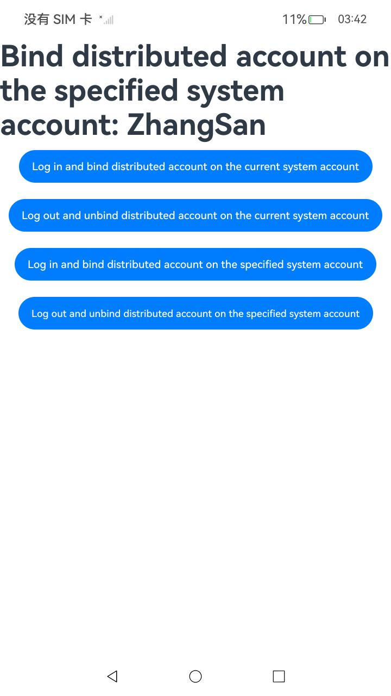

#  管理分布式账号（仅对系统应用开放）

### 介绍

1.OEM厂商可以通过[分布式账号SDK](https://gitee.com/openharmony/docs/blob/master/zh-cn/application-dev/reference/apis-basic-services-kit/js-apis-distributed-account.md)将自有账号与本地系统账号建立关联关系。

2.实现对以下指南文档中 [管理分布式账号](https://gitee.com/openharmony/docs/blob/master/zh-cn/application-dev/basic-services/account/manage-distributed-account.md) 示例代码片段的工程化，保证指南中示例代码与sample工程文件同源。

### 效果预览

|                             首页                             |            执行Log in and bind distributed account on the current system account            |
| :----------------------------------------------------------: | :----------------------------------------------------------: |
|  |  |
|          **执行Log out and unbind distributed account on the current system account**          |         **执行Log in and bind distributed account on the specified system account**         |
|  |  |
|          **执行Log out and unbind distributed account on the specified system account**          |                                                              |
|  |                                                              |

### 使用说明

1. 在主界面，点击'Log in and bind distributed account on the current system account'，执行Log in and bind distributed account on the current system account。
2. 点击'Log out and unbind distributed account on the current system account'，执行Log out and unbind distributed account on the current system account。
3. 点击'Log in and bind distributed account on the specified system account'，执行Log in and bind distributed account on the specified system account。
4. 点击'Log out and unbind distributed account on the specified system account'，执行Log out and unbind distributed account on the specified system account。
5. 执行结果会即时反馈在屏幕中央,并在控制台打印log。

### 工程目录

```
entry/src/
 ├── main
 │   ├── ets
 │   │   ├── entryability
 │   │   ├── entrybackupability
 │   │   └── pages
 │   │       └── Index.ets               // 管理分布式账号示例代码
 │   ├── module.json5
 │   └── resources
 ├── ohosTest
 │   ├── ets
 │   │   └── test
 │   │       └── Ability.test.ets        // 自动化测试代码
```

### 相关权限

[ohos.permission.MANAGE_DISTRIBUTED_ACCOUNTS](https://docs.openharmony.cn/pages/v5.0/zh-cn/application-dev/security/AccessToken/permissions-for-system-apps.md#ohospermissionmanagedistributedaccounts)

### 依赖

不涉及。

### 约束与限制

1.本示例仅支持标准系统上运行, 支持设备：RK3568。

2.本示例为Stage模型，支持API14版本full-SDK，版本号：5.0.2.57，镜像版本号：OpenHarmony_5.0.2.58。

3.本示例需要使用DevEco Studio 5.0.1 Release (Build Version: 5.0.5.306, built on December 6, 2024)及以上版本才可编译运行。

### 下载

如需单独下载本工程，执行如下命令：

````
git init
git config core.sparsecheckout true
echo code/DocsSample/Account/ManageDistributedAccount > .git/info/sparse-checkout
git remote add origin https://gitee.com/openharmony/applications_app_samples.git
git pull origin master
````