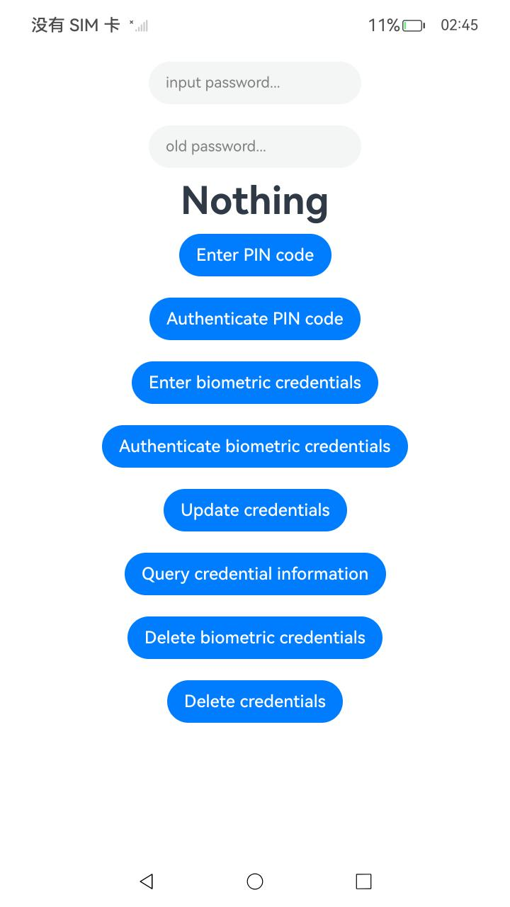
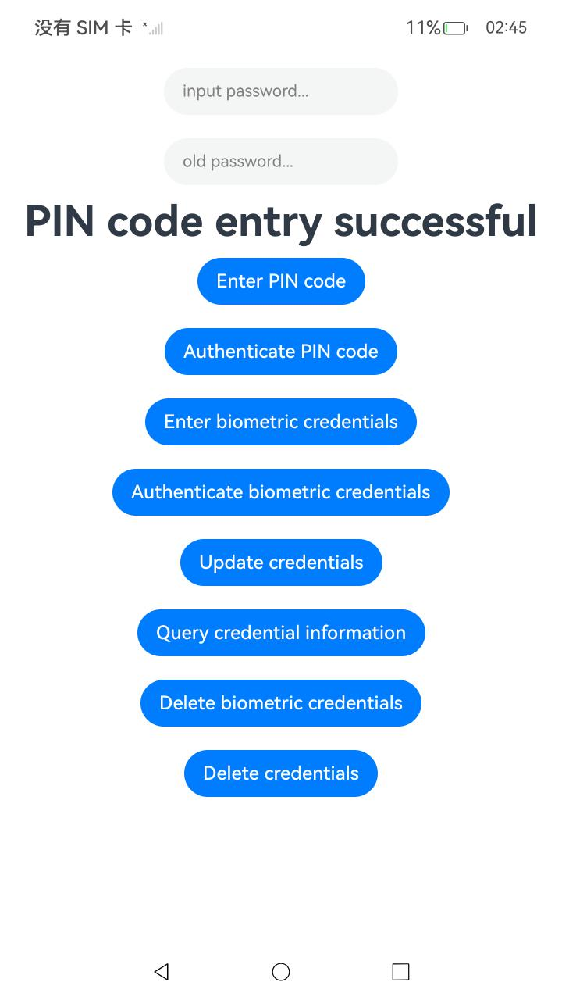
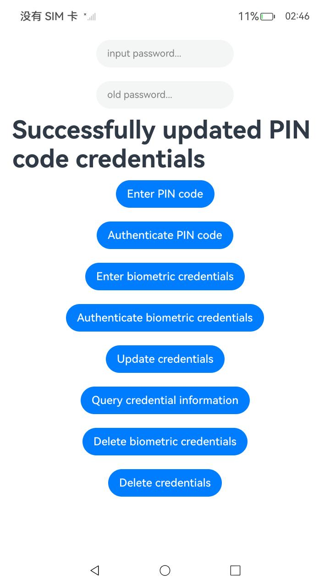
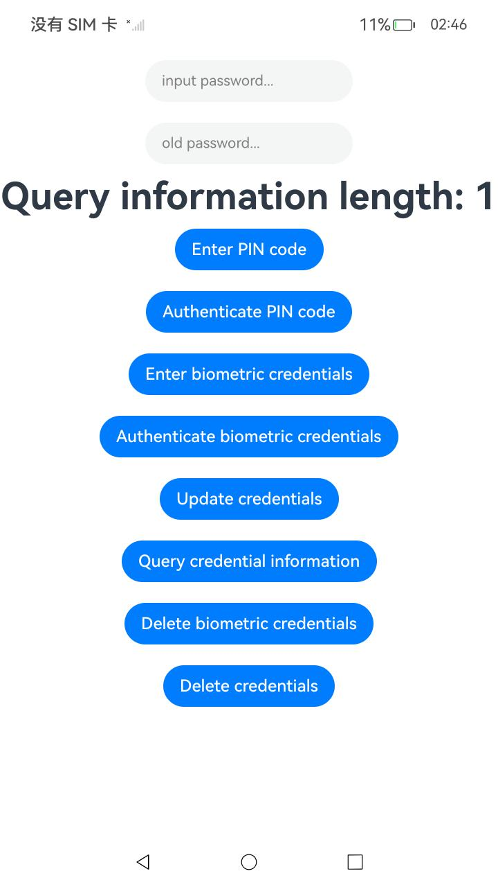

#  管理系统账号凭据

### 介绍

凭据可用于认证用户的身份，本文档将介绍如何录入、认证、更新、查询和删除指定系统账号的凭据。

该工程中展示的代码详细描述可查如下链接：

- [ 管理系统账号凭据](https://gitee.com/openharmony/docs/blob/master/zh-cn/application-dev/basic-services/account/manage-os-account-credential.md)

### 效果预览

|                             首页                             |                        执行录入PIN码                         |
| :----------------------------------------------------------: | :----------------------------------------------------------: |
|  |  |
|                        执行认证PIN码                         |                         执行更新凭据                         |
|  |  |
|                       执行查询凭据信息                       |                         执行删除凭据                         |
|  |  |

### 使用说明

1. 在主界面，点击'Enter PIN code'，执行录入PIN码。
2. 点击'Authenticate PIN code'，执行认证PIN码。
3. 点击'Update credentials'，执行更新凭据。
4. 点击'Query credential information'，执行查询凭据信息。
5. 点击'Delete credentials'，执行删除凭据。
6. 执行结果会即时反馈在屏幕中央,并在控制台打印log。

### 工程目录

```
entry/src/
 ├── main
 │   ├── ets
 │   │   ├── entryability
 │   │   ├── entrybackupability
 │   │   ├── pages
 │   │       ├── Index.ets               // 管理系统账号凭据示例代码
 │   ├── module.json5
 │   └── resources
 ├── ohosTest
 │   ├── ets
 │   │   ├── test
 │   │       ├── Ability.test.ets        // 自动化测试代码
```

### 相关权限

[ohos.permission.MANAGE_USER_IDM](https://docs.openharmony.cn/pages/v5.0/zh-cn/application-dev/security/AccessToken/permissions-for-system-apps.md#ohospermissionmanageuseridm)

[ohos.permission.ACCESS_PIN_AUTH](https://docs.openharmony.cn/pages/v5.0/zh-cn/application-dev/security/AccessToken/permissions-for-system-apps.md#ohospermissionaccesspinauth)

[ohos.permission.ACCESS_USER_AUTH_INTERNAL](https://docs.openharmony.cn/pages/v5.0/zh-cn/application-dev/security/AccessToken/permissions-for-system-apps.md#ohospermissionaccessuserauthinternal)

[ohos.permission.USE_USER_IDM](https://docs.openharmony.cn/pages/v5.0/zh-cn/application-dev/security/AccessToken/permissions-for-system-apps.md#ohospermissionuseuseridm)

### 依赖

不涉及。

### 约束与限制

1.本示例仅支持标准系统上运行, 支持设备：RK3568。

2.本示例为Stage模型，支持API14版本full-SDK，版本号：5.0.2.57，镜像版本号：OpenHarmony_5.0.2.58。

3.本示例需要使用DevEco Studio 5.0.1 Release (Build Version: 5.0.5.306, built on December 6, 2024)及以上版本才可编译运行。

### 下载

如需单独下载本工程，执行如下命令：

````
git init
git config core.sparsecheckout true
echo code/DocsSample/Account/ManageSystemAccountCredentials > .git/info/sparse-checkout
git remote add origin https://gitee.com/openharmony/applications_app_samples.git
git pull origin master
````