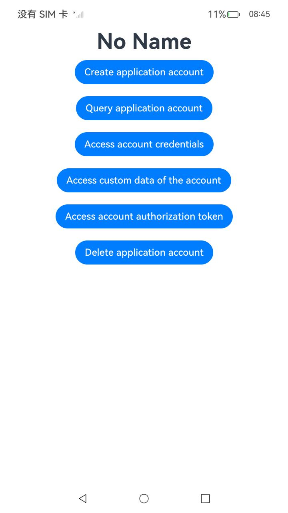
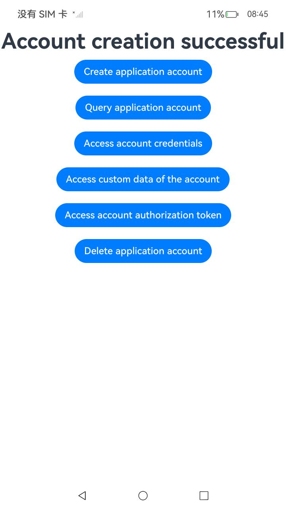
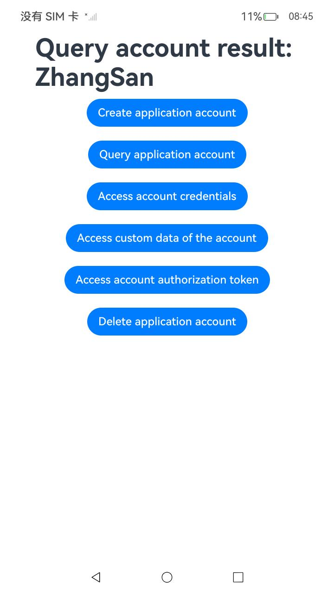
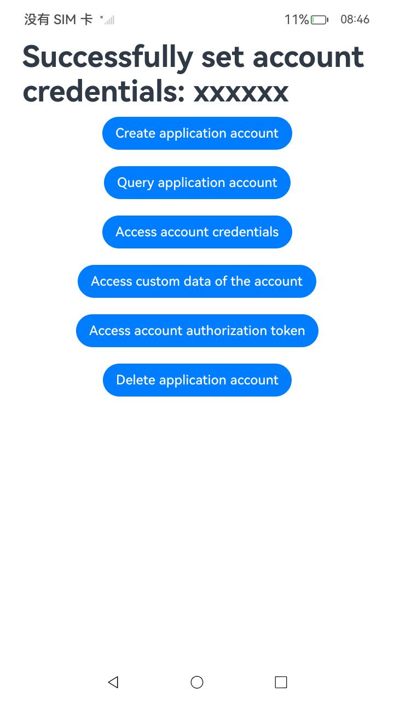
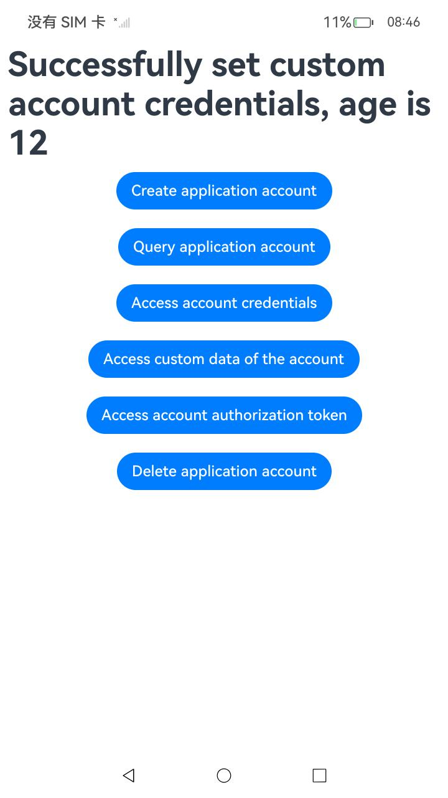
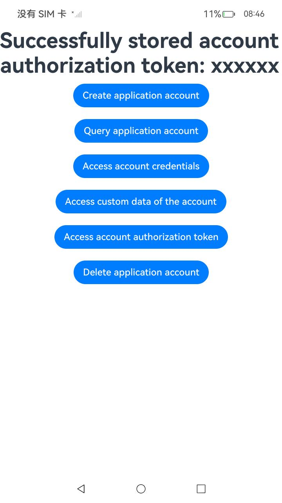
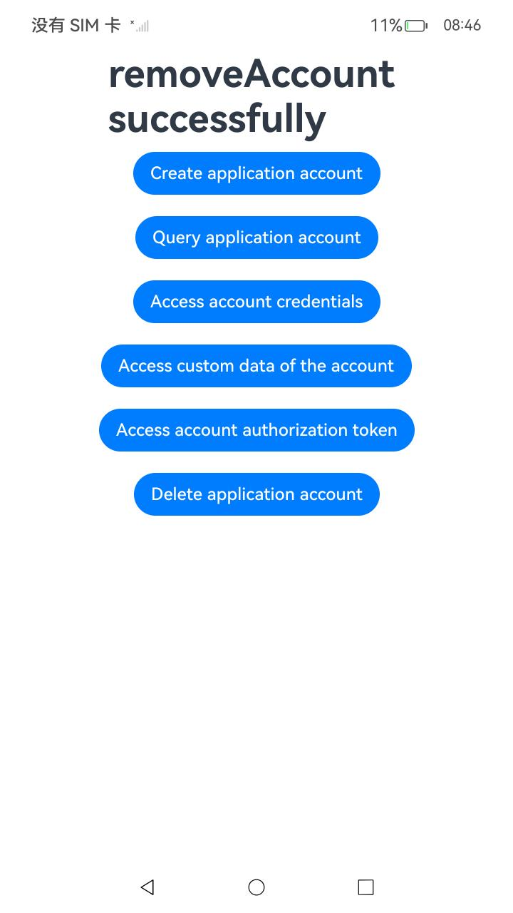

#  管理应用账号

### 介绍

1.应用开发者可以使用[应用账号SDK](https://gitee.com/openharmony/docs/blob/master/zh-cn/application-dev/reference/apis-basic-services-kit/js-apis-appAccount.md)管理本应用的账号数据。

能力限制：应用卸载场景下，被卸载应用的账号数据会被删除；本地账号删除场景下，被删除本地账号下的所有应用的账号数据会被删除。

2.实现对以下指南文件中 [管理应用账号](https://gitee.com/openharmony/docs/blob/master/zh-cn/application-dev/basic-services/account/manage-application-account.md#/openharmony/docs/blob/master/zh-cn/application-dev/reference/apis-basic-services-kit/js-apis-appAccount.md)  示例代码片段的工程化。保证指南中示例代码与sample工程文件同源。

### 效果预览

|                             首页                             |                     **执行创建应用账号**                     |
| :----------------------------------------------------------: | :----------------------------------------------------------: |
|  |  |
|                     **执行查询应用账号**                     |                    **执行存取账号的凭据**                    |
|  |  |
|                 **执行存取账号的自定义数据**                 |                  **执行存取账号的授权令牌**                  |
|  |  |
|                     **执行删除应用账号**                     |                                                              |
|  |                                                              |

### 使用说明

1. 在主界面，可以点击’Create application account‘，创建应用账号。
2. 点击’Query application account‘，查询应用账号。
3. 点击’Access account credentials‘，存取账号的凭据。
4. 点击’Access custom data of the account‘，存取账号的自定义数据。
5. 点击’Access account authorization token‘，存取账号的授权令牌。
6. 点击’Delete application account‘，删除应用账号。
7. 执行结果会即时反馈在屏幕中央,并在控制台打印log。

### 工程目录

```
entry/src/
 ├── main
 │   ├── ets
 │   │   ├── entryability
 │   │   ├── entrybackupability
 │   │   └── pages
 │   │       └── Index.ets               // 管理应用账号示例代码
 │   ├── module.json5
 │   └── resources
 └── ohosTest
     └── ets
         └── test
             └── Ability.test.ets        // 自动化测试代码
```

### 相关权限

不涉及。

### 依赖

不涉及。

### 约束与限制

1.本示例仅支持标准系统上运行, 支持设备：RK3568。

2.本示例为Stage模型，支持API14版本full-SDK，版本号：5.0.2.57，镜像版本号：OpenHarmony_5.0.2.58。

3.本示例需要使用DevEco Studio 5.0.1 Release (Build Version: 5.0.5.306, built on December 6, 2024)及以上版本才可编译运行。

### 下载

如需单独下载本工程，执行如下命令：

````
git init
git config core.sparsecheckout true
echo code/DocsSample/Account/ApplicationAccount > .git/info/sparse-checkout
git remote add origin https://gitee.com/openharmony/applications_app_samples.git
git pull origin master
````