# 系统账号 (管理系统账号和使用约束管控系统账号)

### 介绍

1.管理系统账号：

系统提供了用于管理系统账号的接口。 系统应用开发者在申请对应的权限后，可以创建、激活、修改和删除系统账号，实现对系统账号的生命周期管理；三方应用开发者可以查询系统账号的基本信息，以完成与系统账号相关的业务逻辑开发。

2.使用约束管控系统账号：

账号管理模块提供了基于角色的访问控制机制，用户可以为系统账号设置约束，以限制目标账号的行为。

预定义的账号约束条件，可以参考 ：[系统账号约束列表](https://gitee.com/openharmony/docs/blob/master/zh-cn/application-dev/reference/apis-basic-services-kit/js-apis-osAccount.md#系统账号约束列表)

3.实现对以下指南文件中 [管理系统账号](https://gitee.com/openharmony/docs/blob/master/zh-cn/application-dev/basic-services/account/manage-os-account.md)  [使用约束管控系统账号](https://gitee.com/openharmony/docs/blob/master/zh-cn/application-dev/basic-services/account/control-os-account-by-constraints.md) 示例代码片段的工程化。保证指南中示例代码与sample工程文件同源。

### 效果预览

|                             首页                             |                   使用约束管控系统账号页面                   |
| :----------------------------------------------------------: | :----------------------------------------------------------: |
| 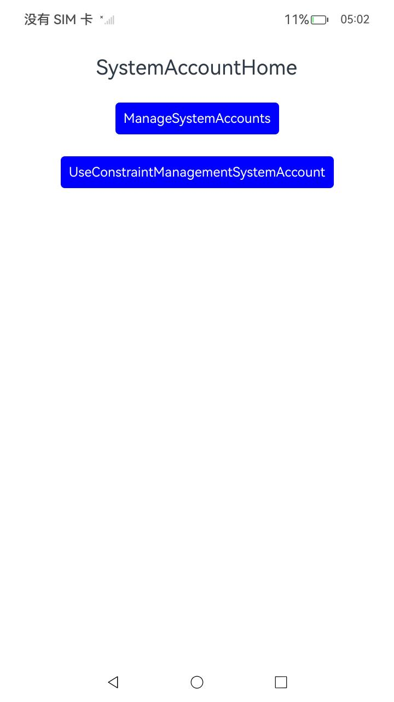 | 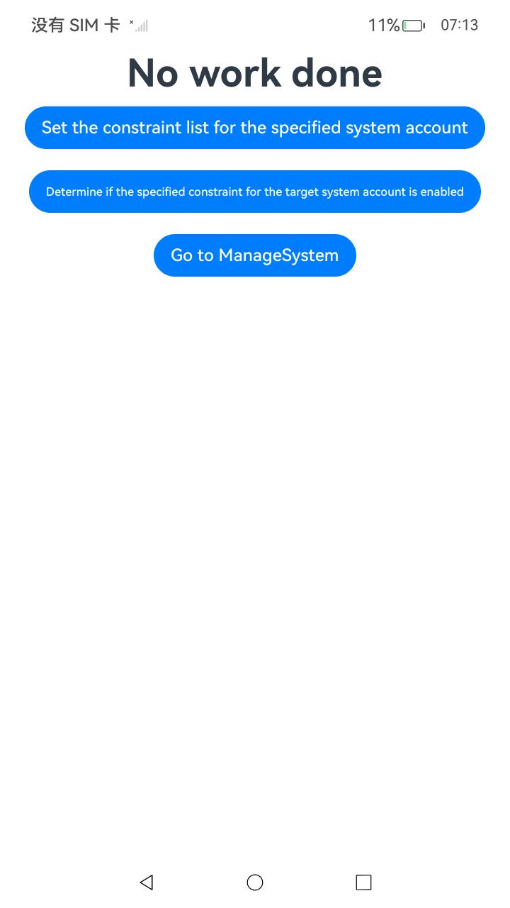 |
|                执行Set the constraint list for the specified system account                |            执行Determine if the specified constraint for the target system account is enabled            |
| 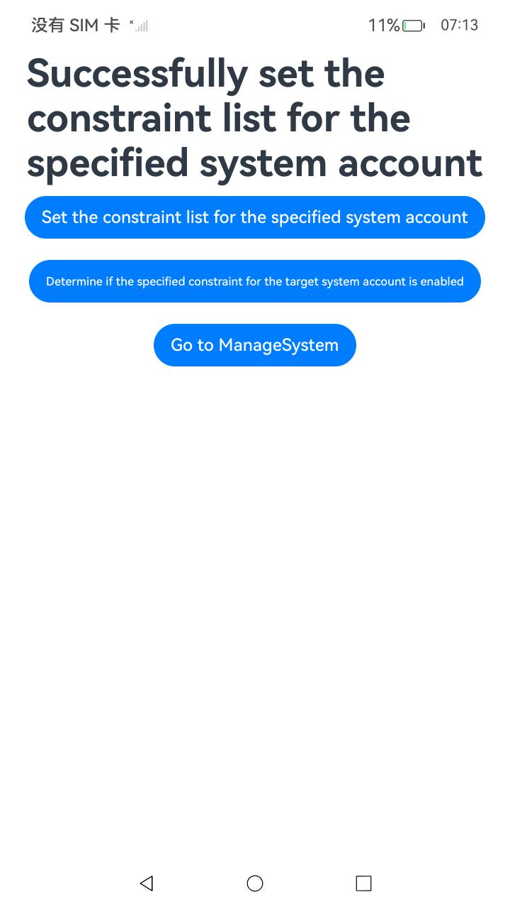 | 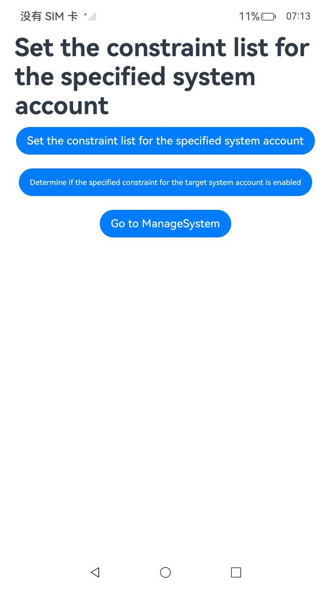 |
|                       管理系统账号首页                       |                       执行Create system account                       |
| 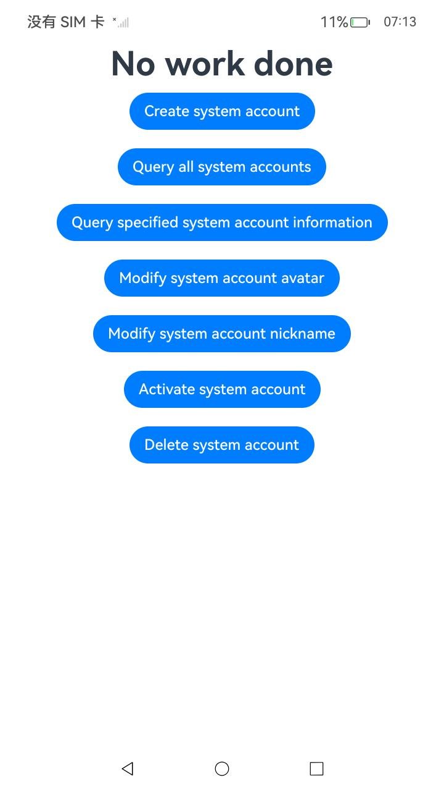 | 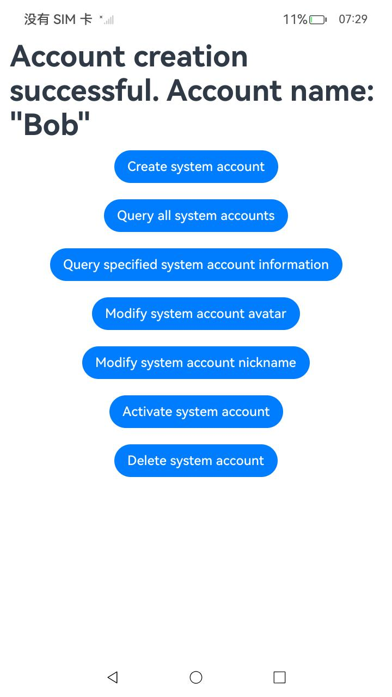 |
|                     执行Query all system accounts                     |                   执行Query specified system account information                   |
| 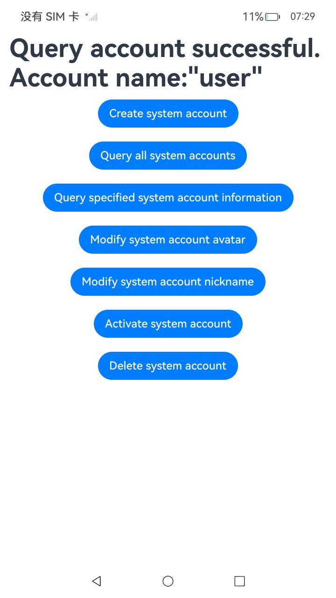 | 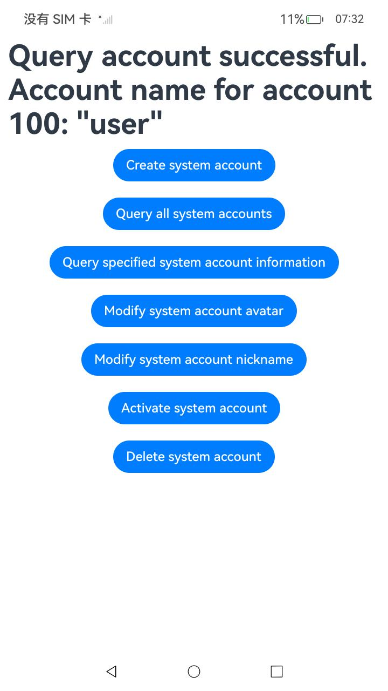 |
|                     执行Modify system account avatar                     |                     执行Modify system account nickname                     |
| 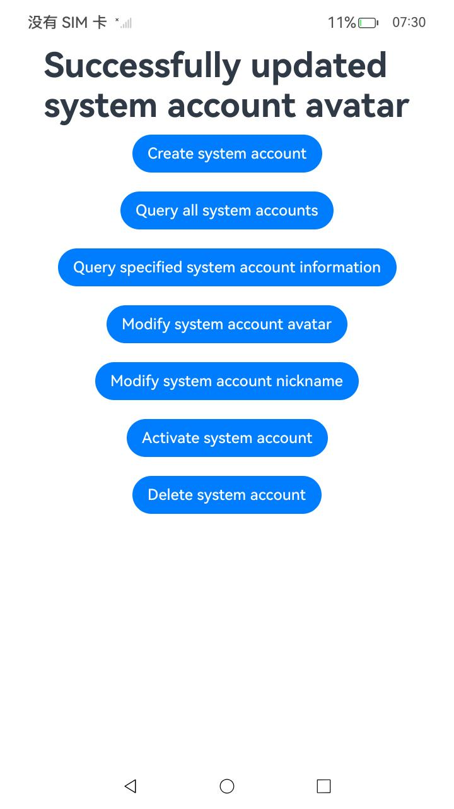 | 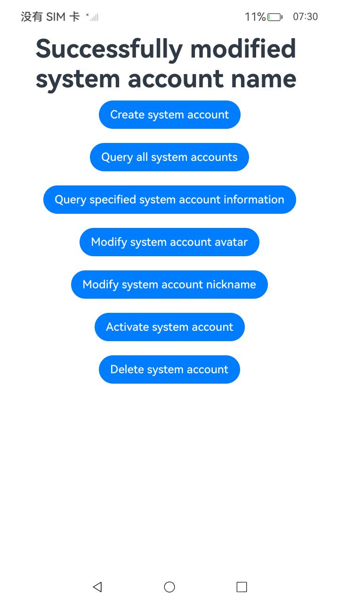 |
|                       执行Delete system account                       |                                                              |
| 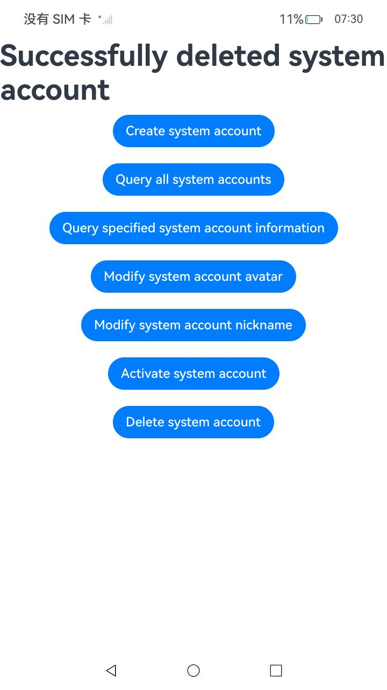 |                                                              |

### 使用说明

1. 在主界面，点击’UseConstraintManagementSystemAccount‘，进入约束管控系统账号页面。
2.  点击’Set the constraint list for the specified system account‘，Set the constraint list for the specified system account。
3. 点击’Determine if the specified constraint for the target system account is enabled‘，Determine if the specified constraint for the target system account is enabled。
4. 点击’Go to ManageSystem‘，进入管理系统账号首页。
5. 点击’Create system account‘，Create system account。
6. 点击’Query all system accounts‘，Query all system accounts。
7. 点击’Query specified system account information‘，Query specified system account information。
8. 点击’Modify system account avatar‘，Modify system account avatar。
9. 点击’Modify system account nickname‘，Modify system account nickname。
10. 点击’Delete system account‘，Delete system account。

### 工程目录

```
entry/src/
 ├── main
 │   ├── ets
 │   │   ├── entryability
 │   │   ├── entrybackupability
 │   │   └── pages
 |   |       ├──SystemAccount
 |   |       |		├── ManageSystemAccounts                       // 管理系统账号示例代码
 |   |       |      └── UseConstraintManagementSystemAccount       // 使用约束管控系统账号示例代码
 │   │       └── Index.ets               // 系统账号首页
 │   ├── module.json5
 │   └── resources
 ├── ohosTest
 │   ├── ets
 │   │   └── test
 │   │       └── Ability.test.ets        // 自动化测试代码
```

### 相关权限

[ohos.permission.MANAGE_LOCAL_ACCOUNTS](https://docs.openharmony.cn/pages/v5.0/zh-cn/application-dev/security/AccessToken/permissions-for-system-apps.md#ohospermissionmanagelocalaccounts)

[ohos.permission.INTERACT_ACROSS_LOCAL_ACCOUNTS_EXTENSION](https://docs.openharmony.cn/pages/v5.0/zh-cn/application-dev/security/AccessToken/permissions-for-system-apps.md#ohospermissioninteractacrosslocalaccountsextension)

### 依赖

不涉及。

### 约束与限制

1.本示例仅支持标准系统上运行, 支持设备：RK3568。

2.本示例为Stage模型，支持API14版本full-SDK，版本号：5.0.2.57，镜像版本号：OpenHarmony_5.0.2.58。

3.本示例需要使用DevEco Studio 5.0.1 Release (Build Version: 5.0.5.306, built on December 6, 2024)及以上版本才可编译运行。

### 下载

如需单独下载本工程，执行如下命令：

````
git init
git config core.sparsecheckout true
echo code/DocsSample/Account/SystemAccount > .git/info/sparse-checkout
git remote add origin https://gitee.com/openharmony/applications_app_samples.git
git pull origin master
````