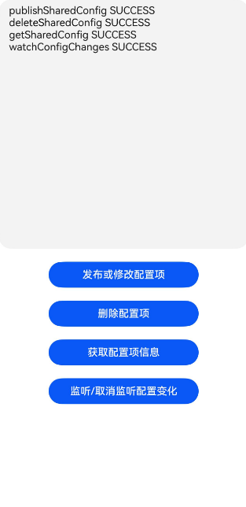

# 应用间配置共享 (ArkTS)

## 介绍

本实例主要介绍应用间配置共享通过集中管理公共配置信息，在不同应用间共享配置，提升协作效率。


- [ 应用间配置共享 (ArkTS)](https://gitcode.com/openharmony/docs/blob/master/zh-cn/application-dev/database/share-config.md)

## 效果预览

| 应用成功启动界面                                          | 文件访问结果                                          |
|---------------------------------------------------|-------------------------------------------------|
|  |  |

使用说明：
1.在主界面中通过点击相应的按钮，应用可以完成相应的功能，完成的反馈将如日志的形式出现在主界面的上半部分。

## 工程目录

```
//应用文件访问
data
├──entry/src/main
|	├──ets
|	|	├──entryability
|	|	|	└──EntryAbility.ets         // 程序入口类
|	|	├──entrybackupability
|	|	|	└──EntryBackupAbility.ets   
|	|	└──pages                        // 页面文件
|	|		└──Index.ets 				// 主界面
|	├──resources						// 资源文件目录	
```

## 具体实现

- **配置发布方（即数据提供方）**：负责提供默认共享配置项，并能动态修改配置项信息。当前支持静态配置和动态配置两种配置方式。
  - **静态配置**：应用包在安装时提供的默认共享配置项（不依赖应用启动即生效）。
  - **动态配置**：配置发布方通过调用相关接口可以动态新增、删除或修改配置项（不依赖应用升级）。

- 配置的新建、更新、读取、订阅配置变化与取消订阅的使用的功能函数都集成在[Index.ets](entry/src/main/ets/pages/Index.ets)文件中。

  - 接口请参考：[@ohos.data.dataShare](https://gitcode.com/openharmony/docs/blob/master/zh-cn/application-dev/reference/apis-arkdata/js-apis-data-dataShare.md)

- 一个应用最多可以发布32个配置项，这个数量是静态配置与动态配置的总和。

- 配置项中的allowlist使用的是appIdentifier，详见[什么是appIdentifier](https://gitcode.com/openharmony/docs/blob/master/zh-cn/application-dev/quick-start/common_problem_of_application.md#%E4%BB%80%E4%B9%88%E6%98%AFappidentifier)

## 相关权限

无

## 依赖

不涉及

## 约束与限制

1.本示例仅支持标准系统上运行，支持设备：RK3568。

2.本示例为Stage模型，支持API20版本SDK，版本号：6.0.0.47，镜像版本号：OpenHarmony 6.0.0.47。

3.本示例需要使用DevEco Studio 6.0.0 Release (构建版本：6.0.0.858，构建 2025年9月24日)及以上版本才可编译运行。


## 下载

如需单独下载本工程，执行如下命令

```
git init
git config core.sparsecheckout true
echo code/DocsSample/ArkData/DataShare/ShareConfig > .git/info/sparse-checkout
git remote add origin https://gitcode.com/openharmony/applications_app_samples.git
git pull origin master
```