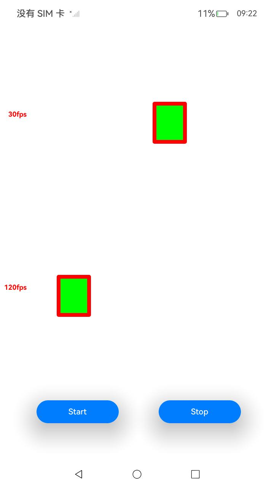

# DisplaySoloist分级管控

### 介绍

本示例通过 DisplaySoloist 系列功能，使用 UI 外的线程对 XComponent 的绘制内容，设置开发者所期望的帧率。使用 [NativeDisplaySoloist](https://developer.huawei.com/consumer/cn/doc/harmonyos-guides/displaysoloist-native-guidelines) 和 [Drawing](https://developer.huawei.com/consumer/cn/doc/harmonyos-guides/graphic-drawing-overview) 来实现图像绘制和显示。

### 效果预览

|                        XComponent                        |
| :------------------------------------------------------: |
|  |

使用说明

1.进入 XComponent 页面，依次点击“**Start**”，三个方块分别按照 30Hz、60Hz、120Hz 移动；点击“**Stop**”动画停止。

### 工程目录

```
├──entry/src/main
│  ├──cpp                                       // C++代码区
│  │  ├──CMakeLists.txt                         // CMake配置文件
│  │  ├──napi_init.cpp                          // Napi模块注册
│  │  ├──common
│  │  │  └──log_common.h                        // 日志封装定义文件
│  │  ├──plugin                                 // 生命周期管理模块
│  │  │  ├──plugin_manager.cpp
│  │  │  └──plugin_manager.h
│  │  ├──samples                                // samples渲染模块
│  │  │  ├──sample_xcomponent.cpp
│  │  │  └──sample_xcomponent.h
│  ├──ets                                       // ets代码区
│  │  ├──entryability
│  │  │  ├──EntryAbility.ts                     // 程序入口类
|  |  |  └──EntryAbility.ets
|  |  ├──interface
│  │  │  └──XComponentContext.ts                // XComponentContext
│  │  ├──pages                                  // 页面文件
│  │  |  └──Index.ets                           // XComponent页面
│  │  ├──utils                                  // 工具类
|  ├──resources         			// 资源文件目录
```

### 具体实现

* XComponent：通过在 IDE 中的 Native C++ 工程，在 TS 侧中声明对外接口为 register、unregister 以及 destroy；在 C++ 侧调用 NativeDisplaySoloist 分级管控接口，并在使用 drawing 来绘制期望帧率图像。

  | 接口名                                      | 描述                                                |
  | ------------------------------------------- | --------------------------------------------------- |
  | OH_DisplaySoloist_Create                    | 创建一个OH_DisplaySoloist实例                       |
  | OH_DisplaySoloist_Destroy                   | 销毁一个OH_DisplaySoloist实例                       |
  | OH_DisplaySoloist_Start                     | 设置每帧回调函数，每次vsync信号到来时启动每帧回调   |
  | OH_DisplaySoloist_Stop                      | 停止请求下一次vsync信号，并停止调用回调函数callback |
  | OH_DisplaySoloist_SetExpectedFrameRateRange | 设置期望帧率范围                                    |


### 相关权限

不涉及。

### 依赖

不涉及。

### 约束与限制

1.本示例仅支持在标准系统上运行；

2.本示例为 Stage 模型，已适配 API version 14 版本 SDK，SDK 版本号（API Version 14 5.0.2.57）；

3.本示例需要使用 DevEco Studio 版本号（5.0.5.306）及以上版本才可编译运行。

### 下载

如需单独下载本工程，执行如下命令：

```
git init
git config core.sparsecheckout true
echo ArkGraphics2D/DisplaySoloist/ > .git/info/sparse-checkout
git remote add origin https://gitee.com/harmonyos_samples/guide-snippets.git
git pull origin master
```