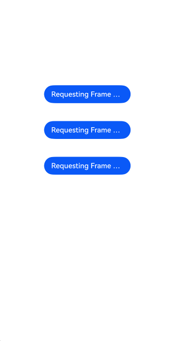
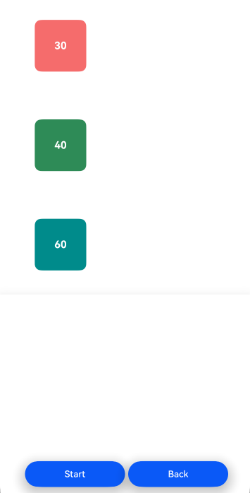
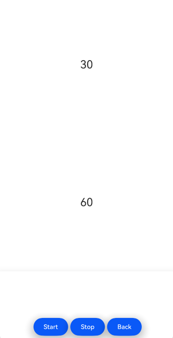
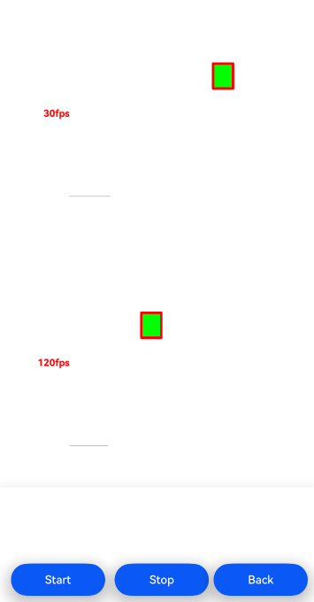

# DisplaySync

### 介绍

本示例通过 DisplaySync 系列功能，对请求动画绘制帧率、请求 UI 绘制帧率和请求自绘制内容绘制帧率设置开发者所期望的帧率。

本示例主要展示了 DisplaySync 系列能力，使用 [ExpectedFrameRateRange](https://developer.huawei.com/consumer/cn/doc/harmonyos-references/ts-explicit-animation#expectedframeraterange11) 属性来配置显性动画和属性动画的帧率；利用 [@ohos.graphics.displaySync](https://developer.huawei.com/consumer/cn/doc/harmonyos-references/js-apis-graphics-displaysync) 方法来为独立的帧率绘制、更新操作UI界面；采用 [XComponent](https://developer.huawei.com/consumer/cn/doc/harmonyos-guides/napi-xcomponent-guidelines) 组件进行开发，从而可以请求独立的绘制帧率进行内容开发。

### 效果预览

|                           初始页                            |                           请求动画绘制帧率                           |                      请求 UI 绘制帧率                      |                          请求自绘制内容绘制帧率                          |
|:--------------------------------------------------------:|:------------------------------------------------------------:|:----------------------------------------------------:|:-------------------------------------------------------------:|
|  |  |  |  |

使用说明

1.在初始页面点击“**Requesting Frame Rates for Animations**”，进入请求动画绘制帧率页面，点击“**Start**”，三个方块分别按照30Hz、40Hz、60Hz移动；点击“**Back**”返回初始页面。

2.在初始页面点击“**Requesting Frame Rates for UI Components**”，进入请求 UI 绘制帧率页面，点击“**Start**”，数字“**30**”按照30Hz帧率放大缩小，数字“**60**”按照60Hz帧率放大缩小；点击“**Stop**”绘制停止；点击“**Back**”返回初始页面。

3.在初始页面点击“**Requesting Frame Rates for Custom Content**”，进入请求自绘制内容绘制帧率页面，点击“**Start**”，两个方块分别按照30Hz、120Hz移动；点击“**Stop**”动画停止；点击“**Back**”返回初始页面。

### 工程目录	

```
├──entry/src/main
│  ├──cpp                                       // C++代码区
│  │  ├──CMakeLists.txt                         // CMake配置文件
│  │  ├──napi_init.cpp                          // Napi模块注册
│  │  ├──common
│  │  │  └──log_common.h                        // 日志封装定义文件
│  │  ├──plugin                                 // 生命周期管理模块
│  │  │  ├──plugin_manager.cpp
│  │  │  └──plugin_manager.h
│  │  ├──samples                                // samples渲染模块
│  │  │  ├──sample_xcomponent.cpp
│  │  │  └──sample_xcomponent.h
│  ├──ets                                       // ets代码区
│  │  ├──entryability
│  │  │  ├──EntryAbility.ts                     // 程序入口类
|  |  |  └──EntryAbility.ets
|  |  ├──interface
│  │  │  └──XComponentContext.ts                // XComponentContext
│  │  ├──DispalySync                            // 业务页面目录
│  │  |  ├──PropertyAnimationDisplaySync.ets    // 属性动画页面
│  │  |  ├──CustomDrawDisplaySync.ets           // 自绘制页面
│  │  |  ├──XComponentDisplaySync.ets           // XComponent页面
│  │  ├──pages                                  // 页面文件
│  │  |  ├──Index.ets                           // 初始页面
│  │  ├──utils                                  // 工具类
|  ├──resources         			// 资源文件目录
```

### 具体实现

* 请求动画绘制帧率：通过 animation 和 animateTo 接口的参数——expectedFrameRateRange，来设置动画刷新率区间、预期刷新率。其作为动画的属性之一，主要作用于动画场景。

    * 涉及到的相关接口：

      |      新增动画属性      |                             描述                             |
      | :--------------------: | :----------------------------------------------------------: |
      | expectedFrameRateRange | animation和animateTo接口的动画属性参数中可选配置expectedFrameRateRange参数 |
* 请求 UI 绘制帧率：通过调用 [@ohos.graphics.displaySync ](https://docs.openharmony.cn/pages/v4.1/zh-cn/application-dev/reference/apis-arkgraphics2d/js-apis-graphics-displaySync.md)接口，来注册回调和设置刷新区间并控制回调周期。

    * 涉及到的相关接口：

      通过 `import displaySync from '@ohos.graphics.displaySync` 表达式引入，

      | 接口名                                                       | 描述                       |
      | ------------------------------------------------------------ | -------------------------- |
      | Create(): DisplaySync                                        | 创建一个DisplaySync实例    |
      | setExpectedFrameRateRange(rateRange: ExpectedFrameRateRange): void | 设置期望帧率               |
      | on(type: 'frame', callback: Callback<IntervalInfo>): void    | 设置自定义绘制内容回调函数 |
      | off(type: 'frame', callback?: Callback<IntervalInfo>): void  | 清除自定义绘制内容回调函数 |
      | start(): void                                                | DisplaySync使能            |
      | stop(): void                                                 | DisplaySync失能            |

* 请求自绘制内容绘制帧率：通过在 IDE 中的 Native c++ 工程，在 c++ 代码中定义对外接口为 register 和 unregister，并调用新增的 CAPI 接口,可在页面上使用 drawing 根据设定的期望帧率来绘制。

    | 接口名                                        | 描述             |
    | --------------------------------------------- | ---------------- |
    | OH_NativeXComponent_SetExpectedFrameRateRange | 设置期望帧率范围 |
    | OH_NativeXComponent_RegisterOnFrameCallback   | 注册更新回调     |
    | OH_NativeXComponent_UnregisterOnFrameCallback | 取消更新回调     |

### 相关权限

不涉及。

### 依赖

不涉及。

### 约束与限制

1.本示例仅支持在标准系统上运行；

2.本示例为 Stage 模型，已适配 API version 14 版本 SDK，SDK 版本号（API Version 14 5.0.2.57）；

3.本示例需要使用 DevEco Studio 版本号（5.0.5.306）及以上版本才可编译运行。

### 下载

如需单独下载本工程，执行如下命令：

```
git init
git config core.sparsecheckout true
echo ArkGraphics2D/DisplaySync/ > .git/info/sparse-checkout
git remote add origin https://gitee.com/harmonyos_samples/guide-snippets.git
git pull origin master
```