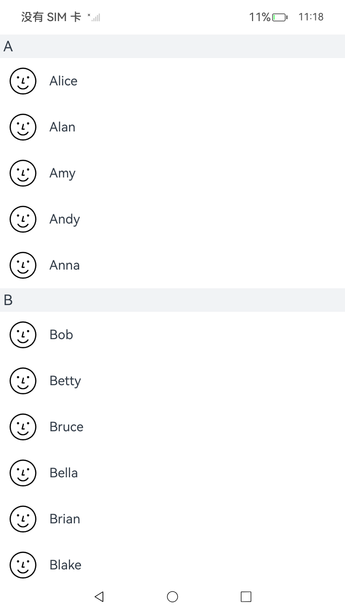

# CoastingAxisEventNDK

## 介绍

本示例通过使用[ArkUI指南文档](https://gitee.com/openharmony/docs/tree/master/zh-cn/application-dev/reference)中各场景的开发示例，展示在工程中，帮助开发者更好地理解ArkUI提供的组件及组件属性并合理使用。该工程中展示的代码详细描述可查如下链接： 

1. [输入事件开发指导](https://gitcode.com/openharmony/docs/blob/master/zh-cn/application-dev/reference/apis-arkui/capi-ui-input-event-h.md)。

本示例展示了如何注册监听和使用惯性滚动轴事件接口。通过惯性轴事件相关接口，在双指抛滑离开触控板时，让滚动类容器继续惯性滚动。

## 效果预览

| 预览                                      | 
| -------------------------------------------- | 


## 使用说明
1. 安装编译生成的hap包，并打开应用；
2. 双指在触摸板上抛滑；


## 工程目录

```
CoastingAxisEventNDK
entry/src/main/ets/
└── pages
    ├── common
    │   └── icon.svg
    └── Index.ets (应用主页面)
entry/src/main/
├── cpp
│   ├── types
│   │   └── libentry
│   │       └── Index.d.ts (NDK函数对应的js映射)
│   ├── CMakeLists.txt (CMake脚本)
|   ├── manager.cpp (创建文本实现CPP文件)
|   ├── manager.h
│   └── napi_init.cpp (NDK函数)
```

## 相关权限

不涉及

## 依赖

不涉及

## 约束和限制

1. 本示例支持标准系统上运行，支持设备：RK3568;

2. 本示例支持API22版本SDK，版本号：6.0.2.53;
   
3. 本示例已支持使DevEco Studio 5.0.5 Release (构建版本：5.0.13.220，构建 2025年7月22日)编译运行

## 下载

如需单独下载本工程，执行如下命令：

```
git init
git config core.sparsecheckout true
echo code/DocsSample/ArkUISample/CoastingAxisEventNDK > .git/info/sparse-checkout
git remote add origin https://gitcode.com/openharmony/applications_app_samples.git
git pull origin master
```