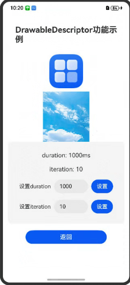

# ArkUI使用DrawableDescriptor指南文档示例

### 介绍

本示例通过使用[drawable_descriptor.h](https://developer.huawei.com/consumer/cn/doc/harmonyos-references/capi-drawable-descriptor-h)中的接口，帮助开发者更好的理解并合理使用ArkUI提供的组件以及组件属性。该工程创建Image组件，入参类型为DrawableDescriptor,并可以设置duration、iteration属性。

### 效果预览

| 首页                                  | 设置属性                                |
|-------------------------------------|-------------------------------------|
|  |  |

### 使用说明

1. 工程启动后，通过文本输入，设置属性值。

2. 在"设置duration"和"设置iteration"文本输入框中，分别输入属性值，其中duration为动图播放的播放时长，iteration为动图播放的次数。

3. 分别点击"设置"，查看已设置的属性值。

4. 工程启动后，会自动加载图片并触发对OH_ArkUI_DrawableDescriptor_GetStaticPixelMap、OH_ArkUI_DrawableDescriptor_GetAnimatedPixelMapArray、OH_ArkUI_DrawableDescriptor_GetAnimatedPixelMapArraySize这几个接口的调用，若接口成功调用可以在DevEco Studio开发环境中的日志界面看到如下相关日志信息：
```
"GetStaticPixelMap success"
"GetAnimatedPixelMapArray success"
"GetAnimatedPixelMapArraySize success"
```

5. 退出工程后，会自动调用OH_ArkUI_DrawableDescriptor_Dispose接口，若接口成功调用可以在DevEco Studio开发环境中的日志界面看到如下相关日志信息：
```
"Dispose success"
```

### 工程目录
```
entry/src/main/cpp
|---CMakeLists.txt                     // 编译脚本
|---napi_init.cpp                      // 实现资源创建、属性设置相关功能
|---drawable_manager.cpp               // 管理DrawableDescriptor节点
|---types
    |---Index.d.ts                     // 注册napi函数到ets层，供上层调用
entry/src/main/ets/
|---entryability
|---pages
|   |---Index.ets                      // 应用主页面
entry/src/ohosTest/
|---ets
|   |---index.test.ets                 // 示例代码测试代码
```

### 具体实现

1. 在[Index.ets](entry%2Fsrc%2Fmain%2Fets%2Fpages%2FIndex.ets)文件中，通过文本输入框和"设置"按钮设置Image组件属性值。
2. 在[Index.d.ts](entry%2Fsrc%2Fmain%2Fcpp%2Ftypes%2Flibentry%2FIndex.d.ts)文件中，注册napi函数到ets层。
3. 在[napi_init.cpp](entry%2Fsrc%2Fmain%2Fcpp%2Fnapi_init.cpp)文件中，实现Index.d.ts中对外的接口。
4. 在[drawable_manager.cpp](entry%2Fsrc%2Fmain%2Fcpp%2Fmanager.cpp)文件中，实现对DrawableDescriptor节点的保存、获取、删除功能。

### 相关权限

不涉及。

### 依赖

不涉及。

### 约束与限制

1.本示例支持标准系统上运行, 支持设备：RK3568等。

2.本示例为Stage模型，支持API20版本SDK，版本号：6.0.0.47，镜像版本号：OpenHarmony_5.0.2.57。

### 下载

如需单独下载本工程，执行如下命令：

````
git init
git config core.sparsecheckout true
echo code/DocsSample/ArkUIDocSample/DrawableDescriptorSample > .git/info/sparse-checkout
git remote add origin https://gitcode.com/openharmony/applications_app_samples.git
git pull origin master
````