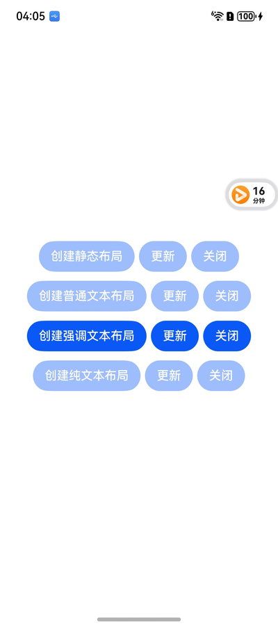

# ArkTS 悬浮球（FloatingBall）

### 介绍

悬浮球是一种在设备屏幕上悬浮的非全屏应用窗口，为应用提供临时的全局能力，完成跨应用交互。

应用可以将关键信息（如比价、搜题或抢单等）以小窗（悬浮球）模式呈现。切换为小窗（悬浮球）模式后，用户可以进行其他界面操作，提升使用体验。

从API version 20开始，支持使用悬浮球能力。

### 效果预览
1、Demo提供4种悬浮球创建布局

2、除了静态布局不支持创建后【更新】，其余布局均支持创建后【更新】

   
   

### 使用说明

单击悬浮球：触发悬浮球点击事件。

长按悬浮球：长按悬浮球震动变为待删除态，可以点击图标单个删除或全部删除。

拖动悬浮球：可以手动拖拽悬浮球改变位置，拖拽时自动避让状态栏、固定态软键盘（改变软键盘为固定态或者悬浮态方法详细介绍请参见输入法服务）、导航条等其他组件， 设备处于横屏场景时不会自动避让输入法。拖拽松手时悬浮球自动吸附在最近的侧边，拖拽到垃圾桶区域（底部中部区域）松手即可删除。
悬浮球位置记忆：关闭悬浮球会记录当前位置，下一次打开功能时自动展示在上次关闭时的位置。旋转屏幕或重启设备会恢复到默认位置，默认位置位于屏幕右上侧。

同一个应用只能启动一个悬浮球，同一个设备最多同时存在两个悬浮球，在超出悬浮球最大个数限制时，打开新的悬浮球会替换最早启动的悬浮球。

### 工程目录

```
entry/src/
 ├── main
 │   ├── ets
 │   │   ├── entryability
 │   │   ├── entrybackupability
 │   │   ├── pages
 │   │       ├── Index.ets               // 悬浮球应用页面
 │   │   ├── util
 │   │       ├── ContextUtil.ts          // 上下文相关类
 │   │       ├── Utils.ts                // 工具类
 │   ├── module.json5
 │   └── resources
 ├── ohosTest
 │   ├── ets
 │   │   ├── test
 │   │       ├── Index.test.ets        // 自动化测试代码
```

### 相关权限

基于安全考虑，仅允许应用在前台时启动悬浮球，并且需要具有ohos.permission.USE_FLOAT_BALL权限。

### 依赖

@ohos/hvigor-ohos-online-sign-plugin，最低版本"3.2.0"。

### 约束与限制

1.本示例仅支持标准系统上运行, 支持设备：手机和平板。

2.本示例为Stage模型，支持API20版本SDK，版本号：6.0.0.49，镜像版本号：OpenHarmony-6.0.2.53(Beta1)。

3.本示例需要使用DevEco Studio 5.1.1 Release (Build Version: 5.1.1.720, built on July 1, 2025)及以上版本才可编译运行。

### 下载

如需单独下载本工程，执行如下命令：

```
git init
git config core.sparsecheckout true
echo code/XXXXXXXXXXX????????? > .git/info/sparse-checkout
git remote add origin https://gitcode.com/openharmony/applications_app_samples.git
git pull origin master
```
