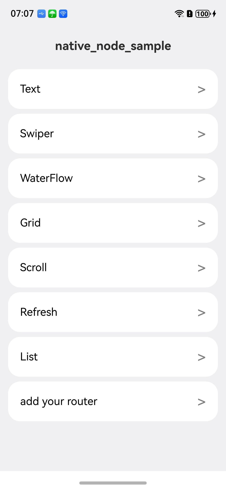

# Native_node_Sample

## 介绍

本示例展示了如何创建文本、输入框、文本域、Grid、滑动容器、Form表单类、信息选择图片类等组件，配置其样式、属性与事件，还含 UI 任务、反色设置，可见区域变化监听等功能，构建文本页面。该工程中展示的接口详细描述可查如下链接：

[native_node.h](https://developer.huawei.com/consumer/cn/doc/harmonyos-references/capi-native-node-h)

## 效果预览
<table>
  <tr>
    <th>首页</th>
    <th>Text</th>
    <th>Swiper</th>
    <th>WaterFlow</th>
    <th>Grid</th>
    <th>Scroll</th>
    <th>Refresh</th>
    <th>List</th>
    <th>XComponent</th>
    <th>Public</th>
    <th>Form表单类</th>
    <th>信息选择图片类</th>
  </tr>
  <tr>
    <td></td>
    <td></td>
    <td></td>
    <td></td>
    <td></td>
    <td></td>
    <td></td>
    <td></td>
    <td></td>
    <td></td>
    <td></td>
    <td></td>
  </tr>
</table>

## 使用说明
1. 安装编译生成的hap包，并打开应用；
2. 进入首页，可选择不同模块页面。
3. 点击Text选择框进入Text组件的CAPI接口展示界面；
4. 点击Swiper选择框进入Swiper组件的CAPI接口展示界面；
5. 点击Public选择框进入通用属性的CAPI接口展示界面；
6. 点击"Form表单类"选择框进入表单组件的CAPI接口展示界面;<br/>
   a.点击“选择节点类型”按钮选择要创建的组件类型，如“TOGGLE”<br/>
   b.点击"创建"按钮进行节点创建，当前状态会显示创建成功<br/>
   c.点击下边“选择节点属性”，先选择对应节点类型，如“TOGGLE”，再选择要设置的属性类型<br/>
   d.点击“设置属性值”，进行属性设置；点击“获取属性值”，返回值文本框中可以显示当前属性值；点击“重置属性值”会进行属性重置<br/>
   e.点击“清理”清理已创建“TOGGLE”节点。
7. 点击"信息选择图片类"选择框进入多个组件的CAPI接口展示界面；属性值设置为“none”时，图片效果以代码默认值展示。
   "信息选择图片类"界面使用步骤如下：<br/>
   a.点击“选择节点类型”按钮选择要创建的组件类型，如“IMAGE_SPAN”<br/>
   b.点击"创建"按钮进行节点创建，当前状态会显示创建成功<br/>
   c.点击下边“选择节点属性”，先选择对应节点类型，如“IMAGE_SPAN”，再选择要设置的属性类型<br/>
   d.点击“设置属性值”，进行属性设置；点击“获取属性值”，返回值文本框中可以显示当前属性值；点击“重置属性值”会进行属性重置<br/>
   e.创建DatePicker、TimePicker、TextPicker、CalendarPicker组件时，会自动触发相关事件注册，
   可以在DevEco Studio开发环境中的日志界面看到如下相关日志信息：
8. 点击XComponent选择框进入XComponent组件的CAPI接口展示界面(OpenHarmpny和HarmonyOS展示效果有区别，请以实际效果为准) ；
```
"BIND_EVENT success"
```

## 工程目录

```
native_node_sample
entry/src/main/cpp/
├── ArkUINode.h
├── ArkUINodeAdapter.h
├── baseUtils.cpp
├── baseUtils.h
├── CMakeLists.txt (CMake脚本)
├── form_manager.cpp
├── form_manager.h
├── GridMaker.cpp
├── GridMaker.h
├── imagespan_manager.cpp
├── imagespan_manager.h
├── ListItemGroup.h
├── ListItemSwipe.h
├── ListMaker.cpp
├── ListMaker.h
├── manager.cpp 
├── manager.h
├── napi_init.cpp
├── PublicEvent.cpp
├── PublicEvent.h
├── RefreshMaker.cpp
├── RefreshMaker.h
├── ScrollEvent.h
├── ScrollMaker.cpp
├── ScrollMaker.h
├── ScrollUtils.cpp
├── ScrollUtils.h
├── SwiperMaker.cpp
├── SwiperMaker.h
├── TextMaker.cpp
├── TextMaker.h
├── WaterFlowMaker.cpp
├── WaterFlowMaker.h
├── WaterFlowSection.h
├── XComponentMaker.cpp
└── XComponentMaker.h
    └── types/libentry
        ├── Index.d.ts (函数对应的js映射)
        └── oh-package.json5

entry/src/main/ets/
├── entryability
│   └── EntryAbility.ets
├── entrybackupability
│   └── EntryBackupAbility.ets
└── pages
    ├── Index.ets          (获取导航页面)
    ├── page_form.ets      (Form页面)
    ├── page_grid.ets      (Grid页面)
    ├── page_imagespan.ets (imagespan页面)
    ├── page_list.ets      (List页面)
    ├── page_refresh.ets   (Refresh页面)
    ├── page_scroll.ets    (Scroll页面)
    ├── page_swiper.ets    (Swiper页面)
    ├── page_text.ets      (文本界面)
    ├──page_xcomponent.ets (XComponent界面)
    ├── page_waterflow.ets (WaterFlow界面)
    ├──page_waterflow.ets (WaterFlow界面)
    └── page_public_event.ets (通用属性界面)

entry/src/main/resources/
├── base
│   ├── element
│   │   ├── color.json
│   │   ├── float.json
│   │   └── string.json
│   ├── media
│   │   ├── background.png
│   │   ├── foreground.png
│   │   ├── layered_image.json
│   │   └── startIcon.png
│   └── profile
│       ├── backup_config.json
│       └── main_pages.json
├── dark
│   └── element
│       └── color.json
└── rawfile

entry/src/ohosTest/ets/test
├── Ability.test.ets
├── List.test.ets
└── Public.test.ets (通用属性测试用例)
```

## 相关权限

不涉及

## 依赖

不涉及

## 约束和限制

1. 本示例支持标准系统上运行，支持设备：RK3568;

2. 本示例支持API22版本SDK，版本号：6.0.2.54;

3. 本示例已支持使DevEco Studio 5.1.1 Release (构建版本：5.1.1.840，构建 2025年9月20日)编译运行

## 下载

如需单独下载本工程，执行如下命令：

```
git init
git config core.sparsecheckout true
echo code/DocsSample/ArkUISample/native_node_sample > .git/info/sparse-checkout
git remote add origin https://gitcode.com/openharmony/applications_app_samples.git
git pull origin master
```