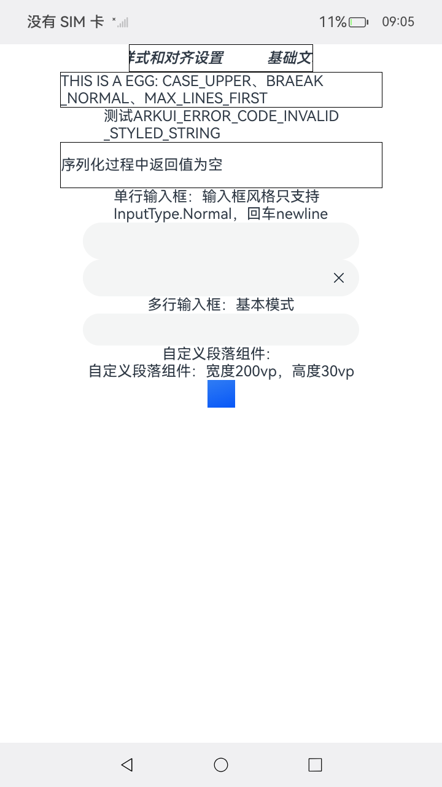
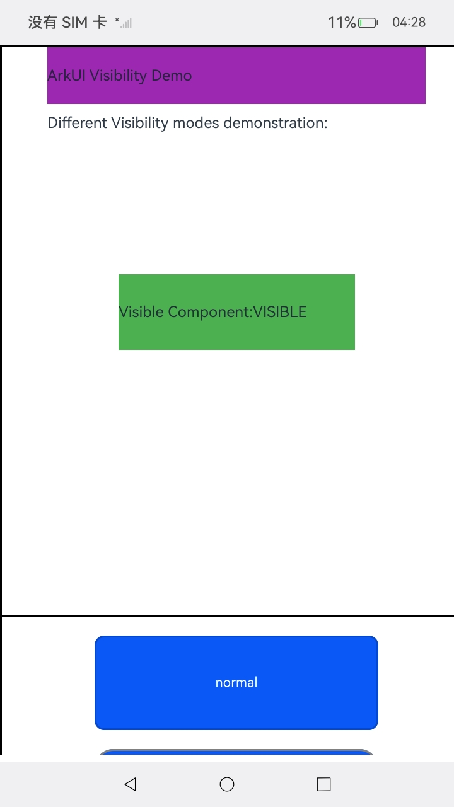
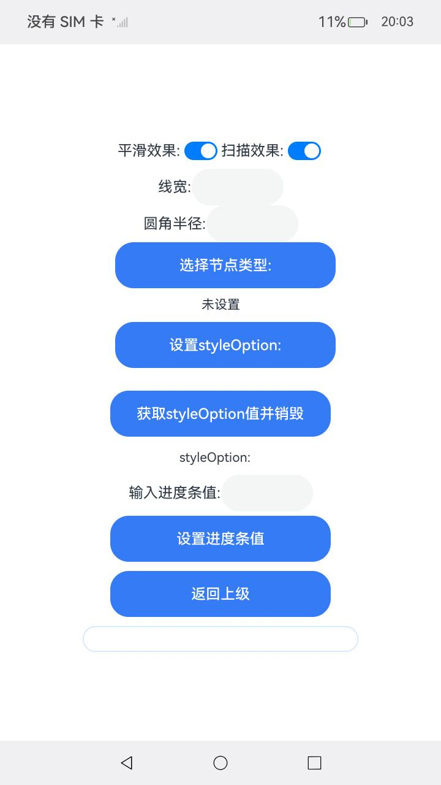
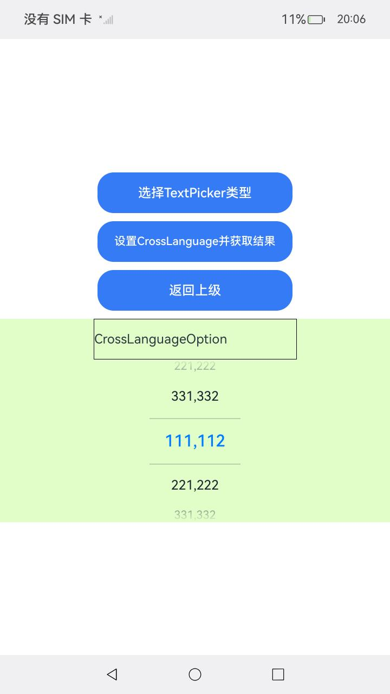
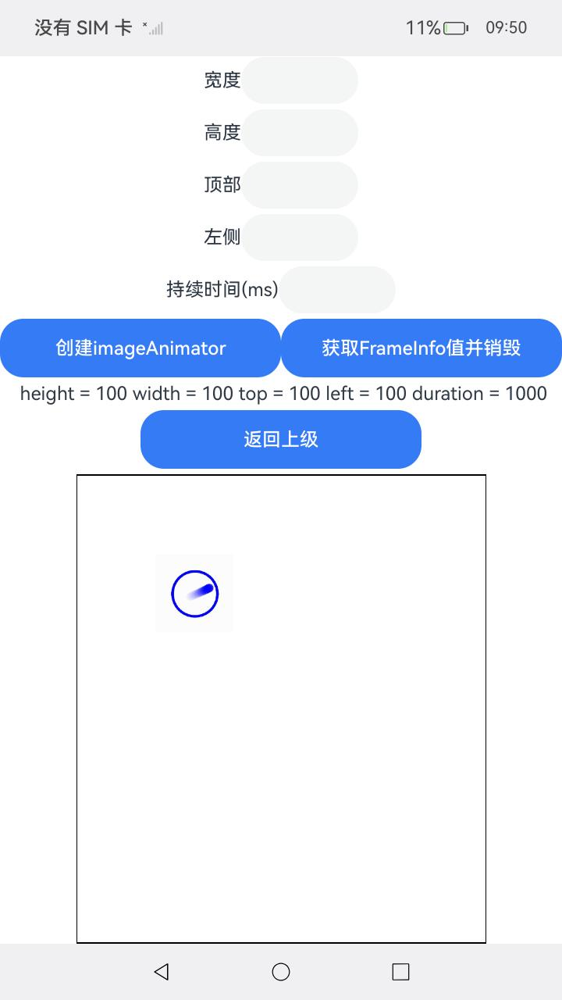
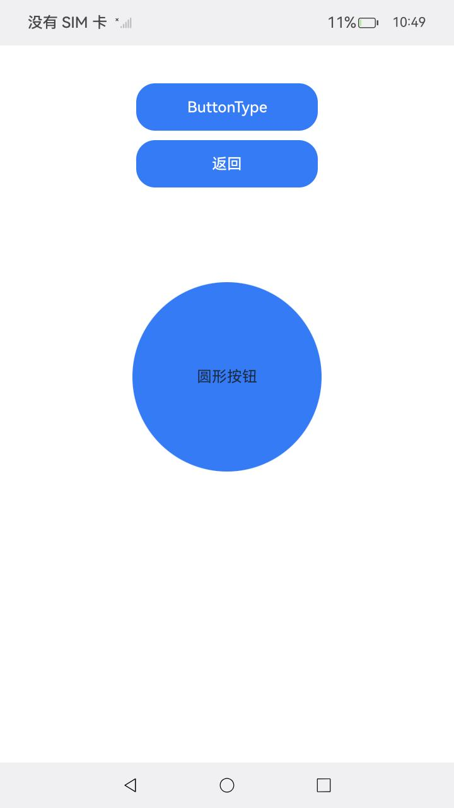
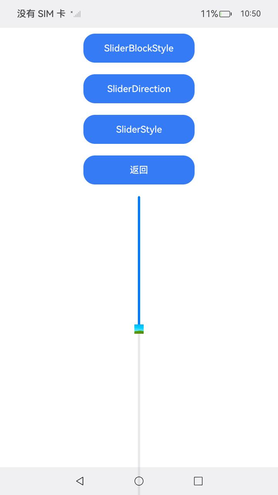

# Native_node_Sample

## 介绍

本示例展示了如何创建文本、输入框、文本域、视效、动效、进度条、日期选择器、日历选择器、文本选择器、图片、滑动容器等组件，配置其样式、属性与事件设置等功能，构建文本页面。

## 效果预览

| 首页 | Text页面                                              | Swiper页面                                              |Public页面                                              |
| ---- | ----------------------------------------------------- | ------------------------------------------------------- | ------------------------------------------------------- |
|      |  |  |  |


## 使用说明

1. 安装编译生成的hap包，并打开应用；
2. 首页面会出现对应text选择框，点击选择框进入text界面；
3. 点击Public选择框进入通用属性的CAPI接口展示界面。
4. 点击Progress选择框进入Progress组件的CAPI接口展示界面；

| Progress页面                                                |
|-----------------------------------------------------------|
|  |
5. 点击DatePicker选择框进入DatePicker组件的CAPI接口展示界面；

| DatePicker页面                                                |
|-----------------------------------------------------------|
|  |
6. 点击TextPicker选择框进入TextPicker组件的CAPI接口展示界面；

| TextPicker页面                                                |
|-----------------------------------------------------------|
|  |
7. 点击CalendarPicker选择框进入CalendarPicker组件的CAPI接口展示界面；

| CalendarPicker页面                                                |
|-----------------------------------------------------------|
|  |
8. 点击Image选择框进入Image组件的CAPI接口展示界面；

| Image页面                                                |
|--------------------------------------------------------|
|  |
9. 点击ImageAnimator选择框进入ImageAnimator组件的CAPI接口展示界面；

| ImageAnimator页面                                                |
|--------------------------------------------------------|
|  |
10. 点击Button选择框进入Button组件的CAPI接口展示界面；

| Button页面                                                |
|-----------------------------------------------------------|
|  |
11. 点击Slider选择框进入Slider组件的CAPI接口展示界面；

| Slider页面                                                |
|-----------------------------------------------------------|
|  |
12. 点击CheckboxShape选择框进入checkbox组件的CAPI接口展示界面；

| CheckboxShape页面                                                |
|-----------------------------------------------------------|
|  |
13. 点击HoverModeAreaType选择框进入HoverModeArea组件的CAPI接口展示界面；

14. 点击XComponent选择框进入XComponent组件的CAPI接口展示界面；

| XComponent页面(OpenHarmpny和HarmonyOS展示效果有区别，请以实际效果为准)  |
|-----------------------------------------------------------|
|  |

## 工程目录

```
native_type_sample
entry/src/main/ets/
└── pages
    ├── Index.ets (获取导航页面)
    ├── page_animation.ets (动效界面)
    ├── page_button.ets (按钮界面)
    ├── page_visual_effects.ets (视效界面)
    ├── page_slider.ets (滑块界面)
    ├── page_checkbox_shape.ets (复选框形状界面)
    ├── page_hovermode_areatype.ets (悬停模式区域类型界面)
    ├── page_text.ets (文本界面)
    ├── page_swiper.ets (滑动容器页面)
    ├── page_accessibility.ets (无障碍界面)
    ├── page_public_event.ets (通用属性页面)
    ├──page_xcomponent.ets (XComponent界面)
    ├── page_progress.ets (进度条页面)
    ├── page_calendar_picker.ets (日历选择器页面)
    ├── page_date_picker.ets (日期选择器页面)
    ├── page_image.ets (图片页面)
    ├── page_image_animator.ets (图片帧页面)
    ├── page_text_picker.ets (文本选择器页面)
    └── page_embedded_component.ets (嵌入式组件界面)
entry/src/main/
├── cpp
│   ├── types
│   │   └── libentry
│   │       └── Index.d.ts (函数对应的js映射)
│   ├── ArkUIAnimationNode.h
│   ├── ArkUIBaseNode.h
│   ├── ArkUIButtonNode.h
│   ├── ArkUIColumnNode.h
│   ├── ArkUINode.h
│   ├── ArkUINumber.h
│   ├── ArkUITextNode.h
│   ├── ArkUIVisualEffectsNode.h
│   ├── NativeModule.h
│   ├── CMakeLists.txt (CMake脚本)
|   ├── manager.cpp 
|   ├── manager.h
│   ├── napi_init.cpp
|   ├── .......
|   ├── baseUtils.cpp
|   ├── baseUtils.h
|   ├── PublicEvent.cpp
|   ├── PublicEvent.h
|   ├── ButtonMaker.cpp
|   ├── ButtonMaker.h
|   ├── SwiperMaker.cpp
|   ├── SwiperMaker.h
|   ├── SliderMaker.cpp
|   ├── SliderMaker.h
|   ├── TextMaker.cpp
│   ├── TextMaker.h
|   ├── AccessibilityMaker.cpp
│   ├── AccessibilityMaker.h
|   ├── XComponentMaker.cpp
│   ├── XComponentMaker.h
|   ├── NodeManager.cpp
│   ├── NodeManager.h
|   ├── EmbeddedComponentMaker.cpp
│   ├── EmbeddedComponentMaker.h
|   ├── CheckboxShapeMaker.cpp
│   ├── CheckboxShapeMaker.h
|   ├── HoverModeAreaTypeMaker.cpp
│   └── HoverModeAreaTypeMaker.h
└── resources
    ├── base
    │   ├── element
    │   │   ├── color.json
    │   │   ├── float.json
    │   │   └── string.json
    │   └── media
```

## 组件描述

1. [Progress组件](https://gitcode.com/openharmony/docs/blob/master/zh-cn/application-dev/reference/apis-arkui/capi-native-node-h.md#arkui_nodetype)
   为进度条组件，用于显示内容加载或操作处理等进度。
2. [Datepicker组件](https://gitcode.com/openharmony/docs/blob/master/zh-cn/application-dev/reference/apis-arkui/capi-native-node-h.md#arkui_nodetype)
   为滑动选择日期的组件。
3. [TextPicker组件](https://gitcode.com/openharmony/docs/blob/master/zh-cn/application-dev/reference/apis-arkui/capi-native-node-h.md#arkui_nodetype)
   为滑动选择文本、图片或图文混排内容的组件。
4. [CalendarPicker组件](https://gitcode.com/openharmony/docs/blob/master/zh-cn/application-dev/reference/apis-arkui/capi-native-node-h.md#arkui_nodetype)
   为日历选择器组件，提供下拉日历弹窗，可以让用户选择日期。
5. [Image组件](https://gitcode.com/openharmony/docs/blob/master/zh-cn/application-dev/reference/apis-arkui/capi-native-node-h.md#arkui_nodetype)
   为图片组件，常用于在应用中显示图片。
6. [ImageAnimator组件](https://gitcode.com/openharmony/docs/blob/master/zh-cn/application-dev/reference/apis-arkui/capi-native-node-h.md#arkui_nodetype)
   该组件提供帧动画组件来实现逐帧播放图片的能力，可以配置需要播放的图片列表，每张图片可以配置时长。

## 相关权限

不涉及

## 依赖

不涉及

## 约束和限制

1. 本示例支持标准系统上运行，支持设备：RK3568;

2. 本示例支持API20版本SDK，版本号：6.0.0.36;

3. 本示例已支持使DevEco Studio 5.1.1 Release (构建版本：5.1.1.840，构建 2025年9月20日)编译运行

## 下载

如需单独下载本工程，执行如下命令：

```
git init
git config core.sparsecheckout true
echo code/DocsSample/NativeType/native_node_sample > .git/info/sparse-checkout
git remote add origin https://gitcode.com/openharmony/applications_app_samples.git
git pull origin master
```
