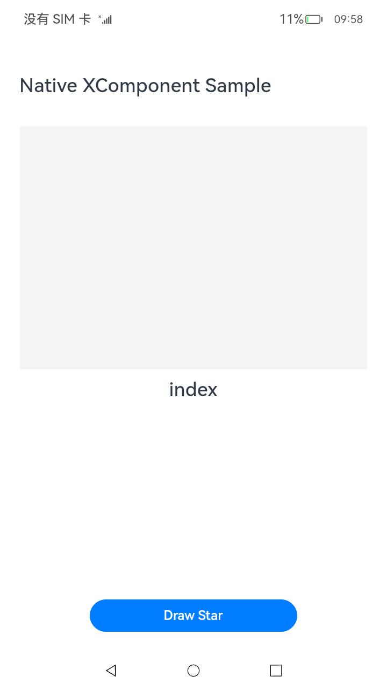
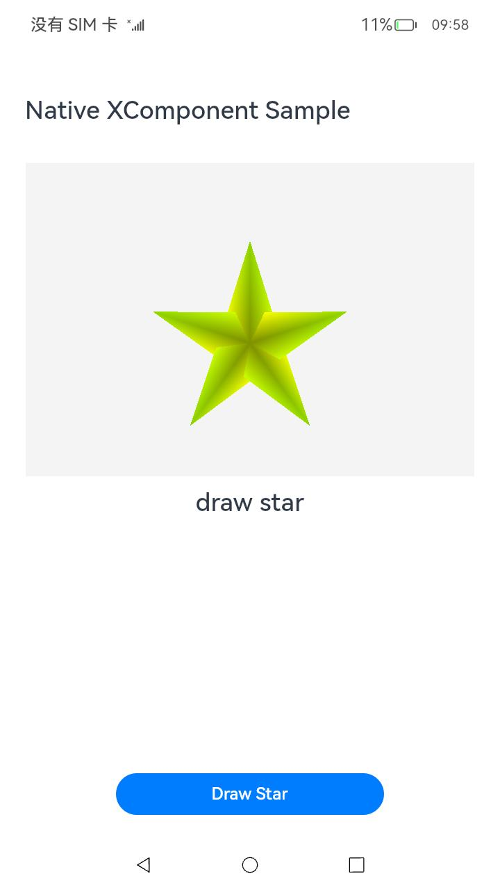
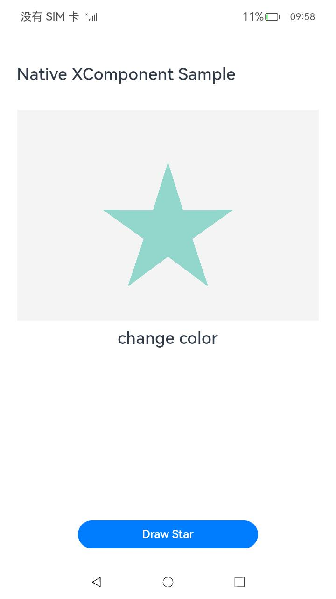
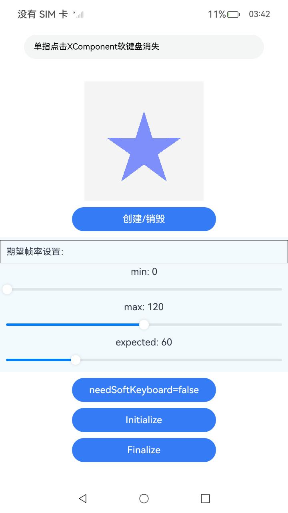
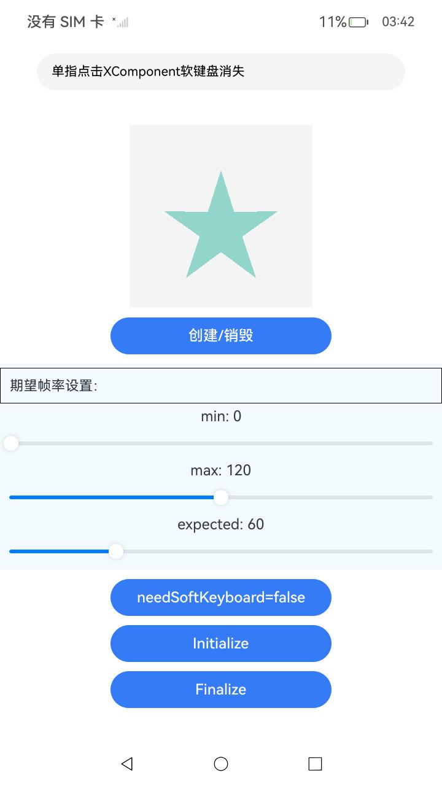

# Native XComponent
本示例包含三个小示例，该工程中展示的代码详细描述可查看如下链接：

1.[native_interface_xcomponent.h](https://gitcode.com/openharmony/docs/blob/master/zh-cn/application-dev/reference/apis-arkui/capi-native-interface-xcomponent-h.md)

示例一：使用NDK接口创建XComponent，并使用NativeXComponent相关接口

示例二：使用ArkTS声明式方法创建XComponent，并使用NativeXComponent相关接口

示例三：使用自定义节点创建XComponent，并使用SurfaceHolder相关接口

### 工程目录

```
├──entry/src/main
│  ├──cpp                           // C++代码区
│  │  ├──CMakeLists.txt             // CMake配置文件
│  │  ├──napi_init.cpp              // Napi模块注册
│  │  ├──manager                    // 生命周期管理模块
│  │  │  ├──plugin_manager.cpp
│  │  │  └──plugin_manager.h
│  │  ├──render                     // 渲染模块
│  │  │  ├──egl_core.cpp
│  │  │  ├──egl_core.h
│  │  │  ├──EGLConst.h
│  │  │  ├──plugin_render.cpp
│  │  │  ├──plugin_render.h
│  │  │  ├──EGLRender.cpp
│  │  │  └──EGLRender.h
|  |  ├──types
|  |  |  ├──libnativerender
|  |  |  |  ├──Index.d.ts
|  |  |  |  ├──oh-package.json5
│  ├──ets                           // ets代码区
│  │  ├──entryability
│  │  │  ├──EntryAbility.ts         // 程序入口类
|  |  ├──entrybackupability
|  |  |  ├──EntryBackupAbility.ets
│  │  ├──pages                      // 页面文件
│  │     ├──Index.ets               // 主界面
|  |     ├──PageOne.ets
|  |     ├──PageTwo.ets
|  |     ├──PageThree.ets
|  ├──resources         			// 资源文件目录
```

# Native XComponent（样例一）

### 简介

本示例展示了如何在native侧使用ArkUI NDK API创建XComponent组件进行自定义绘制。具体步骤包括：创建组件，获取NativeXComponent实例，注册XComponent生命周期和事件回调，通过回调获取NativeWindow后使用OpenGL ES/EGL接口在XComponent组件上进行图形绘制，最后在ArkTS层使用ContentSlot站位组件进行挂载显示。功能主要包括点击按钮绘制一个五角星，并可以通过点击XComponent区域改变五角星的颜色。

### 效果预览

| 主页                                 | 绘制五角星                                    | 改变颜色                                            |
| ------------------------------------ | --------------------------------------------- | --------------------------------------------------- |
|  |  |  |

使用说明

1. 安装编译生成的hap包，并打开应用。

2. 点击页面底部“Draw Star”按钮，页面将绘制一个五角星。

3. 点击XComponent组件区域（页面中灰色区域）改变五角星颜色。


### 具体实现

通过在IDE中创建Native c++ 工程，在c++代码中定义对外接口为drawPattern，在js侧调用该接口可在页面上绘制出一个三角形。

在XComponent的OnSurfaceCreated回调中获取NativeWindow实例并初始化EGL环境。调用OH_NativeXComponent_GetXComponentSize接口获取XComponent的宽高，并以此为输入调用EGL相关的绘制接口在NativeWindow上绘制出一个五角星。在DispatchTouchEvent回调中再次调用EGL相关的绘制接口在NativeWindow上绘制出一个大小相同、颜色不同的五角星，以达到点击后改变颜色的目的。

源码参考：[render目录](entry/src/main/cpp/render)下的文件。

涉及到的相关接口：

| 接口名                                                       | 描述                                                         |
| ------------------------------------------------------------ | ------------------------------------------------------------ |
| OH_NativeXComponent_GetXComponentId(OH_NativeXComponent* component, char* id, uint64_t* size) | 获取XComponent的id。                                         |
| OH_NativeXComponent_GetXComponentSize(OH_NativeXComponent* component, const void* window, uint64_t* width, uint64_t* height) | 获取XComponent持有的surface的大小。                          |
| OH_NativeXComponent_GetXComponentOffset(OH_NativeXComponent* component, const void* window, double* x, double* y) | 获取XComponent持有的surface相对窗口左上角的偏移量。          |
| OH_NativeXComponent_GetTouchEvent(OH_NativeXComponent* component, const void* window, OH_NativeXComponent_TouchEvent* touchEvent) | 获取由XComponent触发的触摸事件。                             |
| OH_NativeXComponent_GetTouchPointToolType(OH_NativeXComponent* component, uint32_t pointIndex, OH_NativeXComponent_TouchPointToolType* toolType) | 获取XComponent触摸点的工具类型。                             |
| OH_NativeXComponent_GetTouchPointTiltX(OH_NativeXComponent* component, uint32_t pointIndex, float* tiltX) | 获取XComponent触摸点处相对X轴的倾斜角度。                    |
| OH_NativeXComponent_GetTouchPointTiltY(OH_NativeXComponent* component, uint32_t pointIndex, float* tiltY) | 获取XComponent触摸点处相对Y轴的倾斜角度。                    |
| OH_NativeXComponent_GetMouseEvent(OH_NativeXComponent* component, const void* window, OH_NativeXComponent_MouseEvent* mouseEvent) | 获取由XComponent触发的鼠标事件。                             |
| OH_NativeXComponent_RegisterCallback(OH_NativeXComponent* component, OH_NativeXComponent_Callback* callback) | 为此OH_NativeXComponent实例注册生命周期和触摸事件回调。      |
| OH_NativeXComponent_RegisterMouseEventCallback(OH_NativeXComponent* component, OH_NativeXComponent_MouseEvent_Callback* callback) | 为此OH_NativeXComponent实例注册鼠标事件回调。                |
| OH_NativeXComponent_RegisterFocusEventCallback(OH_NativeXComponent* component, void (*callback)(OH_NativeXComponent* component, void* window)) | 为此OH_NativeXComponent实例注册获得焦点事件回调。            |
| OH_NativeXComponent_RegisterKeyEventCallback(OH_NativeXComponent* component, void (*callback)(OH_NativeXComponent* component, void* window)) | 为此OH_NativeXComponent实例注册按键事件回调。                |
| OH_NativeXComponent_RegisterBlurEventCallback(OH_NativeXComponent* component, void (*callback)(OH_NativeXComponent* component, void* window)) | 为此OH_NativeXComponent实例注册失去焦点事件回调。            |
| OH_NativeXComponent_GetKeyEvent(OH_NativeXComponent* component, OH_NativeXComponent_KeyEvent** keyEvent) | 获取由XComponent触发的按键事件。                             |
| OH_NativeXComponent_GetKeyEventAction(OH_NativeXComponent_KeyEvent* keyEvent, OH_NativeXComponent_KeyAction* action) | 获取按键事件的动作。                                         |
| OH_NativeXComponent_GetKeyEventCode(OH_NativeXComponent_KeyEvent* keyEvent, OH_NativeXComponent_KeyCode* code) | 获取按键事件的键码值。                                       |
| OH_NativeXComponent_GetKeyEventSourceType(OH_NativeXComponent_KeyEvent* keyEvent, OH_NativeXComponent_EventSourceType* sourceType) | 获取按键事件的输入源类型。                                   |
| OH_NativeXComponent_GetKeyEventDeviceId(OH_NativeXComponent_KeyEvent* keyEvent, int64_t* deviceId) | 获取按键事件的设备ID。                                       |
| OH_NativeXComponent_GetKeyEventTimestamp(OH_NativeXComponent_KeyEvent* keyEvent, int64_t* timestamp) | 获取按键事件的时间戳。                                       |
| OH_ArkUI_QueryModuleInterfaceByName(ArkUI_NativeAPIVariantKind type, const char* structName) | 获取指定类型的Native模块接口集合。                           |
| OH_ArkUI_GetNodeContentFromNapiValue(napi_env env, napi_value value, ArkUI_NodeContentHandle* content) | 获取ArkTS侧创建的NodeContent对象映射到native侧的ArkUI_NodeContentHandle。 |
| OH_ArkUI_NodeContent_SetUserData(ArkUI_NodeContentHandle content, void* userData) | 在NodeContent对象上保存自定义数据。                          |
| OH_ArkUI_NodeContentEvent_GetNodeContentHandle(ArkUI_NodeContentEvent* event) | 获取触发事件的NodeContent对象。                              |
| OH_ArkUI_NodeContent_GetUserData(ArkUI_NodeContentHandle content) | 获取在NodeContent对象上保存的自定义数据。                    |
| OH_ArkUI_NodeContentEvent_GetEventType(ArkUI_NodeContentEvent* event) | 获取触发NodeContent事件的事件类型。                          |
| OH_ArkUI_NodeContent_AddNode(ArkUI_NodeContentHandle content, ArkUI_NodeHandle node) | 将一个ArkUI组件节点添加到对应的NodeContent对象下。           |
| OH_ArkUI_NodeContent_RegisterCallback(ArkUI_NodeContentHandle content, ArkUI_NodeContentCallback callback) | 注册NodeContent事件函数。                                    |
| OH_NativeXComponent_GetNativeXComponent(ArkUI_NodeHandle node) | 基于Native接口创建的组件实例获取OH_NativeXComponent类型的指针。 |


# Native XComponent（样例二）

### 介绍

本示例中主要介绍开发者如何使用Native XComponent接口来获取NativeWindow实例、获取布局/事件信息、注册事件回调并通过OpenGL/EGL实现在页面上绘制形状。功能主要包括点击按钮绘制一个五角星，并可以通过点击XComponent区域改变五角星的颜色。

### 效果预览

| 主页                                 | 绘制五角星                                    | 改变颜色                                            |
| ------------------------------------ | --------------------------------------------- | --------------------------------------------------- |
|  |  |  |

使用说明

1. 安装编译生成的hap包，并打开应用。

2. 点击页面底部“Draw Star”按钮，页面将绘制一个五角星。

3. 点击XComponent组件区域（页面中灰色区域）改变五角星颜色。


### 具体实现

通过在IDE中创建Native c++ 工程，在c++代码中定义对外接口为drawPattern，在js侧调用该接口可在页面上绘制出一个三角形。

在XComponent的OnSurfaceCreated回调中获取NativeWindow实例并初始化EGL环境。调用OH_NativeXComponent_GetXComponentSize接口获取XComponent的宽高，并以此为输入调用EGL相关的绘制接口在NativeWindow上绘制出一个五角星。在DispatchTouchEvent回调中再次调用EGL相关的绘制接口在NativeWindow上绘制出一个大小相同、颜色不同的五角星，以达到点击后改变颜色的目的。

源码参考：[render目录](entry/src/main/cpp/render)下的文件。

涉及到的相关接口：

| 接口名                                                       | 描述                                                    |
| ------------------------------------------------------------ | ------------------------------------------------------- |
| OH_NativeXComponent_GetXComponentId(OH_NativeXComponent* component, char* id, uint64_t* size) | 获取XComponent的id。                                    |
| OH_NativeXComponent_GetXComponentSize(OH_NativeXComponent* component, const void* window, uint64_t* width, uint64_t* height) | 获取XComponent持有的surface的大小。                     |
| OH_NativeXComponent_GetXComponentOffset(OH_NativeXComponent* component, const void* window, double* x, double* y) | 获取XComponent持有的surface相对窗口左上角的偏移量。     |
| OH_NativeXComponent_GetTouchEvent(OH_NativeXComponent* component, const void* window, OH_NativeXComponent_TouchEvent* touchEvent) | 获取由XComponent触发的触摸事件。                        |
| OH_NativeXComponent_GetTouchPointToolType(OH_NativeXComponent* component, uint32_t pointIndex, OH_NativeXComponent_TouchPointToolType* toolType) | 获取XComponent触摸点的工具类型。                        |
| OH_NativeXComponent_GetTouchPointTiltX(OH_NativeXComponent* component, uint32_t pointIndex, float* tiltX) | 获取XComponent触摸点处相对X轴的倾斜角度。               |
| OH_NativeXComponent_GetTouchPointTiltY(OH_NativeXComponent* component, uint32_t pointIndex, float* tiltY) | 获取XComponent触摸点处相对Y轴的倾斜角度。               |
| OH_NativeXComponent_GetMouseEvent(OH_NativeXComponent* component, const void* window, OH_NativeXComponent_MouseEvent* mouseEvent) | 获取由XComponent触发的鼠标事件。                        |
| OH_NativeXComponent_RegisterCallback(OH_NativeXComponent* component, OH_NativeXComponent_Callback* callback) | 为此OH_NativeXComponent实例注册生命周期和触摸事件回调。 |
| OH_NativeXComponent_RegisterMouseEventCallback(OH_NativeXComponent* component, OH_NativeXComponent_MouseEvent_Callback* callback) | 为此OH_NativeXComponent实例注册鼠标事件回调。           |
| OH_NativeXComponent_RegisterFocusEventCallback(OH_NativeXComponent* component, void (*callback)(OH_NativeXComponent* component, void* window)) | 为此OH_NativeXComponent实例注册获得焦点事件回调。       |
| OH_NativeXComponent_RegisterKeyEventCallback(OH_NativeXComponent* component, void (*callback)(OH_NativeXComponent* component, void* window)) | 为此OH_NativeXComponent实例注册按键事件回调。           |
| OH_NativeXComponent_RegisterBlurEventCallback(OH_NativeXComponent* component, void (*callback)(OH_NativeXComponent* component, void* window)) | 为此OH_NativeXComponent实例注册失去焦点事件回调。       |
| OH_NativeXComponent_GetKeyEvent(OH_NativeXComponent* component, OH_NativeXComponent_KeyEvent** keyEvent) | 获取由XComponent触发的按键事件。                        |
| OH_NativeXComponent_GetKeyEventAction(OH_NativeXComponent_KeyEvent* keyEvent, OH_NativeXComponent_KeyAction* action) | 获取按键事件的动作。                                    |
| OH_NativeXComponent_GetKeyEventCode(OH_NativeXComponent_KeyEvent* keyEvent, OH_NativeXComponent_KeyCode* code) | 获取按键事件的键码值。                                  |
| OH_NativeXComponent_GetKeyEventSourceType(OH_NativeXComponent_KeyEvent* keyEvent, OH_NativeXComponent_EventSourceType* sourceType) | 获取按键事件的输入源类型。                              |
| OH_NativeXComponent_GetKeyEventDeviceId(OH_NativeXComponent_KeyEvent* keyEvent, int64_t* deviceId) | 获取按键事件的设备ID。                                  |
| OH_NativeXComponent_GetKeyEventTimestamp(OH_NativeXComponent_KeyEvent* keyEvent, int64_t* timestamp) | 获取按键事件的时间戳。                                  |


# NativeXComponent(样例三)

### 介绍

本示例主要介绍开发者如何使用ArkUI NDK API创建XComponent组件进行自定义绘制。主要包括：创建组件，获取ArkUI_NodeHandle和OH_ArkUI_SurfaceHolder实例，注册Surface生命周期和无障碍回调，设置可变帧率，获取NativeWindow后使用OpenGL ES/EGL接口在XComponent组件上进行图形绘制。功能主要包括绘制一个五角星，期望帧率设置，点击按钮开启/关闭软键盘，并可以通过点击XComponent区域改变五角星的颜色。

### 效果预览

| 绘制五角星                                         | 改变颜色                                                |
|-----------------------------------------------|-----------------------------------------------------|
|  |  |

使用说明

1. 安装编译生成的hap包，并打开应用。
3. 点击XComponent组件区域（页面中蓝色五角星所在区域）改变五角星颜色。
3. 点击“单指点击XComponent软键盘消失”对应区域，软键盘拉起；点击XComponent组件区域，软键盘消失。
4. 点击needSoftKeyboard=false 按钮，点击“单指点击XComponent软键盘不消失”对应区域，软键盘拉起；点击XComponent组件区域，软键盘不消失。
5. 拖动期望帧率设置下的滑动条，可以控制期望帧率，具体通过打印日志的速度来衡量，日志检索"OnFrameCallback count"关键字。


### 具体实现

通过在IDE中创建Native c++ 工程，在c++代码中定义对外接口为BindNode，在ArkTS侧调用该接口用于注册Surface生命周期、事件和无障碍等回调，在回调逻辑中实现绘制五角星的逻辑。

基于OH_ArkUI_SurfaceHolder实例，在Native侧调用OH_ArkUI_XComponent_GetNativeWindow创建NativeWindow实例并初始化
EGL环境。在Native侧的OnsurfaceChanged回调中，传入OH_ArkUI_SurfaceHolder、宽和高，并以此为输入调用EGL相关的接口改变对应NativeWindow的尺寸和内容。

源码参考：[main目录](entry/src/main/)下的文件。涉及到的相关接口：

| 接口名                                                       | 描述                                                         |
| ------------------------------------------------------------ | ------------------------------------------------------------ |
| OH_ArkUI_QueryModuleInterfaceByName(ArkUI_NativeAPIVariantKind type, const char* structName) | 获取指定类型的Native模块接口集合。                                         |
| OH_ArkUI_XComponent_GetNativeWindow(OH_ArkUI_SurfaceHolder* surfaceHolder) | 获取与OH_ArkUI_SurfaceHolder实例关联的nativeWindow。                                         |
| OH_ArkUI_SurfaceHolder_RemoveSurfaceCallback(OH_ArkUI_SurfaceHolder* surfaceHolder, OH_ArkUI_SurfaceCallback* callback) | 从OH_ArkUI_SurfaceHolder实例中移除先前添加的Surface生命周期回调。                                         |
| OH_ArkUI_SurfaceCallback_Dispose(OH_ArkUI_SurfaceCallback* callback) | 释放OH_ArkUI_SurfaceCallback对象。                                         |
| OH_ArkUI_SurfaceHolder_Dispose(OH_ArkUI_SurfaceHolder* surfaceHolder) | 释放OH_ArkUI_SurfaceHolder对象。                                         |
| OH_ArkUI_NodeEvent_GetEventType(ArkUI_NodeEvent* event) | 从组件事件获取事件类型。                                         |
| OH_ArkUI_NodeEvent_GetNodeHandle(ArkUI_NodeEvent* event) | 获取触发组件事件的组件对象。                                         |
| OH_ArkUI_GetNodeHandleFromNapiValue(napi_env env, napi_value frameNode, ArkUI_NodeHandle* handle) | 获取ArkTS侧创建的FrameNode节点对象映射到native侧的ArkUI_NodeHandle。                                         |
| OH_ArkUI_SurfaceHolder_Create(ArkUI_NodeHandle node) | 从XComponent节点创建一个OH_ArkUI_SurfaceHolder对象。                                       |
| OH_ArkUI_SurfaceCallback_Create() | 创建一个OH_ArkUI_SurfaceCallback对象。                                         |
| OH_ArkUI_SurfaceCallback_SetSurfaceCreatedEvent(OH_ArkUI_SurfaceCallback* callback, void (\*onSurfaceCreated)(OH_ArkUI_SurfaceHolder* surfaceHolder)) | 往OH_ArkUI_SurfaceCallback对象中注册onSurfaceCreated回调。                                         |
| OH_ArkUI_SurfaceCallback_SetSurfaceChangedEvent(OH_ArkUI_SurfaceCallback* callback, void (\*onSurfaceChanged)(OH_ArkUI_SurfaceHolder* surfaceHolder, uint64_t width, uint64_t height)) | 往OH_ArkUI_SurfaceCallback对象中注册onSurfaceChanged回调。                                         |
| OH_ArkUI_SurfaceCallback_SetSurfaceDestroyedEvent(OH_ArkUI_SurfaceCallback* callback, void (\*onSurfaceDestroyed)(OH_ArkUI_SurfaceHolder* surfaceHolder)) | 往OH_ArkUI_SurfaceCallback对象中注册onSurfaceDestroyed回调。                                         |
| OH_ArkUI_SurfaceCallback_SetSurfaceShowEvent(OH_ArkUI_SurfaceCallback* callback, void (\*onSurfaceShow)(OH_ArkUI_SurfaceHolder* surfaceHolder)) | 往OH_ArkUI_SurfaceCallback对象中注册onSurfaceShow回调。                                         |
| OH_ArkUI_SurfaceCallback_SetSurfaceHideEvent(OH_ArkUI_SurfaceCallback* callback, void (\*onSurfaceHide)(OH_ArkUI_SurfaceHolder* surfaceHolder)) | 往OH_ArkUI_SurfaceCallback对象中注册onSurfaceHide回调。                                         |
| OH_ArkUI_XComponent_RegisterOnFrameCallback(ArkUI_NodeHandle node, void (*callback)(ArkUI_NodeHandle node, uint64_t timestamp, uint64_t targetTimestamp)) | 为XComponent节点注册onFrame回调。                                         |
| OH_ArkUI_SurfaceHolder_AddSurfaceCallback(OH_ArkUI_SurfaceHolder* surfaceHolder, OH_ArkUI_SurfaceCallback* callback) | 往OH_ArkUI_SurfaceHolder实例注册OH_ArkUI_SurfaceCallback对象。                                         |
| OH_ArkUI_AccessibilityProvider_Create(ArkUI_NodeHandle node) | 从XComponent节点创建一个ArkUI_AccessibilityProvider对象。                                         |
| OH_ArkUI_XComponent_UnregisterOnFrameCallback(ArkUI_NodeHandle node) | 取消注册XComponent节点的onFrame回调。                                         |
| OH_ArkUI_AccessibilityProvider_Dispose(ArkUI_AccessibilityProvider* provider) | 释放ArkUI_AccessibilityProvider对象。                                        |
| OH_ArkUI_XComponent_SetExpectedFrameRateRange(ArkUI_NodeHandle node, OH_NativeXComponent_ExpectedRateRange range) | 为XComponent节点设置预期的帧率范围。                                         |
| OH_ArkUI_XComponent_SetNeedSoftKeyboard(ArkUI_NodeHandle node, bool needSoftKeyboard) | 设置XComponent节点在获得焦点时是否需要显示软键盘。                                         |


### 相关权限

不涉及。

### 依赖

不涉及。

### 约束与限制

1. 本示例仅支持标准系统上运行，支持设备：rk3568

2. 本示例为Stage模型，支持API20版本SDK，SDK版本号(API Version 20 Release)，镜像版本号(6.0 Release)

3. 本示例需要使用DevEco Studio 版本号(6.0.0 Release)及以上版本才可编译运行

### 下载

如需单独下载本工程，执行如下命令：

```
git init
git config core.sparsecheckout true
echo code/BasicFeature/Native/NativeXComponent/ > .git/info/sparse-checkout
git remote add origin https://gitcode.com/openharmony/applications_app_samples.git
git pull origin master
```
