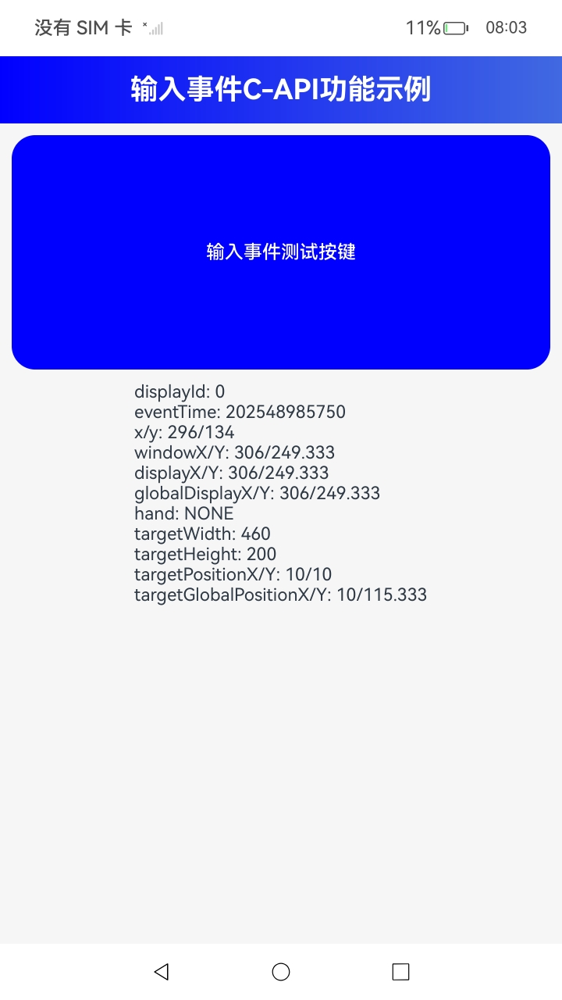

# ArkUI指南文档示例

### 介绍

本示例通过使用[ArkUI指南文档](https://gitee.com/openharmony/docs/tree/master/zh-cn/application-dev/reference)中各场景的开发示例，展示在工程中，帮助开发者更好地理解ArkUI提供的组件及组件属性并合理使用。该工程中展示的代码详细描述可查如下链接：

1. [输入事件C-API参考](https://gitcode.com/openharmony/docs/blob/master/zh-cn/application-dev/reference/apis-arkui/capi-ui-input-event-h.md)。
### 效果预览

| 首页                                 |
|------------------------------------|
|  |

### 使用说明

1. 在首页可以查看多种输入事件API的使用示例，包括单点或多点触摸事件、鼠标事件、轴事件、焦点轴事件的示例。

2. 通过自动测试框架可进行测试及维护。

### 工程目录
```
entry/src/main/ets/
|---cpp
|     |---types
|     |---CMakeLists.txt
|     |---common.h
|     |---container.cpp
|     |---container.h
|     |---function.h                       // 输入事件示例代码
|     |---init.cpp
|     |---manager.cpp                       // 示例入口
|     |---manager.h                         // manager头文件
|     |---napi_init.cpp
|---ets
|   |---pages
|   |   |---Index.ets                       // 应用主页面
```

### 相关权限

不涉及。

### 依赖

不涉及。

### 约束与限制

1.本示例支持仅标准系统上运行，支持设备：华为手机、华为平板。

2.HarmonyOS系统：HarmonyOS 6.0.0 Beta3版本及以上。

3.DevEco Studio版本：DevEco Studio 6.0.0 Beta3版本及以上。

4.HarmonyOS SDK版本：HarmonyOS 6.0.0 Beta3 SDK版本及以上。

### 下载

如需单独下载本工程，执行如下命令：

````
git init
git config core.sparsecheckout true
echo ArkUIKit/NdkInputEvent > .git/info/sparse-checkout
git remote add origin https://gitee.com/harmonyos_samples/guide-snippets.git
git pull origin master
````