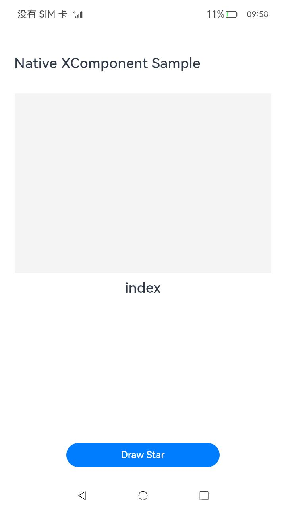
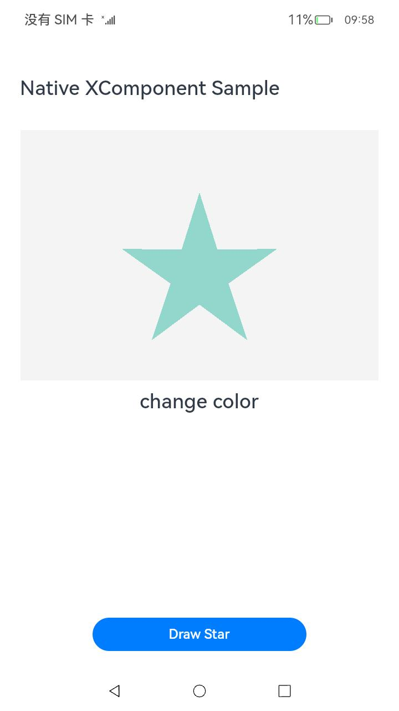

# Native XComponent

### 简介

本示例展示了如何在native侧使用ArkUI NDK API创建XComponent组件进行自定义绘制。具体步骤包括：创建组件，获取NativeXComponent实例，注册XComponent生命周期和事件回调，通过回调获取NativeWindow后使用OpenGL ES/EGL接口在XComponent组件上进行图形绘制，最后在ArkTS层使用ContentSlot站位组件进行挂载显示。功能主要包括点击按钮绘制一个五角星，并可以通过点击XComponent区域改变五角星的颜色。

### 效果预览

| 主页                                 | 绘制五角星                                    | 改变颜色                                            |
| ------------------------------------ | --------------------------------------------- | --------------------------------------------------- |
|  |  |  |

使用说明

1. 安装编译生成的hap包，并打开应用。

2. 点击页面底部“Draw Star”按钮，页面将绘制一个五角星。

3. 点击XComponent组件区域（页面中灰色区域）改变五角星颜色。


### 工程目录

```
├──entry/src/main
│  ├──cpp                           // C++代码区
│  │  ├──CMakeLists.txt             // CMake配置文件
│  │  ├──napi_init.cpp              // Napi模块注册
│  │  ├──common
│  │  │  └──common.h                // 常量定义文件
│  │  ├──manager                    // 生命周期管理模块
│  │  │  ├──plugin_manager.cpp
│  │  │  └──plugin_manager.h
│  │  ├──render                     // 渲染模块
│  │  │  ├──egl_core.cpp
│  │  │  ├──egl_core.h
|  |  ├──types						//定义接口文件
│  │  │  ├──libnativenode
│  │  │  │  ├──Index.d.ts
│  │  │  │  ├──oh-package.json5
│  ├──ets                           // ets代码区
│  │  ├──entryability
│  │  │  └──EntryAbility.ts         // 程序入口类
│  │  └──pages                      // 页面文件
│  │     └──Index.ets               // 主界面
|  ├──resources         			// 资源文件目录
```

### 具体实现

通过在IDE中创建Native c++ 工程，在c++代码中定义对外接口为drawPattern，在js侧调用该接口可在页面上绘制出一个三角形。

在XComponent的OnSurfaceCreated回调中获取NativeWindow实例并初始化EGL环境。调用OH_NativeXComponent_GetXComponentSize接口获取XComponent的宽高，并以此为输入调用EGL相关的绘制接口在NativeWindow上绘制出一个五角星。在DispatchTouchEvent回调中再次调用EGL相关的绘制接口在NativeWindow上绘制出一个大小相同、颜色不同的五角星，以达到点击后改变颜色的目的。

源码参考：[render目录](entry/src/main/cpp/render)下的文件。

涉及到的相关接口：

| 接口名                                                       | 描述                                                         |
| ------------------------------------------------------------ | ------------------------------------------------------------ |
| OH_NativeXComponent_GetXComponentId(OH_NativeXComponent* component, char* id, uint64_t* size) | 获取XComponent的id。                                         |
| OH_NativeXComponent_GetXComponentSize(OH_NativeXComponent* component, const void* window, uint64_t* width, uint64_t* height) | 获取XComponent持有的surface的大小。                          |
| OH_NativeXComponent_GetXComponentOffset(OH_NativeXComponent* component, const void* window, double* x, double* y) | 获取XComponent持有的surface相对窗口左上角的偏移量。          |
| OH_NativeXComponent_GetTouchEvent(OH_NativeXComponent* component, const void* window, OH_NativeXComponent_TouchEvent* touchEvent) | 获取由XComponent触发的触摸事件。                             |
| OH_NativeXComponent_GetTouchPointToolType(OH_NativeXComponent* component, uint32_t pointIndex, OH_NativeXComponent_TouchPointToolType* toolType) | 获取XComponent触摸点的工具类型。                             |
| OH_NativeXComponent_GetTouchPointTiltX(OH_NativeXComponent* component, uint32_t pointIndex, float* tiltX) | 获取XComponent触摸点处相对X轴的倾斜角度。                    |
| OH_NativeXComponent_GetTouchPointTiltY(OH_NativeXComponent* component, uint32_t pointIndex, float* tiltY) | 获取XComponent触摸点处相对Y轴的倾斜角度。                    |
| OH_NativeXComponent_GetMouseEvent(OH_NativeXComponent* component, const void* window, OH_NativeXComponent_MouseEvent* mouseEvent) | 获取由XComponent触发的鼠标事件。                             |
| OH_NativeXComponent_RegisterCallback(OH_NativeXComponent* component, OH_NativeXComponent_Callback* callback) | 为此OH_NativeXComponent实例注册生命周期和触摸事件回调。      |
| OH_NativeXComponent_RegisterMouseEventCallback(OH_NativeXComponent* component, OH_NativeXComponent_MouseEvent_Callback* callback) | 为此OH_NativeXComponent实例注册鼠标事件回调。                |
| OH_NativeXComponent_RegisterFocusEventCallback(OH_NativeXComponent* component, void (*callback)(OH_NativeXComponent* component, void* window)) | 为此OH_NativeXComponent实例注册获得焦点事件回调。            |
| OH_NativeXComponent_RegisterKeyEventCallback(OH_NativeXComponent* component, void (*callback)(OH_NativeXComponent* component, void* window)) | 为此OH_NativeXComponent实例注册按键事件回调。                |
| OH_NativeXComponent_RegisterBlurEventCallback(OH_NativeXComponent* component, void (*callback)(OH_NativeXComponent* component, void* window)) | 为此OH_NativeXComponent实例注册失去焦点事件回调。            |
| OH_NativeXComponent_GetKeyEvent(OH_NativeXComponent* component, OH_NativeXComponent_KeyEvent** keyEvent) | 获取由XComponent触发的按键事件。                             |
| OH_NativeXComponent_GetKeyEventAction(OH_NativeXComponent_KeyEvent* keyEvent, OH_NativeXComponent_KeyAction* action) | 获取按键事件的动作。                                         |
| OH_NativeXComponent_GetKeyEventCode(OH_NativeXComponent_KeyEvent* keyEvent, OH_NativeXComponent_KeyCode* code) | 获取按键事件的键码值。                                       |
| OH_NativeXComponent_GetKeyEventSourceType(OH_NativeXComponent_KeyEvent* keyEvent, OH_NativeXComponent_EventSourceType* sourceType) | 获取按键事件的输入源类型。                                   |
| OH_NativeXComponent_GetKeyEventDeviceId(OH_NativeXComponent_KeyEvent* keyEvent, int64_t* deviceId) | 获取按键事件的设备ID。                                       |
| OH_NativeXComponent_GetKeyEventTimestamp(OH_NativeXComponent_KeyEvent* keyEvent, int64_t* timestamp) | 获取按键事件的时间戳。                                       |
| OH_ArkUI_QueryModuleInterfaceByName(ArkUI_NativeAPIVariantKind type, const char* structName) | 获取指定类型的Native模块接口集合。                           |
| OH_ArkUI_GetNodeContentFromNapiValue(napi_env env, napi_value value, ArkUI_NodeContentHandle* content) | 获取ArkTS侧创建的NodeContent对象映射到native侧的ArkUI_NodeContentHandle。 |
| OH_ArkUI_NodeContent_SetUserData(ArkUI_NodeContentHandle content, void* userData) | 在NodeContent对象上保存自定义数据。                          |
| OH_ArkUI_NodeContentEvent_GetNodeContentHandle(ArkUI_NodeContentEvent* event) | 获取触发事件的NodeContent对象。                              |
| OH_ArkUI_NodeContent_GetUserData(ArkUI_NodeContentHandle content) | 获取在NodeContent对象上保存的自定义数据。                    |
| OH_ArkUI_NodeContentEvent_GetEventType(ArkUI_NodeContentEvent* event) | 获取触发NodeContent事件的事件类型。                          |
| OH_ArkUI_NodeContent_AddNode(ArkUI_NodeContentHandle content, ArkUI_NodeHandle node) | 将一个ArkUI组件节点添加到对应的NodeContent对象下。           |
| OH_ArkUI_NodeContent_RegisterCallback(ArkUI_NodeContentHandle content, ArkUI_NodeContentCallback callback) | 注册NodeContent事件函数。                                    |
| OH_NativeXComponent_GetNativeXComponent(ArkUI_NodeHandle node) | 基于Native接口创建的组件实例获取OH_NativeXComponent类型的指针。 |

### 相关权限

不涉及。

### 依赖

不涉及。

### 约束与限制

1. 本示例仅支持标准系统上运行，支持设备：华为手机

2. 本示例为Stage模型，支持API12版本SDK，SDK版本号(API Version 12Release),镜像版本号(5.0 Release)

3. 本示例需要使用DevEco Studio 版本号(5.0 Release)及以上版本才可编译运行

### 下载

如需单独下载本工程，执行如下命令：

```
git init
git config core.sparsecheckout true
echo ArkUIKit/NdkXComponent/ > .git/info/sparse-checkout
git remote add origin https://gitee.com/harmonyos_samples/guide-snippets.git
git pull origin master
```

