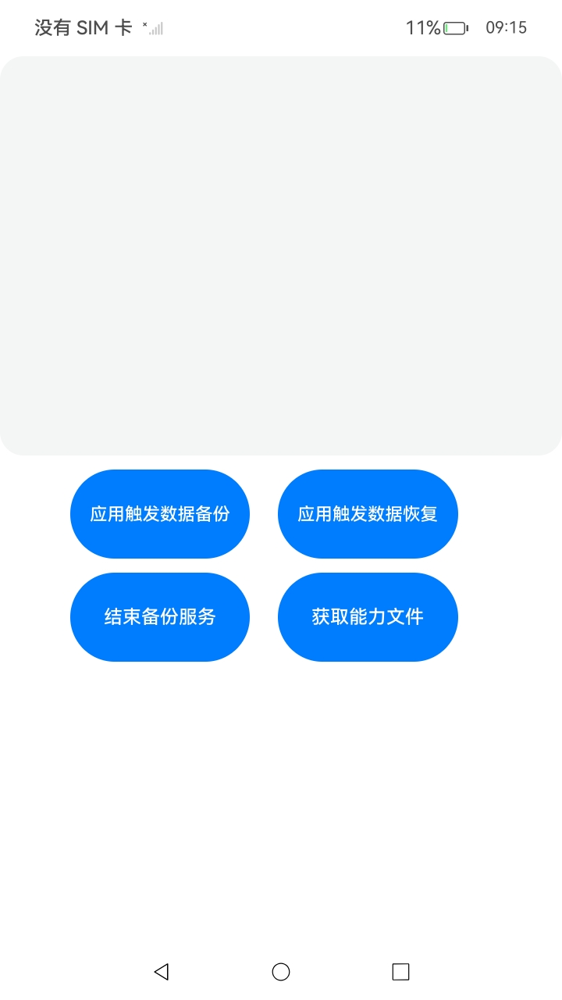

# 应用触发数据备份恢复（仅对系统应用开放）

## 介绍

仅系统应用可以触发数据备份恢复，触发后备份恢复框架会确认各个应用是否接入了数据备份恢复。如果应用已接入，备份恢复框架将会根据应用的配置文件备份、恢复数据。本实例实现了获取能力文件、应用备份数据和应用恢复数据三大功能，应用还涉及到权限申请方式和系统应用签名，该工程中展示的代码详细描述可查如下链接。

- [获取能力文件](https://gitee.com/openharmony/docs/blob/OpenHarmony-5.0.1-Release/zh-cn/application-dev/file-management/app-file-backup.md#获取能力文件)
- [应用备份数据](https://gitee.com/openharmony/docs/blob/OpenHarmony-5.0.1-Release/zh-cn/application-dev/file-management/app-file-backup.md#应用备份数据)
- [应用恢复数据](https://gitee.com/openharmony/docs/blob/OpenHarmony-5.0.1-Release/zh-cn/application-dev/file-management/app-file-backup.md#应用恢复数据)

## 效果预览

|  |
| :------------------------------------------------: |
|                                                    |

使用说明：

1. 本应用主要用于拉起应用数据备份，依赖于FileBackuoExtension应用，在使用前确保安装FileBackuoExtension应用。
2. 启动该应用后，通过点击相关的按钮可以拉起FileBackuoExtensiony应用的数据备份和恢复，备份和恢复将会按照FileBackuoExtensiony应用中配置的数据 备份和恢复框架进行。

## 工程目录

```
├──entry/src/main
|	├──ets
|	|	├──backuprestore
|	|	|	└──BackupRestore.ets        // 备份恢复函数封装
|	|	├──commom
|	|	|	├──Logger.ts				// 日志工具
|	|	├──entryability
|	|	|	└──EntryAbility.ets         // 程序入口类
|	|	├──entrybackupability
|	|	|	└──EntryBackupAbility.ets   
|	|	└──pages                        // 页面文件
|	|		└──Index.ets 				// 主界面
|	├──resources						// 资源文件目录	
```

## 具体实现

1. 导入依赖模块@ohos.file.backup，申请系统权限ohos.permission.BACKUP，详情请参考：[权限申请的方式](https://gitee.com/openharmony/docs/blob/OpenHarmony-5.0.1-Release/zh-cn/application-dev/security/AccessToken/determine-application-mode.md)
2. 获取能力文件需要调用backup.getLocalCapabilities，函数封装在BackupRestore.ets。
3. 启动应用备份过程中，备份恢复服务会将应用的数据打包成文件，通过创建实例时所注册的回调onFileReady接口返回文件句柄。
4. 备份恢复服务会根据开发者调用getFileHandle的请求内容，将应用待恢复数据的文件句柄，通过创建实例时注册的回调onFileReady]接口返回。

## 相关权限

| 权限名                 | 权限说明                   | 级别         |
| ---------------------- | -------------------------- | ------------ |
| ohos.permission.BACKUP | 允许应用拥有备份恢复能力。 | system_basic |

## 依赖

该应用作为系统级应用程序，为了实现备份和恢复功能，必须预先安装文件备份扩展应用。

## 约束与限制

1. 本示例仅支持标准系统上运行，支持设备：RK3568。
2. 本示例为Stage模型，支持API14版本SDK，版本号：5.0.2.58，镜像版本号：OpenHarmony 5.1.0.51。
3. 本示例需要使用DevEco Studio 5. 1Release (Build Version: 5.0.5.306, built on December 6, 2024)及以上版本才可编译运行。
4. 本示例涉及部分接口需要配置系统应用签名，可以参考[特殊权限配置方法](https://gitee.com/openharmony/docs/blob/OpenHarmony-5.0.1-Release/zh-cn/application-dev/security/hapsigntool-overview.md) ，把配置文件中的“apl”字段信息改为“system_basic”。

## 下载

```
git init
git config core.sparsecheckout true
echo code/DocsSample/CoreFile/AppFileBackup > .git/info/sparse-checkout
git remote add origin https://gitee.com/openharmony/applications_app_samples.git
git pull origin master
```

