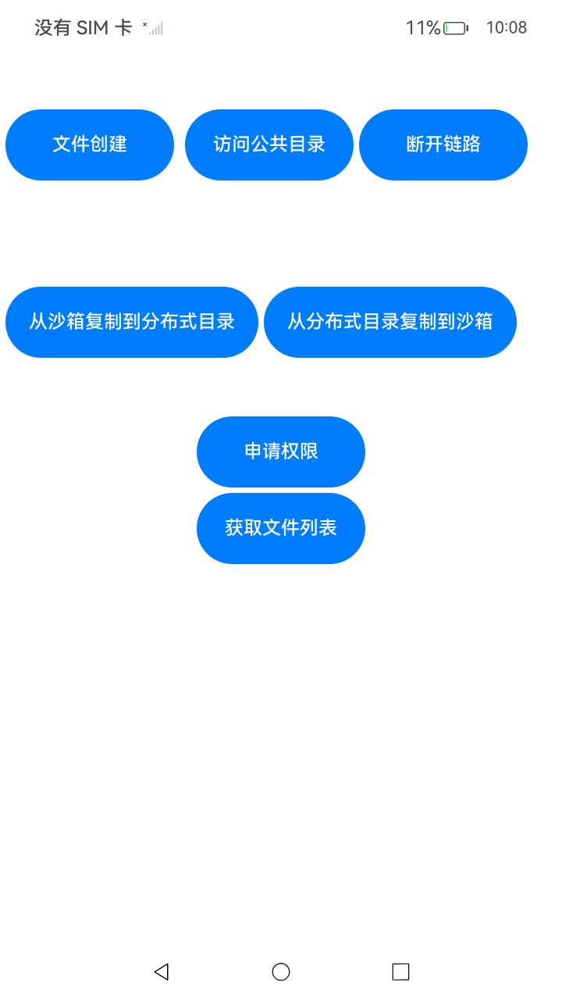

# 分布式文件系统

## 介绍

本实例实现了分布式文件系统的文件跨设备访问、跨设备拷贝以及设计分布式文件数据等级。使用两台设备进行分布式组网，在组网环境下可以对文件进行跨设备的访问和拷贝，该工程中展示的代码详细描述可查如下链接。

- [ 跨设备文件访问](https://gitcode.com/openharmony/docs/blob/master/zh-cn/application-dev/file-management/file-access-across-devices.md)
- [ 跨设备文件拷贝](https://gitcode.com/openharmony/docs/blob/master/zh-cn/application-dev/file-management/file-copy-across-devices.md)

## 效果预览

|                      应用界面                      |
| :------------------------------------------------: |
|  |

使用说明：

1. 本应用在进行分布式文件访问之前，需要两台设备进行组网并且都安装了本应用。
2. 组网要求：两台设备连入同一个局域网中，确保设备进入可信状态，且两台设备的音乐软件能同步播放和暂停。
3. 在启动应用后可以根据相应的按钮实现对应的功能点，首先便是设备A在分布式目录下创建文件，并将此文件的数据等级设置，使其可以跨设备进行访问。
4. 由B设备访问应用公共目录并挂载，向A设备发起建链，设备B可在分布式路径下读取测试文件。
5. 按钮“从沙箱复制到分布式目录”设备A在本地目录下创建一个文件，随后将其拷贝到分布式路径下。
6. 按钮“从分布式目录复制到沙箱”设备A和B在确认组网建链后，由设备B从分布式路径下将测试文件拷贝到设备B的沙箱路径。

## 工程目录

```
├──entry/src/main
|	├──ets
|	|	├──commom
|	|	|	├──Logger.ts				// 日志工具
|	|	|	├──ShowToast.ets			// 弹窗提示工具
|	|	├──entryability
|	|	|	└──EntryAbility.ets         // 程序入口类
|	|	├──entrybackupability
|	|	|	└──EntryBackupAbility.ets   
|	|	└──pages                        // 页面文件
|	|		└──Index.ets 				// 主界面
|	├──resources						// 资源文件目录	
```

## 具体实现

1. 根据Openharmony提供完整的数据分级、设备分级标准，并针对不同设备制定不同的数据流转策略，来设置文件的安全等级。
2. 完成分布式组网。 将需要跨设备访问的两个设备登录同一账号，保证设备蓝牙和Wi-Fi功能开启，蓝牙无需互连，Wi-Fi无需接入同一个局域网。
3. 访问跨设备文件，分布式文件系统为应用提供了跨设备文件访问的能力，开发者在两个设备安装同一应用时，通过基础文件接口，可跨设备读写另一个设备该应用分布式文件路径下的文件。
4. 拷贝跨设备文件，由设备A的将文件从沙箱路径拷贝到分布式路径下，再有组网的设备B从分布式路径将文件拷贝到设备B的应用沙箱路径。

## 相关权限

- [ohos.permission.DISTRIBUTED_SOFTBUS_CENTER](https://gitee.com/openharmony/docs/blob/OpenHarmony-5.0.1-Release/zh-cn/application-dev/security/AccessToken/permissions-for-system-apps.md#ohospermissiondistributed_softbus_center)
- [ohos.permission.ACCESS_SERVICE_DM](https://gitee.com/openharmony/docs/blob/OpenHarmony-5.0.1-Release/zh-cn/application-dev/security/AccessToken/permissions-for-system-apps.md#ohospermissionaccess_service_dm)
- [ohos.permission.DISTRIBUTED_DATASYNC](https://gitee.com/openharmony/docs/blob/OpenHarmony-5.0.1-Release/zh-cn/application-dev/security/AccessToken/permissions-for-all.md#ohospermissiondistributed_datasync)
- [ohos.permission.INTERNET](https://gitee.com/openharmony/docs/blob/OpenHarmony-5.0.1-Release/zh-cn/application-dev/security/AccessToken/permissions-for-all.md#ohospermissioninternet)

## 依赖

不涉及

## 约束与限制

1. 本示例仅支持标准系统上运行，支持设备：RK3568。
2. 本示例为Stage模型，支持API14版本以上SDK，版本号：5.0.2.58。
3. 本示例需要使用DevEco Studio 5. 1Release (Build Version: 5.0.5.306, built on December 6, 2024)及以上版本才可编译运行。
4. 本示例涉及部分接口需要配置系统应用签名，可以参考[特殊权限配置方法](https://gitee.com/openharmony/docs/blob/OpenHarmony-5.0.1-Release/zh-cn/application-dev/security/hapsigntool-overview.md) ，把配置文件中的“apl”字段信息改为“system_basic”。

## 下载

```
git init
git config core.sparsecheckout true
echo code/DocsSample/CoreFile/DistributedFileSample > .git/info/sparse-checkout
git remote add origin https://gitee.com/openharmony/applications_app_samples.git
git pull origin master
```
