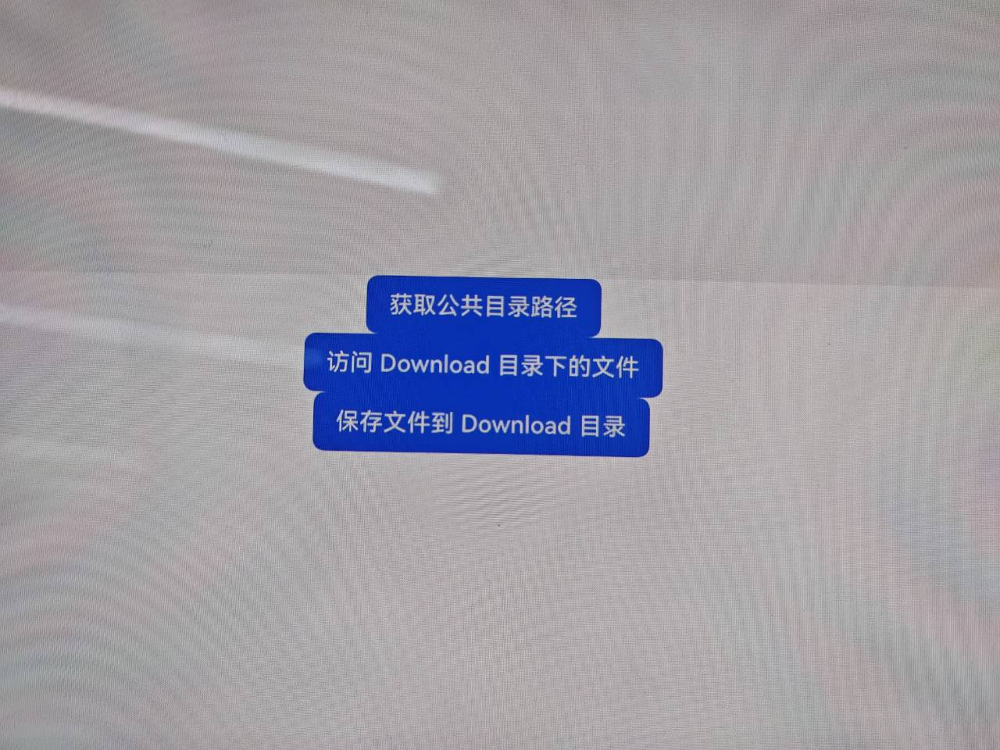
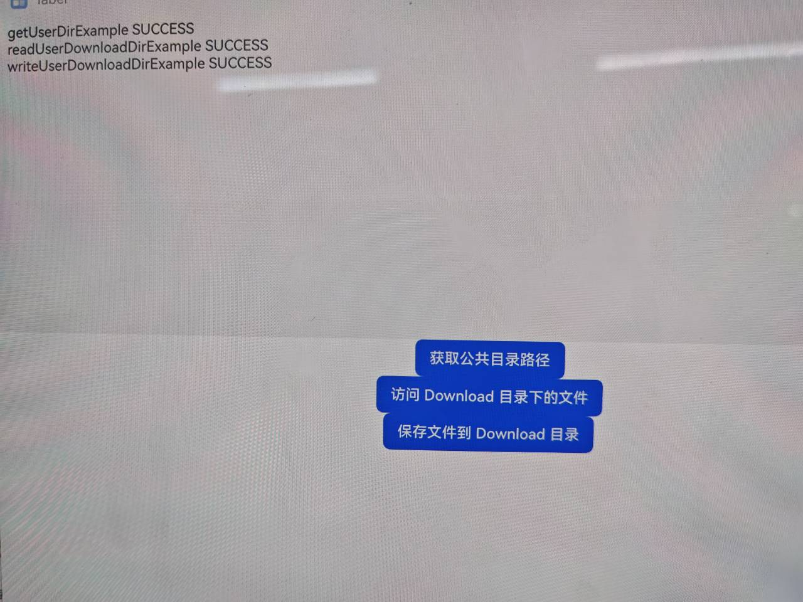

# 获取并使用公共目录

## 介绍

 本实例主要实现了通过 ArkTS 接口获取并访问公共目录。

- [获取并使用公共目录](https://gitcode.com/openharmony/docs/blob/master/zh-cn/application-dev/file-management/request-dir-permission.md)

## 效果预览

| 应用启动界面                                      | 文件访问结果                                    |
| ------------------------------------------------- | ----------------------------------------------- |
|  |  |

使用说明：

1. 本应用主要通过ArkTS接口获取并访问公共目录。
2. 在启动应用之后，点击界面上的三个按钮，通过日志反馈知道访问的结果。

## 工程目录

```
EnvironmentSample
├──entry/src/main
|	├──ets
|	|	├──entryability
|	|	|	└──EntryAbility.ets         // 程序入口类
|	|	├──entrybackupability
|	|	|	└──EntryBackupAbility.ets   
|	|	└──pages                        // 页面文件
|	|		└──Index.ets 				// 主界面
|	├──resources						// 资源文件目录	
```

## 具体实现

- 在应用开始访问文件之前，使用UIAbilityContext[获取UIAbility的上下文信息](https://gitcode.com/openharmony/docs/blob/OpenHarmony-5.0.1-Release/zh-cn/application-dev/application-models/uiability-usage.md)，
  然后调用Context的相关接口获取应用的沙箱文件路径。

- 使用Environment.getUserDownloadDir()、Environment.getUserDesktopDir()、Environment.getUserDesktopDir()分别获取当前用户预授权下载目录的沙箱路径、当前用户预授权桌面目录的沙箱路径、当前用户预授权文档目录的沙箱路径。

## 相关权限

公共目录获取接口仅用于获取公共目录路径，不对公共目录访问权限进行校验。若需访问公共目录需申请对应的公共目录访问权限。三方应用需要访问公共目录时，需通过弹窗授权向用户申请授予 Download 目录权限、Documents 目录权限或 Desktop 目录权限，
具体参考[访问控制](https://gitcode.com/openharmony/docs/blob/master/zh-cn/application-dev/security/AccessToken/request-user-authorization.md)。
"requestPermissions" : [
"ohos.permission.READ_WRITE_DOWNLOAD_DIRECTORY",
"ohos.permission.READ_WRITE_DOCUMENTS_DIRECTORY",
"ohos.permission.READ_WRITE_DESKTOP_DIRECTORY",
]

## 依赖

不涉及

## 约束与限制

1.本示例仅支持标准系统上运行，支持设备：PC/2in1。

2.本示例为Stage模型，支持API12版本SDK，版本号：5.0.0。

3.本示例需要使用DevEco Studio 6.0.0 Release (构建版本：6.0.0.858，构建 2025年9月24日)及以上版本才可编译运行。

## 下载

```
git init
git config core.sparsecheckout true
echo code/DocsSample/CoreFile/EnvironmentSample > .git/info/sparse-checkout
git remote add origin https://gitee.com/openharmony/applications_app_samples.git
git pull origin master
```

