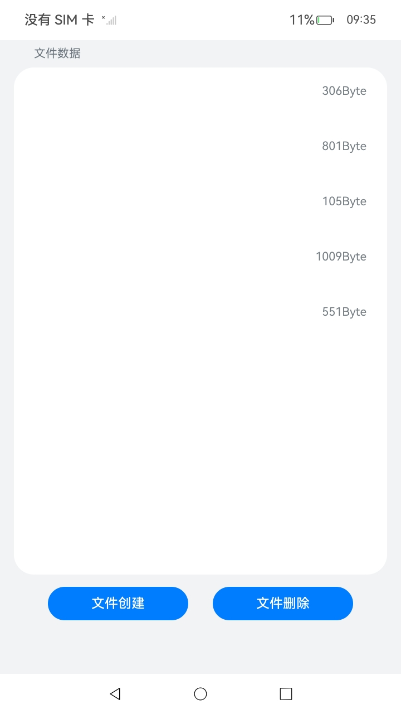

# 应用接入数据备份恢复

## 介绍

应用接入数据备份恢复需要通过配置BackupExtensionAbility实现。

BackupExtensionAbility，是[Stage模型](https://gitee.com/openharmony/docs/blob/OpenHarmony-5.0.1-Release/zh-cn/application-dev/application-models/stage-model-development-overview.md)模型中扩展组件[ ExtensionAbility](https://gitee.com/openharmony/docs/blob/OpenHarmony-5.0.1-Release/zh-cn/application-dev/application-models/extensionability-overview.md)的派生类。开发者可以通过修改配置文件定制备份恢复框架的行为，包括是否允许备份恢复，备份哪些文件等。

本sample主要给备份恢复服务提供应用，用于生成数据、删除数据和备份恢复后显示数据。该工程中展示的代码详细描述可查如下链接。

- [应用接入数据备份恢复](https://gitee.com/openharmony/docs/blob/OpenHarmony-5.0.1-Release/zh-cn/application-dev/file-management/app-file-backup-extension.md)

## 效果预览

| 初始界面                                           | 文件创建                                               | 文件删除                                               | 文件恢复后显示                                          |
| -------------------------------------------------- | ------------------------------------------------------ | ------------------------------------------------------ | ------------------------------------------------------- |
|  |  |  |  |

使用说明：

1. 点击按钮“文件创建”，应用会生成5个txt文件，大小在1Byte到1024Byte之间，用于校验备份和恢复的数据为同一数据。
2. 本应用仅适用于生成和显示数据，具体的备份和恢复的操作需要另外的应用AppFileBackup来执行。
3. 按钮“文件删除”操作用户在备份恢复的测试验证过程中删除文件。

## 工程目录
```
entry/src/main/ets/
|---Application
|---Common
|   |---Logger.ts   				   // 日志工具
|   |---BackupExtension.ets            // 备份恢复类
|---entruability
|   |---EntryAbility.ts                // Ability类
|---entrybackability
|   |---EntryBackupAbility.ts         
|---fileFs
|   |---CreateFile.ts                  // 文件的创建和删除封装
|---pages
|   |---Index.ets                      // 首页
```
## 具体实现

1. 备份恢复框架的开发步骤，请参考介绍中应用接入数据备份恢复链接。
1. 应用封装CreateFile类，其中包含个函数，用于文件的创建和删除，具体代码实现请参考：CreateFile.ets。

## 相关权限

无

## 依赖

该应用为备份恢复服务的框架实现，仅进行文件的创建和删除，不涉及备份和恢复的具体流程，数据文件的备份和恢复依赖于AppFileBackup应用。

## 约束与限制

1.本示例仅支持标准系统上运行，支持设备：RK3568。

2.本示例为Stage模型，支持API14版本SDK，版本号：5.0.2.58，镜像版本号：OpenHarmony 5.0.2.58。

3.本示例需要使用DevEco Studio 5. 1Release (Build Version: 5.0.5.306, built on December 6, 2024)及以上版本才可编译运行。

## 下载

如需单独下载本工程，执行如下命令：
```
git init
git config core.sparsecheckout true
echo code/DocsSample/CoreFile/FileBackupExtension > .git/info/sparse-checkout
git remote add origin https://gitee.com/openharmony/applications_app_samples.git
git pull origin master

```
