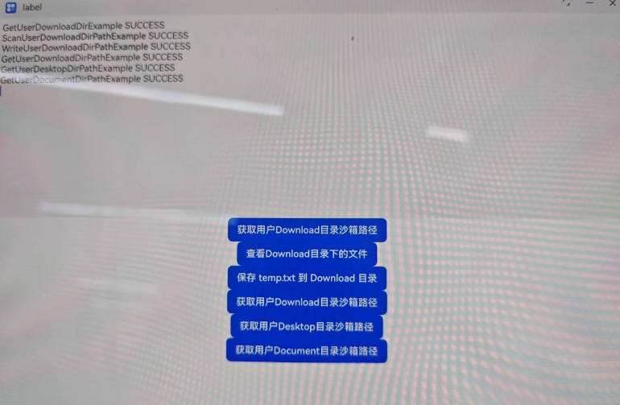

# 应用文件访问（C++）

## 介绍

 本实例主要实现了使用C++的方式去获取并使用公共目录，支持三方应用在公共文件用户目录下进行文件访问操作。

- [获取并使用公共目录
  （C/C++）](https://gitcode.com/openharmony/docs/blob/master/zh-cn/application-dev/file-management/request-dir-permission.md)
- [获取用户目录环境
    （C/C++）](https://gitcode.com/openharmony/docs/blob/master/zh-cn/application-dev/file-management/native-environment-guidelines.md)

## 效果预览

| 应用启动界面                                            | 文件访问结果                                          |
|---------------------------------------------------|-------------------------------------------------|
|  |  |

使用说明：

1. 本应用主要使用napi的方式，使用C语言函数对应用的沙箱文件进行访问。
2. 在启动应用之后，点击界面上的六个按钮，通过日志反馈知道访问的结果。

## 工程目录

```
NDKEnvironmentSample
├──entry/src/main
|	├──cpp
|	|	├──types
|	|	|	├──libentry				
|	|	|	└──CMakeLists.txt        	// CMake脚本文件
|	|	|	└──napi_init.cpp			// napi函数封装类 
|	├──ets
|	|	├──commom
|	|	|	├──Logger.ts				// 封装日志类
|	|	├──entryability
|	|	|	└──EntryAbility.ets         // 程序入口类
|	|	├──entrybackupability
|	|	|	└──EntryBackupAbility.ets   
|	|	└──pages                        // 页面文件
|	|		└──Index.ets 				// 主界面
|	├──resources						// 资源文件目录	
```

## 具体实现

1. 在CMake脚本中链接动态库，即在CMakeLists.txt中添加以下lib。

   ```
   target_link_libraries(sample PUBLIC libohenvironment.so)
   ```

2. 添加头文件

   ```
   #include <cstdio>
   #include <cstdlib>
   #include <filemanagement/environment/oh_environment.h>
   #include <filemanagement/fileio/oh_fileio.h>
   ```

3. 例如调用[OH_Environment_GetUserDownloadDir](https://gitcode.com/openharmony/docs/blob/master/zh-cn/application-dev/reference/apis-core-file-kit/capi-oh-environment-h.md#oh_environment_getuserdownloaddir)接口获取用户Download目录沙箱路径，
   在接口中使用malloc申请的内存需要在使用完后释放因此需要free对应的内存。示例代码如下所示：
   ```c
    void GetUserDownloadDirPathExample() {
        char *downloadPath = NULL;
        FileManagement_ErrCode ret = OH_Environment_GetUserDownloadDir(&downloadPath);
        if (ret == 0) {
            printf("Download Path=%s", downloadPath);
            free(downloadPath);
        } else {
            printf("GetDownloadPath failed, error code is %d", ret);
        }
    }  
   ```

## 相关权限

公共目录获取接口仅用于获取公共目录路径，不对公共目录访问权限进行校验。若需访问公共目录需申请对应的公共目录访问权限。三方应用需要访问公共目录时，需通过弹窗授权向用户申请授予Download目录权限、Documents目录权限或Desktop目录权限，
具体参考[访问控制](https://gitcode.com/openharmony/docs/blob/master/zh-cn/application-dev/security/AccessToken/request-user-authorization.md)。
"requestPermissions" : [
"ohos.permission.READ_WRITE_DOWNLOAD_DIRECTORY",
"ohos.permission.READ_WRITE_DOCUMENTS_DIRECTORY",
"ohos.permission.READ_WRITE_DESKTOP_DIRECTORY",
]

## 依赖

不涉及

## 约束与限制

1.本示例仅支持标准系统上运行，支持设备：PC/2in1。

2.本示例为Stage模型，支持API12版本SDK，版本号：5.0.0。

3.本示例需要使用DevEco Studio 6.0.0 Release (构建版本：6.0.0.858，构建 2025年9月24日)及以上版本才可编译运行。

## 下载

```
git init
git config core.sparsecheckout true
echo code/DocsSample/CoreFile/NDKEnvironmentSample > .git/info/sparse-checkout
git remote add origin https://gitee.com/openharmony/applications_app_samples.git
git pull origin master
```

