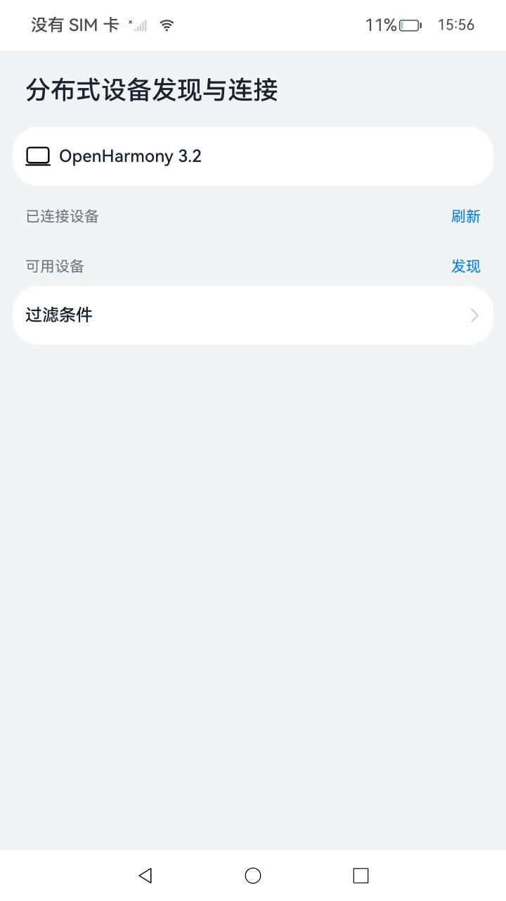
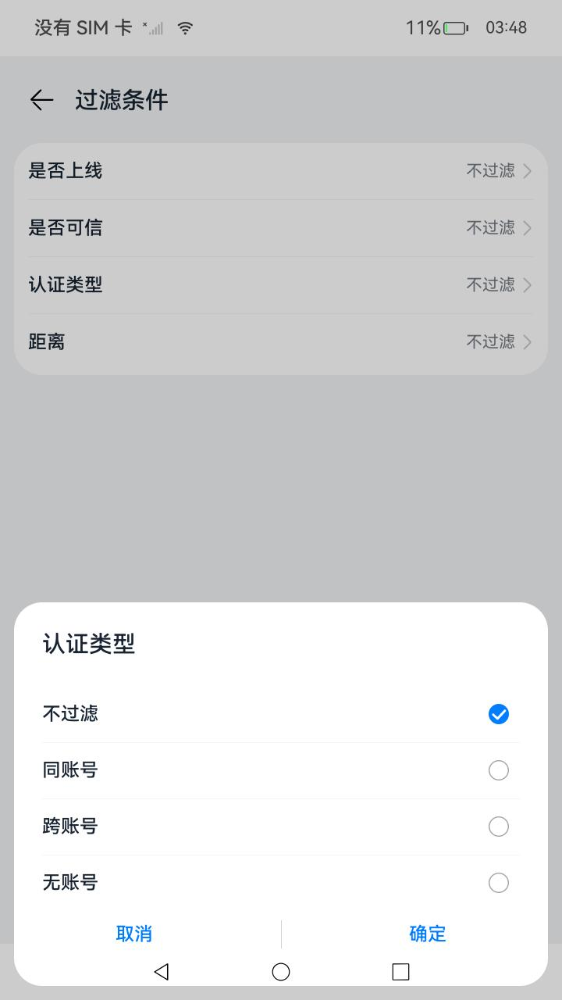
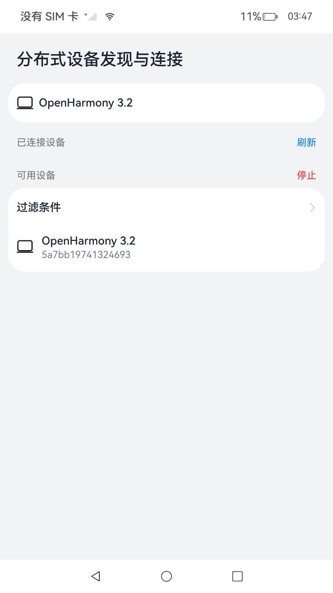
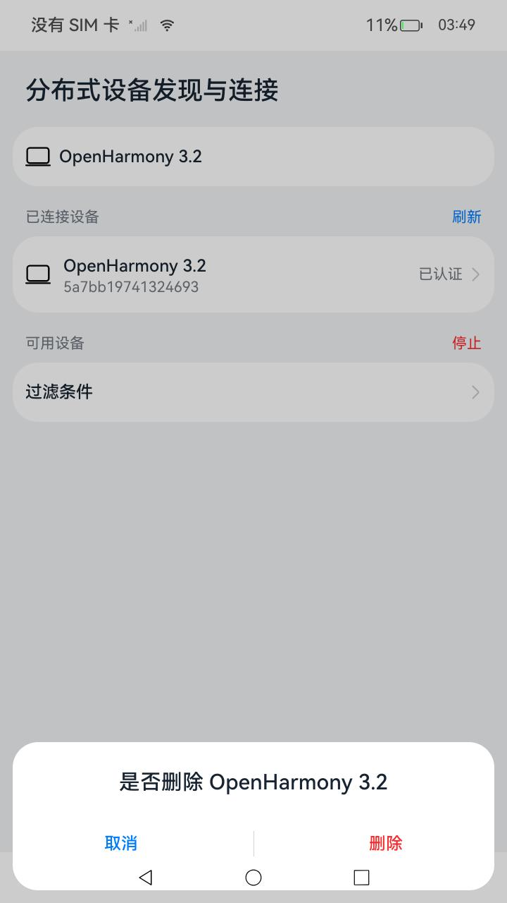

# 设备管理

### 介绍

本示例主要展示了设备管理相关的功能，使用[@ohos.distributedDeviceManager](https://gitee.com/openharmony/docs/blob/master/zh-cn/application-dev/reference/apis-distributedservice-kit/js-apis-distributedDeviceManager.md)
等接口，实现了包括获取本机设备信息，获取授信设备列表，根据过滤条件扫描设备，设备认证，设备状态订阅等功能。

### 效果预览

|主页| 选择过滤条件                                                | 发现与可信设备列表                                     |取消认证|
|--------------------------------|-------------------------------------------------------|-----------------------------------------------|--------------------------------|
|  |  |

使用说明
1. 进入应用会自动获取本机设备信息，并且注册设备状态监听，在有设备上下线的时候，刷新可信设备列表；
2. 在主界面，可以点击刷新，刷新可信设备列表，点击已认证，解除认证关系（只能解除本应用组网设备）；
3. 在主界面，可以点击过滤条件，选择对应的过滤条件，在发现设备时进行过滤；
4. 在主界面，可以点击发现，发现周边的设备，并点击发现的设备，进行PIN码认证。

### 工程目录

```
entry/src/main/ets/
|---common
|   |---Constant.ets                       // 常量
|   |---Logger.ets                         // 日志工具
|---entryability
|---model
|   |---RemoteDeviceModel.ets              // 主要封装了DeviceManager库相关的接口，实现相关的功能
|---pages
|   |---index.ets                          // 首页
|   |---FilterOption.ets                   // 过滤条件页面
|   |---ListDeviceView.ets                 // 列表设备组件
```

### 具体实现

获取本机设备信息，获取授信设备列表，根据过滤条件扫描设备，设备认证，设备状态订阅，控制设备是否允许被发现等功能，接口封装在RemoteDeviceModel，源码参考：[RemoteDeviceModel.ts](entry/src/main/ets/model/RemoteDeviceModel.ets)

    * 使用RemoteDeviceModel.createDeviceManager()来获取DeviceManager对象；
    * 获取本机设备信息：调用RemoteDeviceModel.getLocalDeviceInfo()来获取本机设备信息；
    * 注册设备状态监听：调用RemoteDeviceModel.registerDeviceStateListener()，来注册设备状态监听;
    * 获取可信设备列表：调用RemoteDeviceModel.getTrustedDeviceList()来获取可信设备列表;
    * 发现和停止发现设备：调用RemoteDeviceModel.startDeviceDiscovery()发现设备，调用RemoteDeviceModel.stopDeviceDiscovery()停止发现设备;
    * 认证和取消认证设备：调用RemoteDeviceModel.authenticateDevice()认证，调用RemoteDeviceModel.unAuthenticateDevice()取消认证设备;

### 相关概念

设备管理：用于获取可信设备和本地设备的相关信息。在调用DeviceManager的方法前，需要先通过createDeviceManager构建一个DeviceManager实例。

### 相关权限

允许不同设备间的数据交换：ohos.permission.DISTRIBUTED_DATASYNC。

### 约束与限制

1.本示例需要组网测试。

2.本示例仅支持标准系统上运行，支持设备：RK3568。

3.本示例为Stage模型，支持API12版本SDK，SDK版本号(API Version 12 Release)，镜像版本号(5.0 Release)。

4.本示例需要使用DevEco Studio 版本号(4.0 Release)及以上版本才可编译运行。

5.本示例需要使用@ohos.distributedDeviceManager系统权限的系统接口。使用Full SDK时需要手动从镜像站点获取，并在DevEco Studio中替换，具体操作可参考[替换指南](https://gitee.com/openharmony/docs/blob/master/zh-cn/application-dev/faqs/full-sdk-switch-guide.md)
。

6.本示例涉及系统接口，需要配置系统应用签名，可以参考[特殊权限配置方法](https://gitee.com/openharmony/docs/blob/master/zh-cn/application-dev/security/hapsigntool-overview.md)
，把配置文件中的“app-feature”字段信息改为“hos_system_app”。

### 下载

如需单独下载本工程，执行如下命令：

```
git init
git config core.sparsecheckout true
echo code/SystemFeature/DistributedAppDev/DistributedAuthentication > .git/info/sparse-checkout
git remote add origin https://gitee.com/openharmony/applications_app_samples.git
git pull origin master
```
