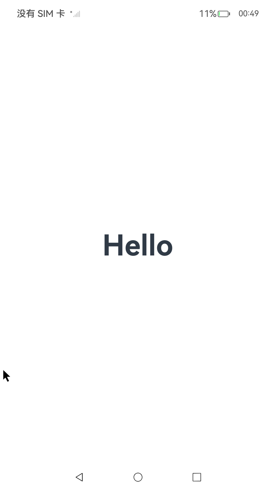
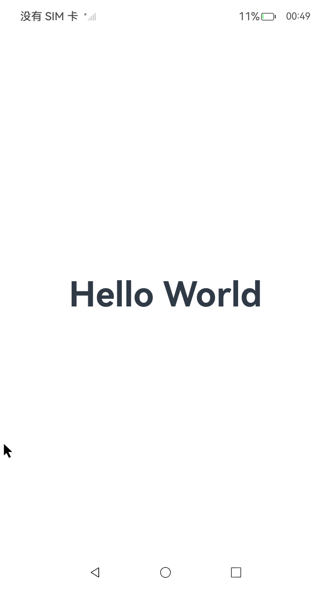

# 驱动开发服务

### 介绍

本示例主要展示了通过DriverDevelopmentKit开发驱动服务，使用[@ohos.driver.deviceManager](https://gitcode.com/openharmony/docs/blob/master/zh-cn/application-dev/reference/apis-driverdevelopment-kit/js-apis-driver-deviceManager.md) 、[@ohos.app.ability.DriverExtensionAbility](https://gitcode.com/openharmony/docs/blob/master/zh-cn/application-dev/reference/apis-driverdevelopment-kit/js-apis-app-ability-driverExtensionAbility.md) 、[@ohos.rpc](https://gitcode.com/openharmony/docs/blob/master/zh-cn/application-dev/reference/apis-ipc-kit/js-apis-rpc.md)
等接口，实现了插入外设时拉起外设驱动服务端，查询外设列表，驱动UI界面与驱动服务端通信的功能;

### 效果预览

屏幕截屏或者视频，文件不超过4个，每张截屏图片不能太大，推荐占1/4页左右，每张图片附上图片标题，示例效果如下所示；

| 主页 | 点击后界面 |
|----|-------|
|  |  |

使用说明

1. 安装该示例应用后，当目标设备插入时，扩展外设驱动服务SA会拉起DriverExtensionAbility相关进程
2. 在主界面，点击“Hello”文字，会触发查询外设列表，筛选目标外设，绑定驱动服务端，给服务端发送“Hello”等一系列流程；
3. 流程结束会主界面中“Hello”文字会修改为驱动服务端发送的“Hello World”文字；


### 工程目录

给出项目中关键的目录结构并描述它们的作用，示例如下：

```
entry/src/main/ets
|---driverextability
|   |---DriverExtAbility.ets               //主要重载了继承驱动扩展能力DriverExtensionAbility，onConnect创建服务端实例，接受客户端消息后回复等
|---entryability
|   |---EntryAbility.ets                   //UIAbility定义
|---pages
|   |---Index.ets                          //应用首页主要逻辑，包含了点击按钮触发与服务端通信的一系列流程
entry/src/main/cpp
|---types
|   |---libentry                           //创建native c++工程，自动生成的文件目录
|   |   |---Index.d.ts                     //定义ArkTs层接口，该示例暂未使用
|---napi_init.cpp                          //主要封装了通过CAPI来与设备交互功能，该示例暂未使用
|---CMakeLists.txt                         //主要通过Cmake语法编译libentry.so，该示例暂未使用
```

### 具体实现

* 驱动UI界面，功能包括查询设备列表、绑定设备驱动服务端、与设备驱动服务端通信，源码参考：[Index.ets](code/DocsSample/DriverDevelopmentKit/DriverDemo/entry/src/main/ets/pages/Index.ets)
    * 使用deviceManager.queryDevices来获取设备列表;
    * 通过deviceManager.bindDeviceDriver来绑定设备驱动服务端，通过返回值拿到驱动服务端实例;
    * 通过服务端实例调用sendMessageRequest与设备驱动服务端通信，并获取到服务端回应，将回应数据打印到主界面;

* 驱动服务端，与驱动UI界面通信，源码参考：[DriverExtAbility.ets](code/DocsSample/DriverDevelopmentKit/DriverDemo/entry/src/main/ets/driverextability/DriverExtAbility.ts)
    * 如效果预览中的**点击后界面**，就是UI界面通过bindDeviceDriver接口获取到驱动服务端实例，再通过服务端实例与服务端通信；

### 相关权限

[ohos.permission.ACCESS_EXTENSIONAL_DEVICE_DRIVER](https://gitcode.com/openharmony/docs/blob/master/zh-cn/application-dev/security/AccessToken/permissions-for-all.md)

### 约束与限制

1. 本示例仅支持标准系统上运行，支持设备：RK3568;
2. 本示例为Stage模型，仅支持API11版本SDK，SDK版本号(API Version 11),镜像版本号(4.1Release)
3. 本示例需要使用DevEco Studio 版本号(6.0Release)版本才可编译运行。

### 下载

如需单独下载本工程，执行如下命令：

```
git init
git config core.sparsecheckout true
echo code/DocsSample/DriverDevelopmentKit > .git/info/sparse-checkout
git remote add origin https://gitee.com/openharmony/applications_app_samples.git
git pull origin master
```