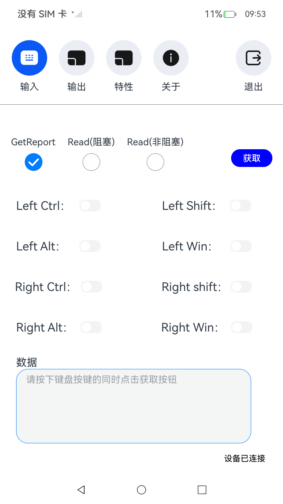
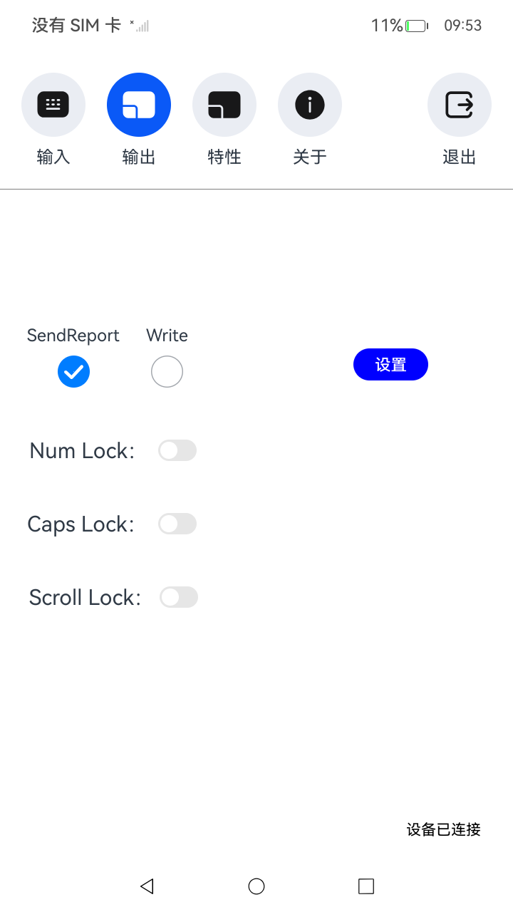
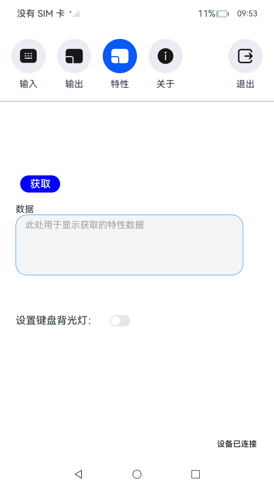
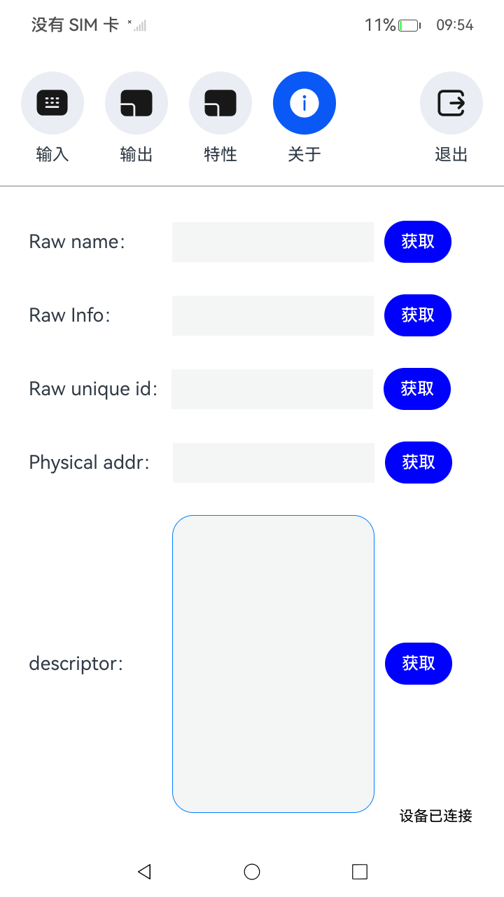

# 驱动开发服务

### 介绍

本示例主要展示了通过DriverDevelopmentKit开发套件中HID DDK开发输入类设备驱动应用，使用[@ohos.driver.deviceManager](https://gitcode.com/openharmony/docs/blob/master/zh-cn/application-dev/reference/apis-driverdevelopment-kit/js-apis-driver-deviceManager.md) 、[@ohos.app.ability.DriverExtensionAbility](https://gitcode.com/openharmony/docs/blob/master/zh-cn/application-dev/reference/apis-driverdevelopment-kit/js-apis-app-ability-driverExtensionAbility.md) 、[@ohos.rpc](https://gitcode.com/openharmony/docs/blob/master/zh-cn/application-dev/reference/apis-ipc-kit/js-apis-rpc.md)、[HID DDK](https://gitcode.com/openharmony/docs/blob/master/zh-cn/application-dev/reference/apis-driverdevelopment-kit/capi-hid-ddk-api-h.md)
等接口，实现了整个输入类设备驱动功能，包括输入类设备UI参数设置界面及驱动服务端。其中UI参数界面包括输入报告，输出报告，特性报告，关于界面，驱动服务端通过客户端绑定拉起，驱动服务端主要给UI界面提供接口及与物理设备通信;

### 效果预览

| 主页(输入报告)                       | 输出                               | 特性                                | 关于                              |
|--------------------------------|----------------------------------|-----------------------------------|---------------------------------|
|  |  |  |  |

使用说明

1. 安装该示例应用后，当目标设备插入时，扩展外设驱动服务SA会拉起DriverExtensionAbility相关进程（即：驱动服务端）
2. 在主界面绘制完成后，会调用deviceManager的绑定接口，绑定驱动服务端，成功后主界面会显示“设备已连接”；
3. 主界面根据键盘常用输入功能设置了一些参数，用户可以根据HID协议填充参数，完成跟物理设备进行输入报告通信；
4. 输出界面根据键盘常用输出功能设置了一些参数，用户可以根据HID协议填充参数，完成跟物理设备进行输出报告通信；
5. 特性界面根据键盘特性功能设置了一些参数，用户可以根据HID协议填充参数，完成跟物理设备进行特性报告通信；
6. 关于界面，可以读取物理设备RawName、RawInfo等信息。
7. 退出按钮，退出驱动界面。

### 工程目录

给出项目中关键的目录结构并描述它们的作用，示例如下：

```
entry/src/main/ets
|---components
|   |---AttributesComponent.ets            //“关于”部件页面构造
|   |---FeatureComponent.ets               //“特性”部件页面构造
|   |---InputComponent.ets                 //“输入”部件页面构造
|   |---OutputComponent.ets                //“输出”部件页面构造
|---DriverAbility
|   |---driver.ts                          //主要重载了继承驱动扩展能力DriverExtensionAbility，Onit初始化USB接口等
|---entryability
|   |---EntryAbility.ets                   //界面ability
|---pages
|   |---Index.ets                          //应用首页
|---tool
|   |---GlobalContext.ets                  //用于上下文存储单例对象工具
|   |---RpcTool.ets                        //主要封装了扩展外设相关接口，实现相关功能，如：查询设备，绑定设备，连接远程对象等
|---utils
|   |---Params.ets                         //输入输出报告信息结构
|   |---RequestCode.ets                    //请求码
entry/src/main/cpp
|---types
|   |---libentry                           //创建native c++工程，自动生成的文件目录
|---data_parser.cpp                        //主要封装了从输入类设备读取到数据与系统数据转换等功能
|---data_parser.h                          //申明数据转换类接口
|---hello.cpp                              //主要封装了输入类驱动相关接口，实现相关功能，如：发送report等功能
|---key_code.h                             //驱动所使用的键值定义
```

### 具体实现

* 驱动UI界面，功能包括查询设备列表、绑定设备驱动服务端、与设备驱动服务端通信，源码参考：[Index.ets](code/DocsSample/DriverDevelopmentKit/ScsiPeripheralDemo/entry/src/main/ets/pages/Index.ets)
    * 使用deviceManager.queryDevices来获取设备列表;
    * 通过deviceManager.bindDeviceDriver来绑定设备驱动服务端，通过返回值拿到驱动服务端实例;
    * 通过服务端实例调用sendMessageRequest与设备驱动服务端通信，并获取到服务端回应，将回应数据打印到主界面;

* 驱动服务端，与驱动UI界面通信，源码参考：[driver.ts](code/DocsSample/DriverDevelopmentKit/ScsiPeripheralDemo/entry/src/main/ets/driverability/driver.ts)
    * 当物理设备插入后，UI界面通过bindDeviceDriver接口获取到驱动服务端实例，再通过服务端实例与服务端通信；
    * 驱动服务拉起后，会调用DriverExtAbility中onInit方法，可以在此方法中通过Napi接口调用CAPI，初始化USB DDK等
    * 驱动UI界面通过deviceManager调用绑定接口，会调用DriverExtAbility中onConnect返回服务端实例
    * 驱动UI界面通过服务端实例与服务端通信，服务端通过Napi接口调用CAPI，与物理设备通信

### 相关权限

[ohos.permission.ACCESS_EXTENSIONAL_DEVICE_DRIVER](https://gitcode.com/openharmony/docs/blob/master/zh-cn/application-dev/security/AccessToken/permissions-for-all.md)   
[ohos.permission.ACCESS_DDK_HID](https://gitcode.com/openharmony/docs/blob/master/zh-cn/application-dev/security/AccessToken/restricted-permissions.md)

### 约束与限制

1. 本示例仅支持标准系统上运行，支持设备：RK3568;
2. 本示例为Stage模型，仅支持API18版本SDK，SDK版本号(API Version 18),镜像版本号(5.1Release)
3. 本示例需要使用DevEco Studio 版本号(6.0Release)版本才可编译运行。

### 下载

如需单独下载本工程，执行如下命令：

```
git init
git config core.sparsecheckout true
echo code/DocsSample/DriverDevelopmentKit > .git/info/sparse-checkout
git remote add origin https://gitee.com/openharmony/applications_app_samples.git
git pull origin master
```