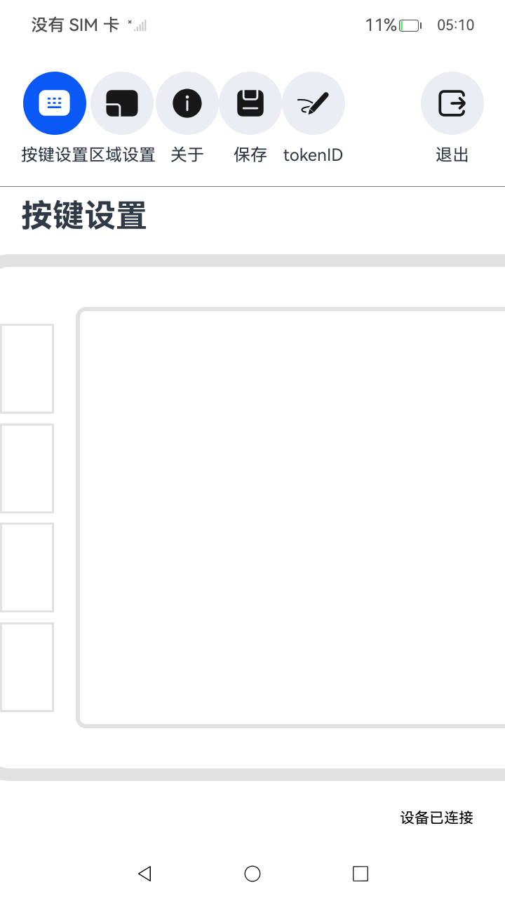
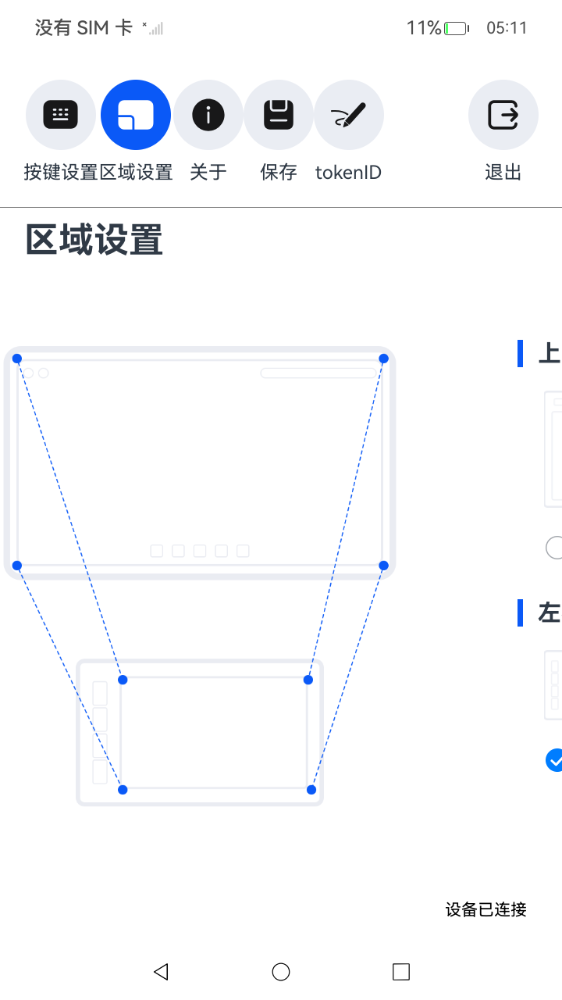
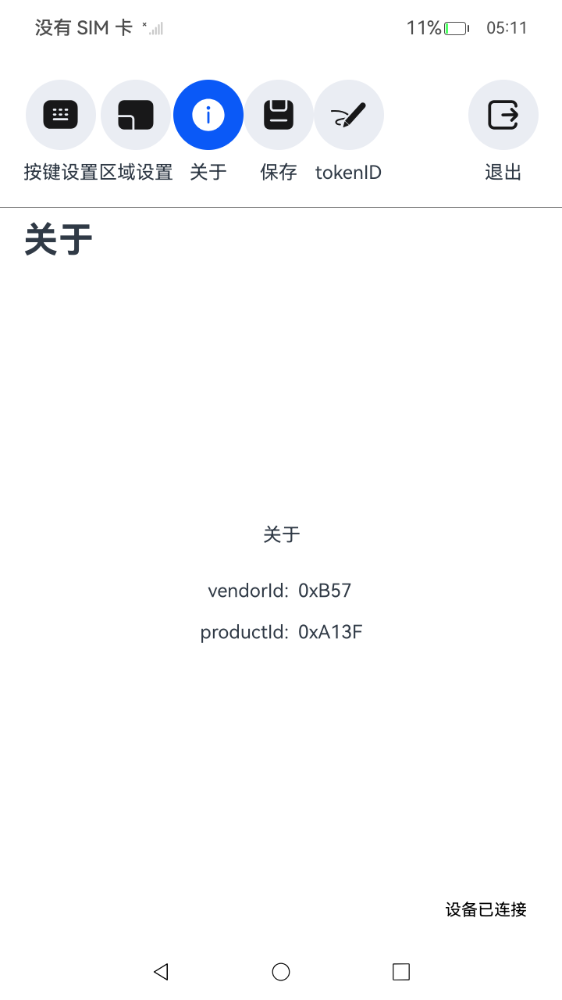
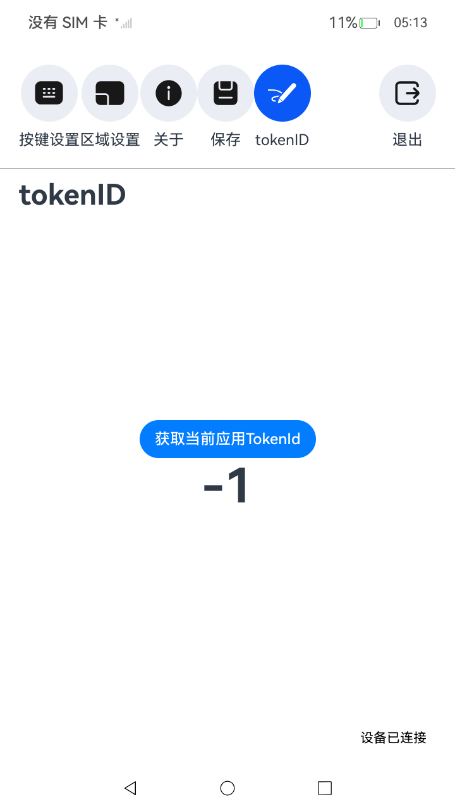

# 驱动开发服务

### 介绍

本示例主要展示了通过DriverDevelopmentKit开发套件中USB DDK开发驱动服务端，使用[@ohos.driver.deviceManager](https://gitcode.com/openharmony/docs/blob/master/zh-cn/application-dev/reference/apis-driverdevelopment-kit/js-apis-driver-deviceManager.md) 、[@ohos.app.ability.DriverExtensionAbility](https://gitcode.com/openharmony/docs/blob/master/zh-cn/application-dev/reference/apis-driverdevelopment-kit/js-apis-app-ability-driverExtensionAbility.md) 、[@ohos.rpc](https://gitcode.com/openharmony/docs/blob/master/zh-cn/application-dev/reference/apis-ipc-kit/js-apis-rpc.md)、[USB DDK](https://gitcode.com/openharmony/docs/blob/master/zh-cn/application-dev/reference/apis-driverdevelopment-kit/capi-usb-ddk-api-h.md)、[HID DDK](https://gitcode.com/openharmony/docs/blob/master/zh-cn/application-dev/reference/apis-driverdevelopment-kit/capi-hid-ddk-api-h.md)
等接口，实现了整个手写板驱动功能，包括手写板UI参数设置界面及驱动服务端。其中UI参数界面包括按键设置、区域设置、关于界面、保存按钮、tokenID界面，驱动服务端通过客户端绑定拉起，驱动服务端主要给UI参数界面提供接口及与物理设备通信;

### 效果预览

| 主页(按键设置) | 区域设置                                 | 关于                              | 获取token                         |
|----------|--------------------------------------|---------------------------------|---------------------------------|
|  |  |  |  |

使用说明

1. 安装该示例应用后，当目标设备插入时，扩展外设驱动服务SA会拉起DriverExtensionAbility相关进程（即：手写板驱动服务端）
2. 在主界面绘制完成后，会调用deviceManager的绑定接口，绑定驱动服务端，成功后主界面会显示“设备已连接”；
3. 主界面展示了手写板上4个按钮，用户可以自定义手写板4个按钮功能；
4. 区域设置可以设置手写板绘画区域与系统显示界面的对应关系
5. 关于界面显示手写板产品信息，包括vendorId、productId
6. 保存按钮，用来保存用户设置

### 工程目录

给出项目中关键的目录结构并描述它们的作用，示例如下：

```
entry/src/main/ets
|---components
|   |---AboutComponent.ets                 //“关于”部件页面构造
|   |---KeyPressComponent.ets              //“按键设置”部件页面构造
|   |---PensComponent.ets                  //“笔”部件页面构造
|   |---RegionComponent.ets                //“区域设置”部件页面构造
|---DriverAbility
|   |---driver.ts                          //主要重载了继承驱动扩展能力DriverExtensionAbility，Onit初始化USB接口等
|---entryability
|---pages
|   |---Index.ets                          //应用首页
|---tool
|   |---RpcTool.ets                        //主要封装了扩展外设相关接口，实现相关功能，如：查询设备，绑定设备，连接远程对象等
entry/src/main/cpp
|---types
|   |---libentry                           //创建native c++工程，自动生成的文件目录
|---data_parser.cpp                        //主要封装了手写笔和按键相关接口，实现相关功能，如：笔的移动或者按下，按键的按下或者抬起等功能
|---data_parser.h                          //定义DataParser类，声明相关接口和成员变量
|---hello.cpp                              //主要封装了手写板驱动相关接口，实现相关功能，如：获取键盘输入，设置方向，获取方向等功能
|---hid_simulator.cpp                      //主要封装了转换事件数据相关接口，实现相关功能，如：转换移动事件数据，转换按键事件数据等功能
|---hid_simulator.h                        //定义了HidSimulator类，声明了数据类型EventType，EventData
|---inject_thread.cpp                      //主要封装了线程相关接口，实现相关功能，如：创建触摸屏设备，创建键盘设备等相关功能
|---inject_thread.h                        //定义了InjectThread类，声明了相关接口和成员变量，定义了虚拟设备名称
|---key_code.h                             //定义了数据类型KeyCode，声明了支持的按键值
|---parse_point_info.cpp                   //实现了接口ParsePointInfo，主要功能：手写笔坐标转换
|---parse_point_info.h                     //声明接口ParsePointInfo
```

### 具体实现

* 驱动UI界面，功能包括查询设备列表、绑定设备驱动服务端、与设备驱动服务端通信，源码参考：[Index.ets](code/DocsSample/DriverDevelopmentKit/UsbDriverDemo/entry/src/main/ets/pages/Index.ets)
    * 使用deviceManager.queryDevices来获取设备列表;
    * 通过deviceManager.bindDeviceDriver来绑定设备驱动服务端，通过返回值拿到驱动服务端实例;
    * 通过服务端实例调用sendMessageRequest与设备驱动服务端通信，并获取到服务端回应，将回应数据打印到主界面;

* 驱动服务端，与驱动UI界面通信，源码参考：[driver.ts](code/DocsSample/DriverDevelopmentKit/UsbDriverDemo/entry/src/main/ets/driverability/driver.ts)
    * 当物理设备插入后，UI界面通过bindDeviceDriver接口获取到驱动服务端实例，再通过服务端实例与服务端通信；
    * 驱动服务拉起后，会调用DriverExtAbility中onInit方法，可以在此方法中通过Napi接口调用CAPI，初始化USB DDK等
    * 驱动UI界面通过deviceManager调用绑定接口，会调用DriverExtAbility中onConnect返回服务端实例
    * 驱动UI界面通过服务端实例与服务端通信，服务端通过Napi接口调用CAPI，与物理设备通信

### 相关权限

[ohos.permission.ACCESS_EXTENSIONAL_DEVICE_DRIVER](https://gitcode.com/openharmony/docs/blob/master/zh-cn/application-dev/security/AccessToken/permissions-for-all.md)
[ohos.permission.ACCESS_DDK_USB](https://gitcode.com/openharmony/docs/blob/master/zh-cn/application-dev/security/AccessToken/restricted-permissions.md)
[ohos.permission.ACCESS_DDK_HID](https://gitcode.com/openharmony/docs/blob/master/zh-cn/application-dev/security/AccessToken/restricted-permissions.md)

### 约束与限制

1. 本示例仅支持标准系统上运行，支持设备：RK3568;
2. 本示例为Stage模型，仅支持API11版本SDK，SDK版本号(API Version 11),镜像版本号(4.1Release)
3. 本示例需要使用DevEco Studio 版本号(6.0Release)版本才可编译运行。

### 下载

如需单独下载本工程，执行如下命令：

```
git init
git config core.sparsecheckout true
echo code/DocsSample/DriverDevelopmentKit > .git/info/sparse-checkout
git remote add origin https://gitee.com/openharmony/applications_app_samples.git
git pull origin master
```