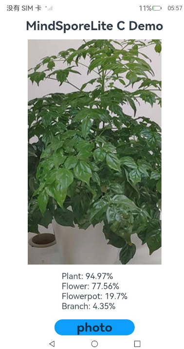

# **基于**Native**接口的MindSpore Lite应用开发**

### 介绍

本文基于MindSpore Lite提供的[Native API](https://docs.openharmony.cn/pages/v4.1/zh-cn/application-dev/reference/apis-mindspore-lite-kit/_mind_spore.md)，实现“图像分类”示例程序，来演示端侧部署的流程。

1. 选择图像分类模型。
2. 将模型转换成MindSpore Lite模型格式。
3. 使用MindSpore Lite推理模型，显示出可能的分类结果。

### 效果预览

| 主页                                               |
| -------------------------------------------------- |
|  |

#### 使用说明

1. 在主界面，可以点击photo按钮，进入相册选择图片界面；
2. 在相册界面，选择图片，点击确定按钮；
3. 自动进行选择图片的图像分类模型推理，部分推理结果显示在主界面。

### 工程目录

```
entry
├── src/main
│   ├── etc
|   |   └── pages 
|   |       └── Index.ets // 首页，获取图片及预处理
│   ├── cpp
|   |   └── mslite_napi.cpp // 推理函数 
|   |   └── CMakeLists.txt // 编译脚本
|   |   └── types 
|   |       └── libentry 
|   |           └── Index.t.ts // 将C++动态库封装成JS模块
│   ├── resources // 资源文件
|   |   └── rawfile 
|   |       └── mobilenetv2.ms // 存放的模型文件
```

### 具体实现

* 本示例程序中使用的终端图像分类模型文件为mobilenetv2.ms，放置在entry\src\main\resources\rawfile工程目录下。

  注：开发者可按需手工下载[MindSpore Model Zoo中图像分类模型](https://download.mindspore.cn/model_zoo/official/lite/mobilenetv2_openimage_lite/1.5/mobilenetv2.ms)。

* 调用[@ohos.file.picker](https://docs.openharmony.cn/pages/v4.1/zh-cn/application-dev/reference/apis-core-file-kit/js-apis-file-picker.md) （图片文件选择）、[@ohos.multimedia.image](https://docs.openharmony.cn/pages/v4.1/zh-cn/application-dev/reference/apis-image-kit/js-apis-image.md) （图片处理效果）、[@ohos.file.fs](https://docs.openharmony.cn/pages/v4.1/zh-cn/application-dev/reference/apis-core-file-kit/js-apis-file-fs.md) （基础文件操作） 等API实现相册图片获取及图片处理。完整代码请参见Index.ets。

* 调用[MindSpore Lite Native API](https://docs.openharmony.cn/pages/v4.1/zh-cn/application-dev/reference/apis-mindspore-lite-kit/_mind_spore.md)实现推理。完整代码请参见mslite_napi.cpp。

* 编写CMake脚本。链接MindSpore Lite动态库，完整代码请参见CMakeLists.txt。

* 使用N-API将C++动态库封装成JS模块。在 entry/src/main/cpp/types/libentry/index.d.ts，定义JS接口`runDemo()` 。

* 调用推理函数并处理结果。完整代码请参见Index.ets

### 相关权限

ohos.permission.READ_IMAGEVIDEO

### 依赖

无。

### 约束与限制

1.本示例仅支持标准系统上运行，测试设备：RK3568;

2.本示例为Stage模型，已适配API version 11版本SDK;

3.本示例需要使用DevEco Studio 4.1 Release及以上版本才可编译运行。

### 下载

如需单独下载本工程，执行如下命令：

```
git init
git config core.sparsecheckout true
echo MindSporeLiteKit/MindSporeLiteCDemo/ > .git/info/sparse-checkout
git remote add origin https://gitee.com/harmonyos_samples/guide-snippets.git
git pull origin master
```

