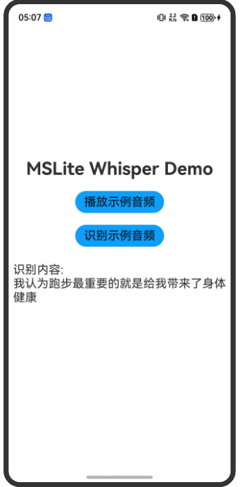

# **基于**Native**接口的MindSpore Lite ASR 应用开发**

### 介绍

本文基于MindSpore Lite提供的[Native API](https://docs.openharmony.cn/pages/v5.0/zh-cn/application-dev/reference/apis-mindspore-lite-kit/_mind_spore.md)，实现“自动语音识别 ASR”示例程序，来演示端侧部署的流程。

### 效果预览

| 主页                                               |
| -------------------------------------------------- |
|  |

#### 使用说明

1. 在主界面点击“播放示例音频”按钮，即可播放音频文件；
2. 在主界面点击“识别示例音频”按钮，即可显示出音频的识别结果；

### 工程目录

```
entry
├── src/main
│   ├── ets
|   |   └── pages 
|   |       └── Index.ets // 首页
|   |       └── player.ets // 音频播放
│   ├── cpp
|   |   └── mslite_napi.cpp // 推理函数 
|   |   └── CMakeLists.txt // 编译脚本
|   |   └── third_party
|   |       └── librosa // 音频特征提取库
|   |       └── libsamplerate // 音频重采样库
|   |   └── types 
|   |       └── libentry 
|   |           └── Index.t.ts // 将C++动态库封装成JS模块
│   ├── resources // 资源文件
|   |   └── rawfile 
|   |       └── tiny-encoder.ms // 存放的模型文件1
|   |       └── tiny-decoder-main.ms // 存放的模型文件2
|   |       └── tiny-decoder-loop.ms // 存放的模型文件3
```

### 具体实现

* 本示例程序中使用的终端图像分类模型文件为[tiny-encoder.ms](entry\src\main\resources\rawfile\tiny-encoder.ms)、[tiny-decoder-main.ms](entry\src\main\resources\rawfile\tiny-decoder-main.ms)、[tiny-decoder-loop.ms](entry\src\main\resources\rawfile\tiny-decoder-loop.ms)。

* 调用[MindSpore Lite Native API](https://docs.openharmony.cn/pages/v5.0/zh-cn/application-dev/reference/apis-mindspore-lite-kit/_mind_spore.md)实现推理。完整代码请参见mslite_napi.cpp。

  说明：需要用户下载三方库，其中librosa来源是[LibrosaCpp](https://github.com/ewan-xu/LibrosaCpp)，libsamplerate来源是[libsamplerate](https://github.com/libsndfile/libsamplerate)，下载后置于[third_party](entry/src/main/cpp/third_party)目录下。AudioFile.h、base64.h、base64.cc来源是[whisper.axera](https://github.com/ml-inory/whisper.axera/tree/main/cpp/src)，下载后置于[src](entry/src/main/cpp/src)目录下。

* 编写CMake脚本。链接MindSpore Lite动态库，完整代码请参见CMakeLists.txt。

* 使用N-API将C++动态库封装成JS模块，在[index.d.ts](entry/src/main/cpp/types/libentry/index.d.ts) 定义JS接口`runDemo()` 。

* 调用推理函数并处理结果。完整代码请参见Index.ets。

### 相关权限

无。

### 依赖

无。

### 约束与限制

1.本示例仅支持 HarmonyOS 5.0.0 及以上运行，测试设备：Phone;

2.本示例为Stage模型，已适配API version 14版本SDK;

3.本示例需要使用DevEco Studio 5.0.2Release及以上版本才可编译运行。

### 下载

如需单独下载本工程，执行如下命令：

```
git init
git config core.sparsecheckout true
echo MindSporeLiteKit/MindSporeLiteCDemoASR/ > .git/info/sparse-checkout
git remote add origin https://gitee.com/harmonyos_samples/guide-snippets.git
git pull origin master
```

