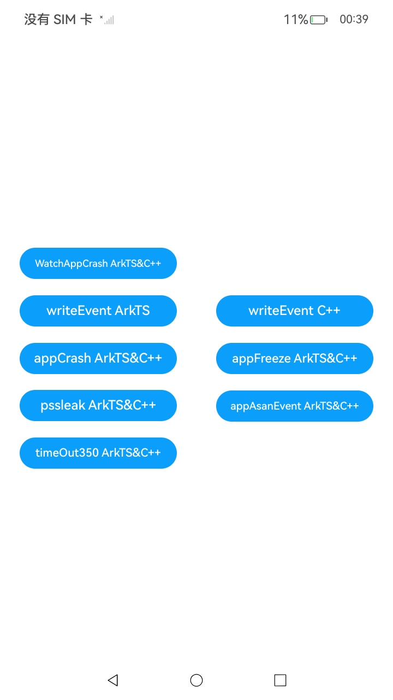

# 事件订阅

###  介绍

本示例主要展示用HiAppEvent如何实现事件订阅（AppEvent），并列举了订阅如下系统事件的例子：

崩溃事件（CrashEvent）、系统卡死事件（FreezeEvent）、系统资源泄漏事件（PssLeakEvent）、系统踩内存事件（ASANEvent）以及主线程超时事件

（TimeOutEvent）。

该工程中的展示的代码详细描述可查如下链接：

- [事件订阅（ArkTS）](https://gitcode.com/openharmony/docs/blob/master/zh-cn/application-dev/dfx/hiappevent-watcher-app-events-arkts.md)

- [事件订阅（C/C++）](https://gitcode.com/openharmony/docs/blob/master/zh-cn/application-dev/dfx/hiappevent-watcher-app-events-ndk.md)

- [订阅崩溃事件（ArkTS）](https://docs.openharmony.cn/pages/v5.0/zh-cn/application-dev/dfx/hiappevent-watcher-crash-events-arkts.md)

- [订阅崩溃事件（C/C++）](https://docs.openharmony.cn/pages/v5.0/zh-cn/application-dev/dfx/hiappevent-watcher-crash-events-ndk.md)

- [订阅卡死事件（ArkTS）](https://docs.openharmony.cn/pages/v5.0/zh-cn/application-dev/dfx/hiappevent-watcher-freeze-events-arkts.md)

- [订阅卡死事件（C/C++）](https://docs.openharmony.cn/pages/v5.0/zh-cn/application-dev/dfx/hiappevent-watcher-freeze-events-ndk.md)

- [订阅资源泄漏事件（ArkTS）](https://docs.openharmony.cn/pages/v5.0/zh-cn/application-dev/dfx/hiappevent-watcher-resourceleak-events-arkts.md)

- [订阅资源泄漏事件（C/C++）](https://docs.openharmony.cn/pages/v5.0/zh-cn/application-dev/dfx/hiappevent-watcher-resourceleak-events-ndk.md)

- [订阅踩内存事件（ArkTS）](https://docs.openharmony.cn/pages/v5.0/zh-cn/application-dev/dfx/hiappevent-watcher-address-sanitizer-events-arkts.md)

- [订阅踩内存事件（C/C++）](https://docs.openharmony.cn/pages/v5.0/zh-cn/application-dev/dfx/hiappevent-watcher-address-sanitizer-events-ndk.md)

- [订阅主线程超时事件（ArkTS）](https://docs.openharmony.cn/pages/v5.0/zh-cn/application-dev/dfx/hiappevent-watcher-mainthreadjank-events-arkts.md)

- [订阅主线程超时事件（C/C++）](https://docs.openharmony.cn/pages/v5.0/zh-cn/application-dev/dfx/hiappevent-watcher-mainthreadjank-events-ndk.md)

###  效果预览

|                             主页                             |
| :----------------------------------------------------------: |
|  |

#### 使用说明

请先按照工程目录添加三方库文件jsoncpp相关文件，否则编译无法通过；jsoncpp官方下载地址为https://github.com/open-source-parsers/jsoncpp，下载完成后在文件夹内运行python脚本“amalgamate.py”（需要有python环境），脚本运行完成后将生成名为“dist”的文件夹，打开后即可得到jsoncpp.cpp，json.h和json-forward.h三个文件。

##### 1.事件订阅（ArkTS&C++）使用说明：订阅崩溃（APP_CRASH）事件

1.在应用侧主界面，点击"WatchAppCrash ArkTS&C++"按钮，触发一次崩溃（APP_CRASH）事件；

2.在DevEco Studio侧下方导航栏，切换到"Log"窗口，日志过滤选择"All log of selected app"，搜索内容设置为"AppEvent HiAppEvent"。此时窗口仅显示符合条件的日志，打印日志结果为：

```text
AppEvent HiAppEvent succeed to read events with onReceive callback form C API   // C++读事件成功
AppEvent HiAppEvent eventInfo.domain=OS
AppEvent HiAppEvent eventInfo.name=APP_CRASH
AppEvent HiAppEvent eventInfo.eventType=1
AppEvent HiAppEvent eventInfo.params.time=1503513021502
AppEvent HiAppEvent eventInfo.params.bundle_name=com.samples.eventsub
AppEvent HiAppEvent eventInfo.params.external_log=["/data/storage/el2/log/hiappevent/APP_CRASH_1503513021744_16523.log"]
AppEvent HiAppEvent succeed to read event with onReceive callback from ArkTS   // ArkTS读事件成功
AppEvent HiAppEvent eventName=APP_CRASH
AppEvent HiAppEvent eventInfo.params.time=1503513021502
AppEvent HiAppEvent eventInfo.params.bundle_name="com.samples.eventsub"
AppEvent HiAppEvent eventInfo.params.external_log=["/data/storage/el2/log/hiappevent/APP_CRASH_1503513021744_16523.log"]
```

注意：

1.EntryAbility.ets的onCreate()方法中同时注册了崩溃事件的ArkTS观察者和C++观察者，故读取时均能读到，不影响结果。

2.C++读事件比ArkTS写事件先出现的原因可能是C++层的日志打印执行速度更快，不影响结果。

##### 2.事件订阅（ArkTS）使用说明：订阅按钮点击（click）事件

1.在应用侧主界面，点击"writeEvent ArkTS"按钮，从ets层触发一次按钮点击事件打点；

2.在DevEco Studio侧下方导航栏，切换到"Log"窗口，日志过滤选择"All log of selected app"，搜索内容设置为"AppEvent HiAppEvent"。此时窗口仅显示符合条件的日志，打印日志结果为：

```text
AppEvent HiAppEvent succeed to read events with onTrigger callback form C API 
AppEvent HiAppEvent eventInfo={"domain_":"button","name_":"click","type_":4,"time_":1503514787492,"tz_":"","pid_":18178,"tid_":18178,"clickTime":100}
AppEvent HiAppEvent eventInfo.domain=button
AppEvent HiAppEvent eventInfo.name=click
AppEvent HiAppEvent eventInfo.eventType=4
AppEvent HiAppEvent eventInfo.params.clickTime=100
AppEvent HiAppEvent succeed to read event with onTrigger callback from ArkTS.
AppEvent HiAppEvent onTrigger: curRow=1, curSize=120
AppEvent HiAppEvent eventPkg.packageId=0
AppEvent HiAppEvent eventPkg.row=1
AppEvent HiAppEvent eventPkg.size=120
AppEvent HiAppEvent eventPkg.info={"domain_":"button","name_":"click","type_":4,"time_":1503514787492,"tz_":"","pid_":18178,"tid_":18178,"clickTime":100}
AppEvents writeEvent ArkTS success
```

注意：

1.EntryAbility.ets的onCreate()方法中同时注册了按钮点击事件的ArkTS观察者和C++观察者，故读取时均能读到，不影响结果。

2.C++读事件比ArkTS写事件先出现的原因可能是C++层的日志打印执行速度更快，不影响结果。

##### 3.事件订阅（C/C++）使用说明：订阅按钮点击（click）事件

1.在应用侧主界面，点击"writeEvent C++"按钮，从c++层触发一次按钮点击事件打点；

2.在DevEco Studio侧下方导航栏，切换到"Log"窗口，日志过滤选择"All log of selected app"，搜索内容设置为"AppEvent HiAppEvent"。此时窗口仅显示符合条件的日志，打印日志结果为：

```text
AppEvent HiAppEvent succeed to read events with onTrigger callback form C API 
AppEvent HiAppEvent eventInfo={"domain_":"button","name_":"click","type_":4,"time_":1503515278195,"tz_":"","pid_":18178,"tid_":18178,"clickTime":1503515278}
AppEvent HiAppEvent eventInfo.domain=button
AppEvent HiAppEvent eventInfo.name=click
AppEvent HiAppEvent eventInfo.eventType=4
AppEvent HiAppEvent eventInfo.params.clickTime=1503515278
AppEvent HiAppEvent succeed to read event with onTrigger callback from ArkTS.
AppEvent HiAppEvent onTrigger: curRow=1, curSize=127
AppEvent HiAppEvent eventPkg.packageId=1
AppEvent HiAppEvent eventPkg.row=1
AppEvent HiAppEvent eventPkg.size=127
AppEvent HiAppEvent eventPkg.info={"domain_":"button","name_":"click","type_":4,"time_":1503515278195,"tz_":"","pid_":18178,"tid_":18178,"clickTime":1503515278}
```

注意：

1.EntryAbility.ets的onCreate()方法中同时注册了按钮点击事件的ArkTS观察者和C++观察者，故读取时均能读到，不影响结果。

2.为了区分ArkTS、C++中设置的自定义打点参数clickTime，点击"writeEvent C++"按钮，配置的clickTime是一个时间戳，而点击"writeEvent ArkTS"按钮，配置的

clickTime是整数100。

3.C++读事件比ArkTS写事件先出现的原因可能是C++层的日志打印执行速度更快，不影响结果。

##### 4.订阅崩溃事件（ArkTS&C++）

1.在应用侧主界面，点击"appCrash ArkTS&C++"按钮触发崩溃，应用退出后重启应用；

2.在DevEco Studio侧下方导航栏，切换到"Log"窗口，日志过滤选择"All log of selected app"，搜索内容设置为"HiAppevent"。此时窗口仅显示符合条件的日志，打印日志结果为：

```text
HiAppEvent eventInfo.WatcherType=OnTrigger
HiAppEvent eventInfo.domain=OS
HiAppEvent eventInfo.name=APP_CRASH
HiAppEvent eventInfo.eventType=1
HiAppEvent eventInfo.params.time=1501890680817
HiAppEvent eventInfo.params.crash_type=JsError
HiAppEvent eventInfo.params.foreground=1
HiAppEvent eventInfo.params.bundle_version=1.0.0
HiAppEvent eventInfo.params.bundle_name=com.samples.eventsub
HiAppEvent eventInfo.params.pid=2579
HiAppEvent eventInfo.params.uid=20010051
HiAppEvent eventInfo.params.uuid=114e22cab85a934b58dca7442edb14bad4301a7fe9a4f5ee5c662c557ada08b1
HiAppEvent eventInfo.params.exception={"message":"Unexpected Text in JSON: Empty Text","name":"SyntaxError","stack":"    at anonymous entry (entry/src/main/ets/pages/Index.ets:65:13)\n"}
HiAppEvent eventInfo.params.hilog.size=100
HiAppEvent eventInfo.params.external_log=["/data/storage/el2/log/hiappevent/APP_CRASH_1501890680961_2579.log"]
HiAppEvent eventInfo.params.log_over_limit=0
// 以上为C++ onTrigger类型观察者日志输出
HiAppEvent eventInfo.WatcherType=OnReceive
HiAppEvent eventInfo.domain=OS
HiAppEvent eventInfo.name=APP_CRASH
HiAppEvent eventInfo.eventType=1
HiAppEvent eventInfo.params.time=1501890680817
HiAppEvent eventInfo.params.crash_type=JsError
HiAppEvent eventInfo.params.foreground=1
HiAppEvent eventInfo.params.bundle_version=1.0.0
HiAppEvent eventInfo.params.bundle_name=com.samples.eventsub
HiAppEvent eventInfo.params.pid=2579
HiAppEvent eventInfo.params.uid=20010051
HiAppEvent eventInfo.params.uuid=114e22cab85a934b58dca7442edb14bad4301a7fe9a4f5ee5c662c557ada08b1
HiAppEvent eventInfo.params.exception={"message":"Unexpected Text in JSON: Empty Text","name":"SyntaxError","stack":"    at anonymous entry (entry/src/main/ets/pages/Index.ets:65:13)\n"}
HiAppEvent eventInfo.params.hilog.size=100
HiAppEvent eventInfo.params.external_log=["/data/storage/el2/log/hiappevent/APP_CRASH_1501890680961_2579.log"]
HiAppEvent eventInfo.params.log_over_limit=0
// 以上为C++ onReceive类型观察者日志输出
HiAppEvent onReceive: domain=OS
HiAppEvent eventName=APP_CRASH
HiAppEvent eventInfo.domain=OS
HiAppEvent eventInfo.name=APP_CRASH
HiAppEvent eventInfo.eventType=1
HiAppEvent eventInfo.params.time=1501890680817
HiAppEvent eventInfo.params.crash_type=JsError
HiAppEvent eventInfo.params.foreground=true
HiAppEvent eventInfo.params.bundle_version=1.0.0
HiAppEvent eventInfo.params.bundle_name=com.samples.eventsub
HiAppEvent eventInfo.params.pid=2579
HiAppEvent eventInfo.params.uid=20010051
HiAppEvent eventInfo.params.uuid=114e22cab85a934b58dca7442edb14bad4301a7fe9a4f5ee5c662c557ada08b1
HiAppEvent eventInfo.params.exception={"message":"Unexpected Text in JSON: Empty Text","name":"SyntaxError","stack":"    at anonymous entry (entry/src/main/ets/pages/Index.ets:65:13)\n"}
HiAppEvent eventInfo.params.hilog.size=100
HiAppEvent eventInfo.params.external_log=["/data/storage/el2/log/hiappevent/APP_CRASH_1501890680961_2579.log"]
HiAppEvent eventInfo.params.log_over_limit=false
HiAppEvent eventInfo.params.test_data=100
// 以上为ArkTS onReceive类型观察者日志输出
```

注意：

1.要确认日志输出中的eventInfo.name为APP_CRASH。

2.C++实现了onReceive和onTrigger两种观察者，ArkTS实现了onReceive观察者。

##### 5.订阅卡死事件（ArkTS&C++）

1.在应用侧主界面，点击"appFreeze ArkTS&C++"按钮触发卡死（可能需要几秒），应用退出后重启应用；

2.在DevEco Studio侧下方导航栏，切换到"Log"窗口，日志过滤选择"All log of selected app"，搜索内容设置为"HiAppevent"。此时窗口仅显示符合条件的日志，打印日志结果为：

```text
HiAppEvent eventInfo.WatcherType=OnReceive
HiAppEvent eventInfo.domain=OS
HiAppEvent eventInfo.name=APP_FREEZE
HiAppEvent eventInfo.eventType=1
HiAppEvent eventInfo.params.time=1501891964864
HiAppEvent eventInfo.params.foreground=1
HiAppEvent eventInfo.params.bundle_version=1.0.0
HiAppEvent eventInfo.params.bundle_name=com.samples.eventsub
HiAppEvent eventInfo.params.process_name=com.samples.eventsub
HiAppEvent eventInfo.params.pid=5105
HiAppEvent eventInfo.params.uid=20010051
HiAppEvent eventInfo.params.uuid=c450b09dcefc0f9bd9b6cb4230e0c8f2d1b1e3c5becf82d272ef1a3241c958da
HiAppEvent eventInfo.params.exception={"message":"App main thread is not response!","name":"THREAD_BLOCK_6S"}
HiAppEvent eventInfo.params.hilog.size=88
HiAppEvent eventInfo.params.event_handler.size=0
HiAppEvent eventInfo.params.event_handler_3s.size=0
HiAppEvent eventInfo.params.event_handler_6s.size=0
HiAppEvent eventInfo.params.peer_binder.size=0
HiAppEvent eventInfo.params.threads.size=38
HiAppEvent eventInfo.params.memory={"pss":0,"rss":0,"sys_avail_mem":1000060,"sys_free_mem":485304,"sys_total_mem":1935816,"vss":0}
HiAppEvent eventInfo.params.external_log=["/data/storage/el2/log/hiappevent/APP_FREEZE_1501891977850_5105.log"]
HiAppEvent eventInfo.params.log_over_limit=0
// 以上为C++ onReceive类型观察者日志输出
HiAppEvent eventInfo.WatcherType=OnTrigger
HiAppEvent eventInfo.domain=OS
HiAppEvent eventInfo.name=APP_FREEZE
HiAppEvent eventInfo.eventType=1
HiAppEvent eventInfo.params.time=1501891964864
HiAppEvent eventInfo.params.foreground=1
HiAppEvent eventInfo.params.bundle_version=1.0.0
HiAppEvent eventInfo.params.bundle_name=com.samples.eventsub
HiAppEvent eventInfo.params.process_name=com.samples.eventsub
HiAppEvent eventInfo.params.pid=5105
HiAppEvent eventInfo.params.uid=20010051
HiAppEvent eventInfo.params.uuid=c450b09dcefc0f9bd9b6cb4230e0c8f2d1b1e3c5becf82d272ef1a3241c958da
HiAppEvent eventInfo.params.exception={"message":"App main thread is not response!","name":"THREAD_BLOCK_6S"}
HiAppEvent eventInfo.params.hilog.size=88
HiAppEvent eventInfo.params.event_handler.size=0
HiAppEvent eventInfo.params.event_handler_3s.size=0
HiAppEvent eventInfo.params.event_handler_6s.size=0
HiAppEvent eventInfo.params.peer_binder.size=0
HiAppEvent eventInfo.params.threads.size=38
HiAppEvent eventInfo.params.memory={"pss":0,"rss":0,"sys_avail_mem":1000060,"sys_free_mem":485304,"sys_total_mem":1935816,"vss":0}
HiAppEvent eventInfo.params.external_log=["/data/storage/el2/log/hiappevent/APP_FREEZE_1501891977850_5105.log"]
HiAppEvent eventInfo.params.log_over_limit=0
// 以上为C++ onTrigger类型观察者日志输出
HiAppEvent onReceive: domain=OS
HiAppEvent eventName=APP_FREEZE
HiAppEvent eventInfo.domain=OS
HiAppEvent eventInfo.name=APP_FREEZE
HiAppEvent eventInfo.eventType=1
HiAppEvent eventInfo.params.time=1501891964864
HiAppEvent eventInfo.params.foreground=true
HiAppEvent eventInfo.params.bundle_version=1.0.0
HiAppEvent eventInfo.params.bundle_name=com.samples.eventsub
HiAppEvent eventInfo.params.process_name=com.samples.eventsub
HiAppEvent eventInfo.params.pid=5105
HiAppEvent eventInfo.params.uid=20010051
HiAppEvent eventInfo.params.uuid=c450b09dcefc0f9bd9b6cb4230e0c8f2d1b1e3c5becf82d272ef1a3241c958da
HiAppEvent eventInfo.params.exception={"message":"App main thread is not response!","name":"THREAD_BLOCK_6S"}
HiAppEvent eventInfo.params.hilog.size=88
HiAppEvent eventInfo.params.event_handler.size=0
HiAppEvent eventInfo.params.event_handler_size_3s=0
HiAppEvent eventInfo.params.event_handler_size_6s=0
HiAppEvent eventInfo.params.peer_binder.size=0
HiAppEvent eventInfo.params.threads.size=38
HiAppEvent eventInfo.params.memory={"pss":0,"rss":0,"sys_avail_mem":1000060,"sys_free_mem":485304,"sys_total_mem":1935816,"vss":0}
HiAppEvent eventInfo.params.external_log=["/data/storage/el2/log/hiappevent/APP_FREEZE_1501891977850_5105.log"]
HiAppEvent eventInfo.params.log_over_limit=false
HiAppEvent eventInfo.params.test_data=100
// 以上为ArkTS onReceive类型观察者日志输出
```

注意：

1.如果在应用重启时立即在log窗口搜索日志会出现日志暂时未出现的情况，原因是Freeze事件处理时间较长，等待10秒即可。

2.要确认日志输出中的eventInfo.name为APP_FREEZE。

3.C++实现了onReceive和onTrigger两种观察者，ArkTS实现了onReceive观察者。

##### 6.订阅资源泄漏事件（ArkTS&C++）

1.先在设备“开发者选项”中打开“系统资源泄漏日志”，并重启设备；

2.在应用侧主界面，点击"pssLeak ArkTS&C++"按钮触发资源泄露事件，等待15~30分钟，会上报应用内存泄漏事件；

3.在DevEco Studio侧下方导航栏，切换到"Log"窗口，日志过滤选择"All log of selected app"，搜索内容设置为"HiAppevent"。此时窗口仅显示符合条件的日志，打印日志结果为：

```text
HiAppEvent eventInfo.WatcherType=OnReceive
HiAppEvent eventInfo.domain=OS
HiAppEvent eventInfo.name=RESOURCE_OVERLIMIT
HiAppEvent eventInfo.eventType=1
HiAppEvent eventInfo.params.time=1502049167732
HiAppEvent eventInfo.params.pid=1587
HiAppEvent eventInfo.params.uid=20010043
HiAppEvent eventInfo.params.resource_type=pss_memory
HiAppEvent eventInfo.params.bundle_name=com.example.eventsub
HiAppEvent eventInfo.params.bundle_version=1.0.0
HiAppEvent eventInfo.params.memory={"pss":2100257,"rss":1352644,"sys_avail_mem":250272,"sys_free_mem":60004,"sys_total_mem":1992340,"vss":2462936}
HiAppEvent eventInfo.params.external_log=["/data/storage/el2/log/resourcelimit/RESOURCE_OVERLIMIT_1725614572401_6808.log","/data/storage/el2/log/resourcelimit/RESOURCE_OVERLIMIT_1725614572412_6808.log"]
HiAppEvent eventInfo.params.log_over_limit=0
以上为C++ OnReceive类型观察者日志输出
HiAppEvent eventInfo.WatcherType=OnTrigger
HiAppEvent eventInfo.domain=OS
HiAppEvent eventInfo.name=RESOURCE_OVERLIMIT
HiAppEvent eventInfo.eventType=1
HiAppEvent eventInfo.params.time=1502049167732
HiAppEvent eventInfo.params.pid=1587
HiAppEvent eventInfo.params.uid=20010043
HiAppEvent eventInfo.params.resource_type=pss_memory
HiAppEvent eventInfo.params.bundle_name=com.example.eventsub
HiAppEvent eventInfo.params.bundle_version=1.0.0
HiAppEvent eventInfo.params.memory={"pss":2100257,"rss":1352644,"sys_avail_mem":250272,"sys_free_mem":60004,"sys_total_mem":1992340,"vss":2462936}
HiAppEvent eventInfo.params.external_log=["/data/storage/el2/log/resourcelimit/RESOURCE_OVERLIMIT_1725614572401_6808.log","/data/storage/el2/log/resourcelimit/RESOURCE_OVERLIMIT_1725614572412_6808.log"]
HiAppEvent eventInfo.params.log_over_limit=0
// 以上为C++ onTrigger类型观察者日志输出
HiAppEvent onReceive: domain=OS
HiAppEvent eventName=RESOURCE_OVERLIMIT
HiAppEvent eventInfo={"domain":"OS","name":"RESOURCE_OVERLIMIT","eventType":1,"params":{"bundle_name":"com.example.eventsub","bundle_version":"1.0.0","memory":{"pss":2100257,"rss":1352644,"sys_avail_mem":250272,"sys_free_mem":60004,"sys_total_mem":1992340,"vss":2462936},"pid":20731,"resource_type":"pss_memory","time":1502348798106,"uid":20010044,"external_log": ["/data/storage/el2/log/resourcelimit/RESOURCE_OVERLIMIT_1725614572401_6808.log", "/data/storage/el2/log/resourcelimit/RESOURCE_OVERLIMIT_1725614572412_6808.log"], "log_over_limit": false}}eventInfo.params.bundle_version=1.0.0
// 以上为ArkTS onReceive类型观察者日志输出
```

注意：

1.如果设备“开发者选项”中没有“系统资源泄漏日志”选项，或有该选项但重启后该选项自动关闭，则无法测试该功能。

2.要确认日志输出中的eventInfo.name为RESOURCE_OVERLIMIT。

3.C++实现了onReceive和onTrigger两种观察者，ArkTS实现了onReceive观察者。

##### 7.订阅踩内存事件（ArkTS&C++）

1.点击DevEco Studio界面中的“entry”，点击“Edit Configurations”，点击“Diagnostics”，勾选“Address Sanitizer”，保存设置。

2.在应用侧主界面，点击"appAsanEvent ArkTS&C++"按钮触发踩内存事件，应用退出后重启应用；

3.在DevEco Studio侧下方导航栏，切换到"Log"窗口，日志过滤选择"All log of selected app"，搜索内容设置为"HiAppevent"。此时窗口仅显示符合条件的日志，打印日志结果为：

```text
HiAppEvent eventInfo.WatcherType=OnTrigger 													
HiAppEvent eventInfo.domain=OS
HiAppEvent eventInfo.name=ADDRESS_SANITIZER													
HiAppEvent eventInfo.eventType=1
HiAppEvent eventInfo.params.time=1609739933049
HiAppEvent eventInfo.params.bundle_version=1.0.0
HiAppEvent eventInfo.params.bundle_name=com.example.cpp
HiAppEvent eventInfo.params.pid=6628
HiAppEvent eventInfo.params.uid=20010050
HiAppEvent eventInfo.params.type="stack-buffer-overflow"
HiAppEvent eventInfo.params.external_log=["/data/storage/el2/log/hiappevent/ADDRESS_SANITIZER_1609739933234_6628.log"]
HiAppEvent eventInfo.params.log_over_limit=0
// 以上为C++ OnTrigger观察者日志输出
HiAppEvent eventInfo.WatcherType=OnReceive 													
HiAppEvent eventInfo.domain=OS
HiAppEvent eventInfo.name=ADDRESS_SANITIZER													
HiAppEvent eventInfo.eventType=1
HiAppEvent eventInfo.params.time=1609739933049
HiAppEvent eventInfo.params.bundle_version=1.0.0
HiAppEvent eventInfo.params.bundle_name=com.example.cpp
HiAppEvent eventInfo.params.pid=6628
HiAppEvent eventInfo.params.uid=20010050
HiAppEvent eventInfo.params.type="stack-buffer-overflow"
HiAppEvent eventInfo.params.external_log=["/data/storage/el2/log/hiappevent/ADDRESS_SANITIZER_1609739933234_6628.log"]
HiAppEvent eventInfo.params.log_over_limit=0
// 以上为C++ OnReceiver观察者日志输出
HiAppEvent onReceive: domain=OS
HiAppEvent eventName=ADDRESS_SANITIZER
HiAppEvent eventInfo.domain=OS
HiAppEvent eventInfo.name=ADDRESS_SANITIZER
HiAppEvent eventInfo.eventType=1
HiAppEvent eventInfo.params.time=1609739473665
HiAppEvent eventInfo.params.crash_type=JsError
HiAppEvent eventInfo.params.foreground=true
HiAppEvent eventInfo.params.bundle_version=1.0.0
HiAppEvent eventInfo.params.bundle_name=com.example.eventsub
HiAppEvent eventInfo.params.pid=4116
HiAppEvent eventInfo.params.uid=20010053
HiAppEvent eventInfo.type=stack-buffer-overflow
HiAppEvent eventInfo.params.external_log=["/data/storage/el2/log/hiappevent/ADDRESS_SANITIZER_1609739473837_4116.log"]
HiAppEvent eventInfo.params.log_over_limit=0
// 以上为ArkTS onReceive类型观察者日志输出
```

注意：

1.如果在勾选“Address Sanitizer”设置后，应用无法在设备上打开，可能是DevEco Studio和设备版本的原因，请切换版本尝试。

2.要确认日志输出中的eventInfo.name为ADDRESS_SANITIZER。

3.C++实现了onReceive和onTrigger两种观察者，ArkTS实现了onReceive观察者。

##### 8.订阅主线程超时事件（ArkTS&C++）

1.测试设备应能使用开发者使用nolog版本，开发者模式处于关闭状态，可以使能主线程超时检测抓取trace的功能，建议使用真机测试；

2.在应用侧主界面，快速连续点击两次"timeOut350 ArkTS&C++"按钮触发主线程超时事件；

3.在DevEco Studio侧下方导航栏，切换到"Log"窗口，日志过滤选择"All log of selected app"，搜索内容设置为"HiAppevent"。此时窗口仅显示符合条件的日志，打印日志结果为：

```text
HiAppEvent eventInfo.WatcherType=OnReceive 													
HiAppEvent eventInfo.domain=OS
HiAppEvent eventInfo.name=MAIN_THREAD_JANK												    
HiAppEvent eventInfo.eventType=1
HiAppEvent eventInfo.params.time=1609739933049
HiAppEvent eventInfo.params.pid=6628
HiAppEvent eventInfo.params.uid=20010050
HiAppEvent eventInfo.params.bundle_version=1.0.0
HiAppEvent eventInfo.params.bundle_name=com.example.cpp
HiAppEvent eventInfo.params.begin_time=1609739932900
HiAppEvent eventInfo.params.end_time=1609739933049
HiAppEvent eventInfo.params.external_log=["/data/storage/el2/log/hiappevent/MAIN_THREAD_JANK_1609739933234_6628.log"]
HiAppEvent eventInfo.params.log_over_limit=0
// 以上为C++ OnReceiver观察者日志输出
HiAppEvent onReceive: domain=OS
HiAppEvent eventName=MAIN_THREAD_JANK
HiAppEvent eventInfo.eventType=1
HiAppEvent eventInfo.params.time=1609739473665
HiAppEvent eventInfo.params.bundle_version=1.0.0
HiAppEvent eventInfo.params.bundle_name=com.example.eventsub
HiAppEvent eventInfo.params.pid=4116
HiAppEvent eventInfo.params.uid=20010053
HiAppEvent eventInfo.params.begin_time=1717593620016
HiAppEvent eventInfo.params.end_time=1717593620518
HiAppEvent eventInfo.params.external_log=["/data/storage/el2/log/hiappevent/APP_CRASH_1609739473837_4116.log"]
HiAppEvent eventInfo.params.log_over_limit=0
// 以上为ArkTS onReceive类型观察者日志输出
```

注意：

1.如果测试设备无法达到"使用nolog版本，开发者模式处于关闭状态，可以使能主线程超时检测抓取trace的功能"的条件，无法触发回调，日志不会输出。

2.要确认日志输出中的eventInfo.name为MAIN_THREAD_JANK。

3.C++实现了onReceive观察者，ArkTS实现了onReceive观察者。

###  工程目录

```text
entry/src/main
├─cpp
│  ├─json
│  │ └─json.h          	  // 自行添加
│  │ └─json-forwards.h    // 自行添加
│  ├─types
│  │ └─libentry
│  │   └─Index.d.ts		    // 定义ArkTS接口
│  ├─CMakeLists.txt  		  // 导入so链接
│  ├─napi_init.cpp  		  // 功能函数，观察者定义
│  └─jsoncpp.cpp          // 自行添加
└─ets
   ├─entryability
   │ └─EntryAbility.ets		// 新增接口调用
   └─pages
     └─Index.ets     		// 主页
```

###  具体实现

1.在entry/src/main/cpp下添加三方库文件jsoncpp.cpp和目录"json"，"json"目录下添加json.h和json-forwards.h；
2.编辑"CMakeLists.txt"文件，添加源文件及动态库；
3.编辑"napi_init.cpp"文件，导入依赖的文件，定义onReceive和onTrigger类型观察者相关方法，注册为ArkTS接口；
4.编辑"index.d.ts"文件，定义ArkTS接口；
5.编辑"EntryAbility.ets"文件，在onCreate()函数中新增观察者调用（包括ArkTS添加观察者和调用C++接口从而调用观察者）；
6.编辑"Index.ets"文件，新增按钮触发各种事件。

###  相关权限

不涉及。

###  依赖

不涉及。

###  约束与限制

1. 本示例仅支持标准系统上运行，支持设备：华为手机；
2. 本示例已适配API14版本SDK，版本号：5.0.2.58；
3. 本示例需要使用DevEco Studio(5.0.3.910)及以上版本才可编译运行。

### 下载

如需单独下载本工程，执行如下命令：

```text
git init
git config core.sparsecheckout true
echo code/DocsSample/PerformanceAnalysisKit/HiAppEvent/EventSub/ > .git/info/sparse-checkout
git remote add origin https://gitcode.com/openharmony/applications_app_samples.git
git pull origin master
```
