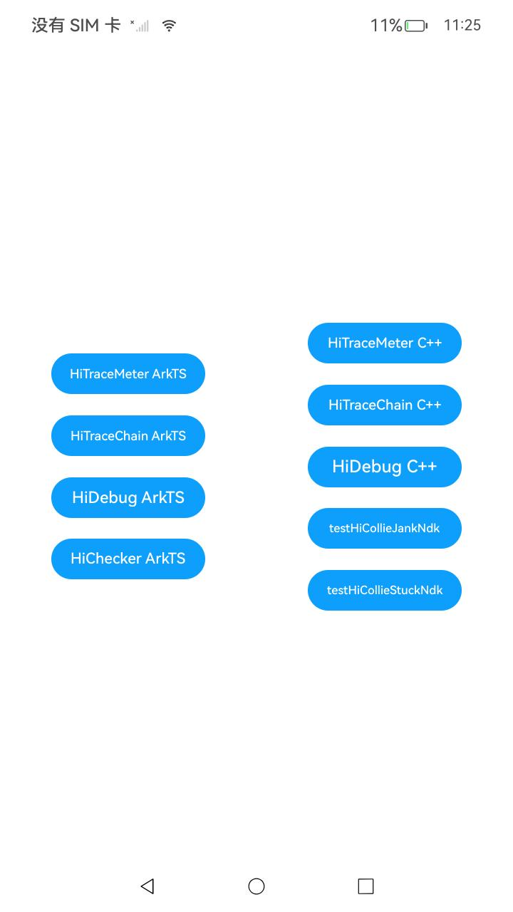

# 性能分析工具

###  介绍

本示例主要展示了使用性能分析的各个工具接口：

HiTraceMeter提供系统性能打点接口。开发者通过在关键代码位置调用HiTraceMeter接口提供的API接口，能够有效跟踪进程轨迹、查看系统性能。

HiTraceChain是基于云计算分布式跟踪调用链思想，在端侧业务流程（涉及跨线程、跨进程、跨设备）中的一种轻量级实现。hiTraceChain在业务控制面流程中，生成和传递唯一跟踪标识，在业务流程中输出的各类信息中（包括应用事件、系统时间、日志等）记录该跟踪标识。在调试、问题定位过程中，开发者可以通过该唯一跟踪标识将本次业务流程端到端的各类信息快速关联起来。

HiChecker可以作为应用开发阶段使用的检测工具，用于检测代码运行过程中部分易忽略的问题，如应用线程出现耗时调用、应用进程中元能力资源泄露等问题。开发者可以通过日志记录或进程crash等形式查看具体问题并进行修改，提升应用的使用体验。

HiDebug对外提供系统调试相关功能的接口，包括应用进程的静态堆内存（native heap）信息、应用进程内存占用PSS（Proportional Set Size）信息的获取等，也可完成虚拟机内存切片导出，虚拟机CPU Profiling采集等操作。

HiCollie模块对外提供检测业务线程卡死、卡顿，以及上报卡死事件的能力。

该工程中的展示的代码详细描述可查如下链接：

- [使用HiTraceMeter跟踪性能（ArkTS/JS）](https://docs.openharmony.cn/pages/v5.0/zh-cn/application-dev/dfx/hitracemeter-guidelines-arkts.md)

- [使用HiTraceMeter跟踪性能（C/C++）](https://docs.openharmony.cn/pages/v5.0/zh-cn/application-dev/dfx/hitracemeter-guidelines-ndk.md)

- [使用HiTraceChain打点（ArkTS/JS）](https://docs.openharmony.cn/pages/v5.0/zh-cn/application-dev/dfx/hitracechain-guidelines-arkts.md)

- [使用HiTraceChain打点（C/C++）](https://docs.openharmony.cn/pages/v5.0/zh-cn/application-dev/dfx/hitracechain-guidelines-ndk.md)

- [使用HiChecker检测问题（ArkTS）](https://docs.openharmony.cn/pages/v5.0/zh-cn/application-dev/dfx/hichecker-guidelines-arkts.md)

- [使用HiDebug获取调试信息（ArkTS）](https://docs.openharmony.cn/pages/v5.0/zh-cn/application-dev/dfx/hidebug-guidelines-arkts.md)

- [使用HiDebug获取调试信息（C/C++）](https://docs.openharmony.cn/pages/v5.0/zh-cn/application-dev/dfx/hidebug-guidelines-ndk.md)

- [使用HiCollie检测业务线程卡死卡顿问题（C/C++）](https://docs.openharmony.cn/pages/v5.0/zh-cn/application-dev/dfx/hicollie-guidelines-ndk.md)

###  效果预览

|                             主页                             |
| :----------------------------------------------------------: |
|  |

#### 使用说明

##### 1.HiTraceMeter（ArkTS）使用说明

1.在主界面点击按钮；DevEco Studio Terminal 中执行如下命令：

```
PS D:\xxx\xxx> hdc shell
$ hitrace --trace_begin app
```

2.执行抓取trace命令后，先在设备中点击几次HiTraceMeter ArkTS按钮，继续在Terminal窗口执行命令：

```
$ hitrace --trace_dump | grep tracing_mark_write
$ hitrace --trace_finish
```

3.成功输出如下数据即为成功：

```
<...>-3310    (-------) [005] .... 351382.921936: tracing_mark_write: S|3310|H:myTraceTest 1001
<...>-3310    (-------) [005] .... 351382.922233: tracing_mark_write: C|3310|H:myTestCount 1
<...>-3310    (-------) [005] .... 351382.922138: tracing_mark_write: S|3310|H:myTraceTest 1002
<...>-3310    (-------) [005] .... 351382.922233: tracing_mark_write: C|3310|H:myTestCount 2
<...>-3310    (-------) [005] .... 351382.922165: tracing_mark_write: F|3310|H:myTestCount 1001
<...>-3310    (-------) [005] .... 351382.922175: tracing_mark_write: F|3310|H:myTestCount 1002
```

##### 2.HiTraceMeter（C++）使用说明

1.将编译好的hap包推送到设备上安装，在DevEco Studio Terminal中执行命令：

```
PS D:\xxx\xxx> hdc shell
$ hitrace --trace_begin app
```

2.执行抓取trace命令后，先在设备中点击几次HiTraceMeter C++按钮，然后在Terminal窗口执行命令：

```
$ hitrace --trace_dump | grep tracing_mark_write
```

3.成功输出如下数据即为成功：

```
<...>-2477    (-------) [001] ....   396.427165: tracing_mark_write: S|2477|H:hitraceTest 123
<...>-2477    (-------) [001] ....   396.427196: tracing_mark_write: F|2477|H:hitraceTest 123
```

##### 3.HiTraceChain（ArkTS）使用说明

1.在主界面点击HiTraceChain ArkTS按钮，然后切换到"Log"窗口，日志过滤选择"No filters"，搜索内容设置为"HiTraceBegin"。查找输出如下的数据：

```
[a92ab145c9421d5, 0, 0] HiTraceBegin name:Write a new app event flags:0x01.
```

2.再搜索形如"[a92ab145c9421d5, 0, 0]"字样的内容，即可查看所有该业务的分布式跟踪信息：

```
[a92ab145c9421d5, 0, 0] HiTraceBegin name:Write a new app event flags:0x01.
[a92ab145c9421d5, 0, 0] pid[24256] first get g_tagsProperty: 0
[a92ab145c9421d5, 0, 0] [event_manager.cpp(835)-(100000:100000:scope)] id: 0, log: {types: Click, node: Button, prcd: Down, state: READY, prcd: Up, state: SUCCEED}
[a92ab145c9421d5, 0, 0] [event_manager.cpp(1817)-(100000:100000:scope)] Consumed new event id=5591 in ace_container, lastEventInfo: id:5590
```

##### 4.HiTraceChain（C++）使用说明

1.在主界面点击HiTraceChain C++按钮，切换到"Log"窗口，日志过滤选择"No filters"，搜索内容设置为"hitraceTest"。成功输出如下数据即为成功：

```
HiTraceBegin name:hitraceTest flags:0x00.
```

##### 5.HiChecker（ArkTS）使用说明

1.先在DevEco Studio Terminal 中执行如下命令：

```
PS D:\xxx\xxx> hdc shell
$ hilog|grep -i hichecker
```

2.hichecker功能调用写在应用启动时，启动应用时（注意要先执行上一步，如已经启动可以重新启动应用），Log窗口有如下调用栈信息说明检测成功，成功的数据如下所示：

```
01-05 19:40:22.837  7782  7782 I C02d0b/HICHECKER: HiChecker caution with RULE_CAUTION_PRINT_LOG.                                   
01-05 19:40:22.837  7782  7782 I C02d0b/HICHECKER: CautionMsg:trigger:RULE_THREAD_CHECK_SLOW_PROCESS,Trigger: pid = 7782, tid = 7782
01-05 19:40:22.837  7782  7782 I C02d0b/HICHECKER: StackTrace:
01-05 19:40:22.837  7782  7782 I C02d0b/HICHECKER: Tid:7782, Name:m.example.arkts
01-05 19:40:22.837  7782  7782 I C02d0b/HICHECKER: #00 pc 00002bad /system/lib/platformsdk/libhichecker.so(OHOS::HiviewDFX::HiChecker::NotifySlowProcess(std::__h::basic_string<char, std::__h::char_traits<char>, std::__h::allocator<c
har>> const&)+48)(d13fb7fce5b5364c7a3994c95f66c6c2)
01-05 19:40:22.837  7782  7782 I C02d0b/HICHECKER: #01 pc 000707cf /system/lib/platformsdk/libimage_napi.z.so(fd73ffee97d631ca6aebf63145d4abf5)
01-05 19:40:22.837  7782  7782 I C02d0b/HICHECKER: #02 pc 00073b4b /system/lib/platformsdk/libimage_napi.z.so(fd73ffee97d631ca6aebf63145d4abf5)
......
```

##### 6.HiDebug（ArkTS）使用说明

1.在主界面，点击HiDebug ArkTS按钮；切换到"Log"窗口，日志过滤选择"No filters",搜索内容设置为"testTag"。成功输出如下数据即为成功：

```
GetSystemCpuUsage: 0.069260
```

##### 7.HiDebug（C++）使用说明

1.在主界面，点击HiDebug C++按钮；切换到"Log"窗口，日志过滤选择"No filters",搜索内容设置为"testTag"。成功输出如下数据即为成功：

```
GetSystemCpuUsage: 0.078654
```

##### 8.HiCollie（C++）使用说明

1.应用刚启动10s内，不进行卡顿检测，等待10s，再在主界面依次点击"testHiCollieJankNDK"按钮和"testHiCollieStuckNDK"，切换到"Log"窗口，日志过滤选择"No filters"，搜索内容设置为"testTag"。成功输出如下数据即为成功：

```
OH_HiCollie_Init_JankDetection: 0
OH_HiCollie_Init_StuckDetection: 0
```

生成栈文件目录地址：/data/app/el2/100/log/应用bundle name/watchdog/BUSSINESS_THREAD_JANK_XXX.txt。

###  工程目录

```
entry/src/main
├─cpp
│  ├─CMakeLists.txt  		//导入so链接
│  └─napi_init.cpp  		//C++功能函数
└─ets
   └─entryability
   │ └─EntryAbility.ets      //生命周期
   └─pages
     └─Index.ets     		//主页
```

###  具体实现

1. ArkTS项目可以在"@kit.PerformanceAnalysisKit"中导入对应模块即可在各种场景下调用对应函数，如在index.ets中直接调用，或者在EntryAbility.ets函数中在应用的各个生命周期内添加功能函数以实现应用自动在“启动”或“结束”时进行性能分析。
1. C++项目可以在CMakeLists.txt里的target_link_libraries中添加对应功能的包，在napi_init.cpp中添加注册自定义C++功能函数（还需在index.d.ts中声明）后，即可在各种场景下通过"libentry.so"库自定义一个对象来调用注册声明的测试函数即可。

###  相关权限

不涉及。

###  依赖

不涉及。

###  约束与限制

1. 本示例仅支持标准系统上运行，支持设备：RK3568；
2. 本示例已适配API14版本SDK，版本号：5.0.2.58，镜像版本号：OpenHarmony5.0.2.58；
3. 本示例需要使用DevEco Studio(5.0.3.910)及以上版本才可编译运行。

### 下载

如需单独下载本工程，执行如下命令：

```
git init
git config core.sparsecheckout true
echo code/DocsSample/PerformanceAnalysisKit/PerformanceAnalysisTool/ > .git/info/sparse-checkout
git remote add origin https://gitee.com/openharmony/applications_app_samples.git
git pull origin master
```

