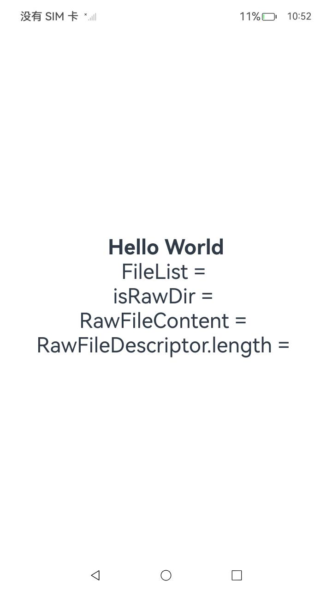
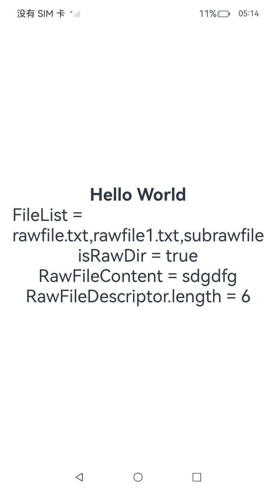
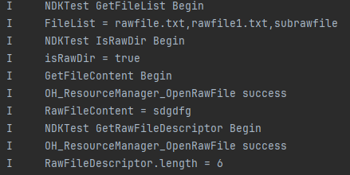

# RawFile（资源管理）

### 介绍

本工程主要实现了[Rawfile开发指导](https://gitcode.com/openharmony/docs/blob/master/zh-cn/application-dev/napi/rawfile-guidelines.md)中功能，开发者可以通过本项目了解如何使用Native Rawfile接口操作Rawfile目录和文件。功能包括文件列表遍历、文件打开、搜索、读取和关闭Rawfile。

### 效果预览

| 显示页面                                                     | 点击Hello World后的页面                   | 点击后日志打印效果                              |
| ------------------------------------------------------------|-------------------------------------| ----------------------------------------------- |
|  |  |  |

### 使用说明

1. 启动项目后，会显示带有“Hello World”的文本页面；
2. 点击“Hello World”文本触发点击事件；
3. 关注DevEco中的日志窗口，会打印log显示处理结果，包括文件资源的文件列表、文件、文件描述符；

### 目录结构

```
RawFile/entry/src/
|---main
│   |---cpp
│   │   |---CMakeLists.txt(CMake构建配置文件)
│   │   |---hello.cpp(RawFile的主要功能逻辑文件)
│   │   |---types
│   │       |---libentry
│   │           |---Index.d.ts(应用侧函数声明文件)
│   │           |---oh-package.json5
│   |---ets
│   │   |---pages
│   │       |---Index.ets(构建页面，调用RawFile功能函数输出Log日志)
│   |---resources
│       |---rawfile(RawFile调用的资源文件)
│       │   |---rawfile.txt
│       │   |---rawfile1.txt
│       │   |---subrawfile
│       │       |---rawfile2.txt
```

### 具体实现

- 想要使用Native Rawfile接口操作Rawfile目录和文件。功能包括文件列表遍历、文件打开、搜索、读取和关闭Rawfile，需要在CPP目录下的index.d.ts文件中声明应用侧函数getFileList()、getRawFileContent()、getRawFileDescriptor()、isRawDir()。
- 在hello.cpp中实现getFileList()、getRawFileContent()、getRawFileDescriptor()、isRawDir()的具体代码，实际操作逻辑。
- 在ets目录下的index.ets文件就可以通过import testNapi from "libentry.so";导入相关库，进行对上述函数的调用。

### 相关权限

不涉及。

### 依赖

不涉及。

### 约束与限制

1. 本示例仅支持标准系统上运行，支持设备：RK3568。
2. 本示例为Stage模型，支持API 18版本SDK，版本号：5.1.0.108。
3. 本示例需要使用DevEco Studio 5.0.4 Release（5.0.11.100）及以上版本才可编译运行。

### 下载

如需单独下载本工程，执行如下命令：

```
git init
git config core.sparsecheckout true
echo code/DocsSample/ResourceManagement/RawFile/ > .git/info/sparse-checkout
git remote add origin https://gitcode.com/openharmony/applications_app_samples.git
git pull origin master
```