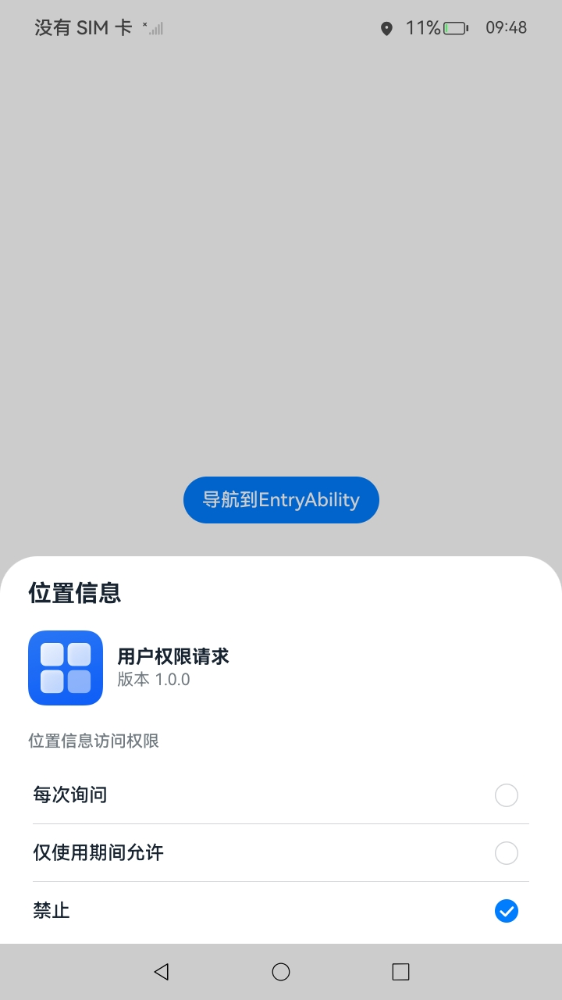

# 向用户申请权限

### 介绍

本示例使用@ohos.abilityAccessCtrl，展示了应用申请权限场景。

### 效果预览

| 主页                                 | 授权弹窗                                 | 二次授权弹窗                                         | 二次授权页面                                           |
| ------------------------------------ | ---------------------------------------- | ---------------------------------------------------- | :----------------------------------------------------- |
|  |  |  |  |

使用说明

1. 打开应用，点击**检测权限**按钮，出现提示信息“权限未申请”。

2. 点击**在Page中申请权限**按钮，跳到Page页面，出现授权弹窗，点击**取消**按钮，返回主页点击**检测权限**按钮，出现提示信息“权限未申请”。

3. 点击**在UIAbility中申请权限**按钮，跳到**secondAbility**页面，出现授权弹窗，点击**取消**按钮，出现二次授权弹窗，选择**仅使用期间允许**选项，点击**导航到EntryAbility**按钮返回主页，点击**检测权限**按钮，出现提示信息“未申请精确定位权限”。

4. 再次点击**在UIAbility中申请权限** 按钮，跳到**secondAbility**页面，出现授权弹窗，点击**仅使用期间允许**按钮，点击**导航到EntryAbility**按钮返回主页，点击**检测权限**按钮，出现提示信息“权限已申请“。

### 工程目录
```
RequsetUserAuthorization
├──entry/src/main
│  ├──ets                                       // ets代码区 
│  │  ├──entryability
│  │  │  └──EntryAbility.ets                    // 程序入口类
|  |  ├──pages                                  // 页面文件
│  │  │  └──Index.ets                           // RequsetUserAuthorization主页
│  │  ├──reqpermissioninui                      
│  │  │  └──pages                               
│  │  │     └──Index.ets                        // UI申请权限页面
│  │  ├──secondability
│  │  │  └──SecondAbility.ets                   // SecondAbility入口
|  |  ├──secondpages                            // SecondAbility页面文件
│  │  │  └──Index.ets                           // 二次申请权限页面
│  │  └──utils                                  // 工具文件
│  │     └──PermissionUtil.ets                  // 校验权限工具
|  ├──resources                                 // 资源文件目录
│  │
```
### 具体实现

* 本示例分为权限检测模块、向用户申请权限模块
  * 权限检测模块
    * 使用bundleManager接口中getBundleInfoForSelf方法获取应用程序的accessTokenID，根据accessTokenID使用abilityAccessCtrl接口中checkAccessToken方法检测权限是否被申请。
    * 接口参考：[@ohos.abilityAccessCtrl](https://gitee.com/openharmony/docs/blob/master/zh-cn/application-dev/reference/apis-ability-kit/js-apis-abilityAccessCtrl.md)，[@ohos.bundle.bundleManager](https://gitee.com/openharmony/docs/blob/master/zh-cn/application-dev/reference/apis-ability-kit/js-apis-bundleManager.md)
  * 向用户申请权限模块
    * 使用abilityAccessCtrl接口中requestPermissionsFromUser方法向用户申请权限，用户拒绝后使用requestPermissionOnSetting方法拉起二次授权功能。
    * 接口参考：[@ohos.abilityAccessCtrl](https://gitee.com/openharmony/docs/blob/master/zh-cn/application-dev/reference/apis-ability-kit/js-apis-abilityAccessCtrl.md)

### 相关权限

1. 允许应用获取设备位置信息权限：[ohos.permission.LOCATION](https://gitee.com/openharmony/docs/blob/master/zh-cn/application-dev/security/AccessToken/permissions-for-all-user.md#ohospermissionlocation)

2. 允许应用获取设备模糊位置信息：[ohos.permission.APPROXIMATELY_LOCATION](https://gitee.com/openharmony/docs/blob/master/zh-cn/application-dev/security/AccessToken/permissions-for-all-user.md#ohospermissionapproximately_location)

### 依赖

不涉及。

### 约束与限制

1. 本示例仅支持在标准系统上运行，支持设备：RK3568。

2. 本示例为Stage模型，支持API14版本SDK，版本号：（5.0.2.58）。

3. 本示例已支持使DevEco Studio 5.0.1 Release (构建版本：5.0.5.306，构建 2024年12月6日)编译运行。

### 下载

如需单独下载本工程，执行如下命令：
```
git init
git config core.sparsecheckout true
echo code/DocsSample/Security/RequsetUserAuthorization/ > .git/info/sparse-checkout
git remote add origin https://gitee.com/openharmony/applications_app_samples.git
git pull origin master
```