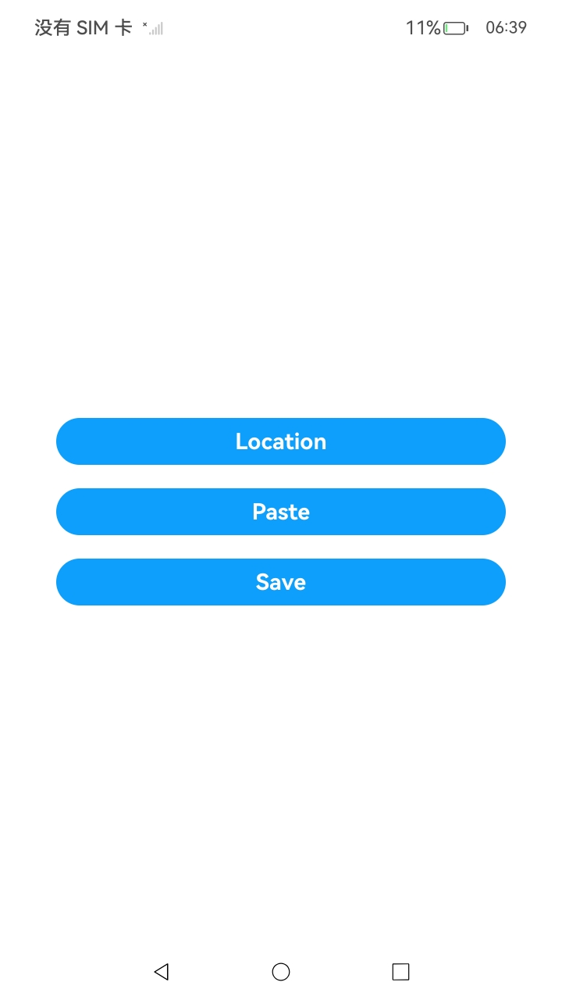
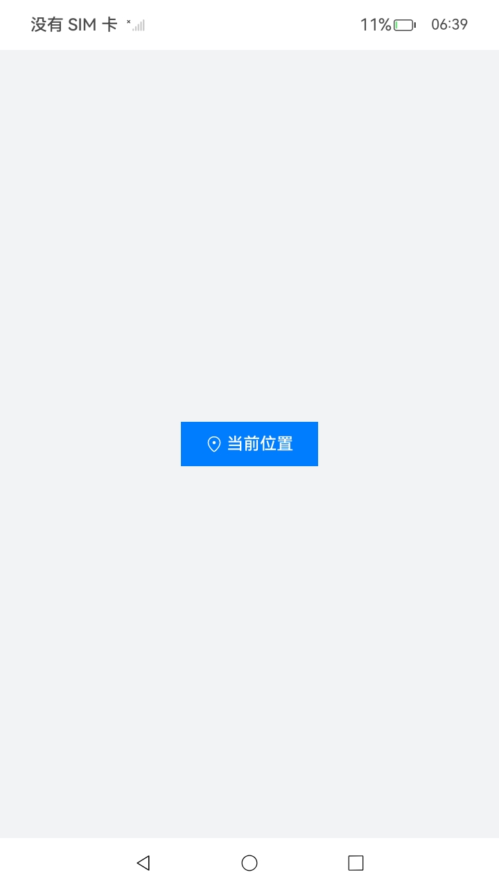
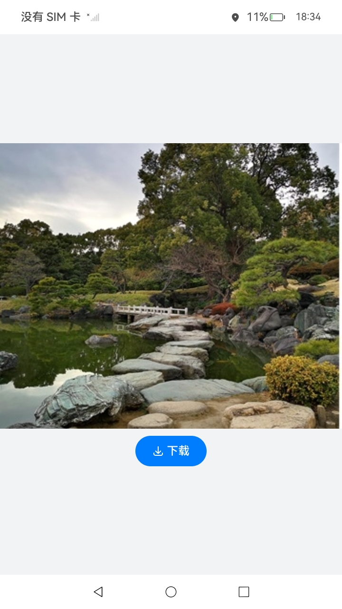

# 安全控件类型的UI控件（仅对系统应用开放）

### 介绍

本示例提供了安全控件类型的UI控件，支撑应用开发者集成安全控件做临时授权场景，当用户实际点击了某种类型的安全控件时，会对应用进行相应的临时授权，减少权限弹窗对用户的干扰，同时提供更小的授权范围。

### 效果预览

|                 主页                  |                    Location                    |                  Paste                  |                **Save**                |
|:-----------------------------------:| :--------------------------------------------: |:---------------------------------------:| :------------------------------------: |
|       |  |         |  |

使用说明
1. 在主界面，点击“Location”按钮，进入“Location”界面，点击“当前位置”按钮，成功获取当前定位信息，并通过提示框显示。

2. 在主界面，点击“Paste”按钮，进入“Paste”界面，在文本输入框输入文字，全选剪切文字，点击“粘贴”按钮，获取剪贴板内容并显示在输入框中。

3. 在主界面，点击“Save”按钮，进入“Save”界面，点击“下载”按钮，将当前页面中的图片保存到本地的图库中。

### 工程目录

```
SecurityComponent
├──entry/src/main
│  ├──ets                                    
│  │  ├──entryability
│  │  │  └──EntryAbility.ets                        // 程序入口类
|  |  ├──pages                                      // 页面文件
│  │  │  └──Index.ets                               // 首页
│  │  └──securitycomponent                          // 组件文件
│  │     └──page  
│  │        ├──Location.ets                         // 位置服务安全控件界面
│  │        ├──Paste.ets                            // 剪贴板安全控件界面
│  │        └──Save.ets                             // 媒体库安全控件界面
|  ├──resources                                     // 资源文件目录
│  │

```

### 具体实现

* 本示例分为Location安全控件模块，剪贴板安全控件模块，媒体库安全控件模块。

  * Location安全控件模块
  
    * 使用LocationButton组件开发获取定位信息功能，在其点击回调onclick事件中调用geoLocationManager.getCurrentLocation()得到当前定位信息经纬度。
    * 接口参考：[@ohos.geoLocationManager](https://gitee.com/openharmony/docs/blob/master/zh-cn/application-dev/reference/apis-location-kit/js-apis-geoLocationManager.md#geolocationmanagergetcurrentlocation)
  * 剪贴板安全控件模块

    * 使用PasteButton组件开发获取剪贴板信息功能，在其点击回调onclick事件中调用pasteboard.getSystemPasteboard().getData()将文本复制到剪贴板中，使用pasteData.getPrimaryText()得到剪贴板内容。
    * 接口参考：[@ohos.pasteboard](https://gitee.com/openharmony/docs/blob/master/zh-cn/application-dev/reference/apis-basic-services-kit/js-apis-pasteboard.md)
  * 媒体库安全控件模块
  
    * 使用SaveButton组件开发保存图片到媒体库功能，在其点击回调onclick事件中调用photoAccessHelper.getPhotoAccessHelper()得到媒体库图片管理器helper， helper.createAsset()得到保存到媒体库图片的uri，使用resourceManager.getMediaContent()得到存放在Resources/base/media文件下的test.jpg图片内容，调用fs.open()和fs.write()将图片内容通过得到的uri写到媒体库中，最后fs.close()关闭文件。
    * 接口参考：[@ohos.file.photoAccessHelper](https://gitee.com/openharmony/docs/blob/master/zh-cn/application-dev/reference/apis-media-library-kit/js-apis-photoAccessHelper.md)，[@ohos.file.fs](https://gitee.com/openharmony/docs/blob/master/zh-cn/application-dev/reference/apis-core-file-kit/js-apis-file-fs.md)

### 相关权限

不涉及。

### 依赖

不涉及。

### 约束与限制

1. 本示例仅支持标准系统上运行，支持设备：RK3568，GPS定位功能仅支持部分机型。
2. 本示例为Stage模型，支持API14版本SDK，版本号：（5.0.2.58）。
4. 本示例已支持使DevEco Studio 5.0.1 Release (构建版本：5.0.5.306，构建 2024年12月6日)编译运行。
5. 本示例需要使用系统权限的系统接口，需要使用Full SDK编译。使用Full SDK时需要手动从镜像站点获取，并在DevEco Studio中替换，具体操作可参考[替换指南](https://gitee.com/link?target=https%3A%2F%2Fdocs.openharmony.cn%2Fpages%2Fv3.2%2Fzh-cn%2Fapplication-dev%2Fquick-start%2Ffull-sdk-switch-guide.md%2F)。

### 下载

如需单独下载本工程，执行如下命令：

```
git init
git config core.sparsecheckout true
echo code/DocsSample/Security/SecurityComponent/ > .git/info/sparse-checkout
git remote add origin https://gitee.com/openharmony/applications_app_samples.git
git pull origin master
```