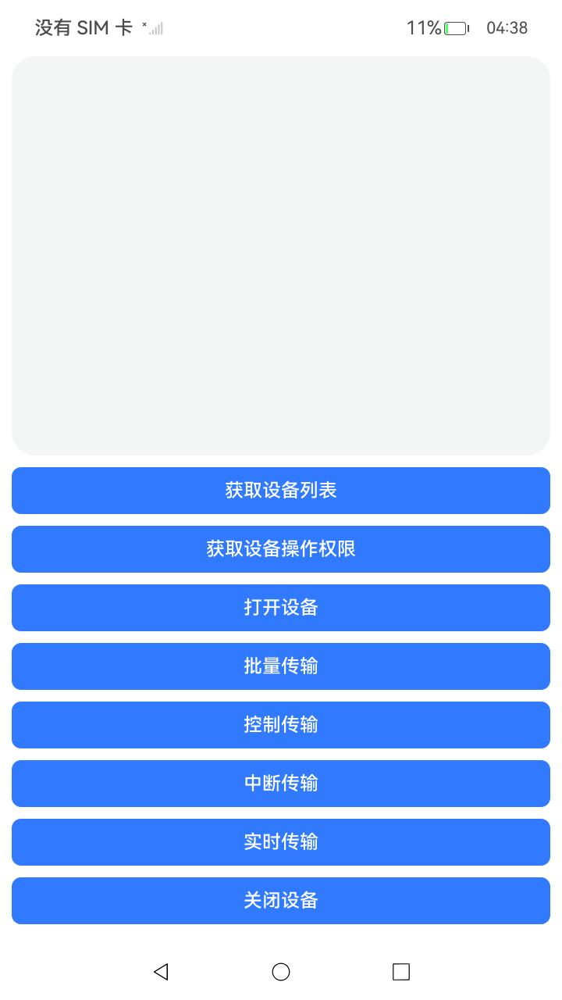

# USBManagerSample

### 介绍

本示例主要展示了USB设备管理以及四种基本传输方式：<br>
1. [USB设备管理](https://gitcode.com/openharmony/docs/blob/master/zh-cn/application-dev/basic-services/usb/usbManager/usbHost/deviceManager.md)。<br>
2. [批量传输](https://gitcode.com/openharmony/docs/blob/master/zh-cn/application-dev/basic-services/usb/usbManager/usbHost/bulkTransfer.md)。<br>
3. [控制传输](https://gitcode.com/openharmony/docs/blob/master/zh-cn/application-dev/basic-services/usb/usbManager/usbHost/controlTransfer.md)。<br>
4. [中断传输](https://gitcode.com/openharmony/docs/blob/master/zh-cn/application-dev/basic-services/usb/usbManager/usbHost/interruptTransfer.md)。<br>
5. [实时传输](https://gitcode.com/openharmony/docs/blob/master/zh-cn/application-dev/basic-services/usb/usbManager/usbHost/isochronousTransfer.md)。

### 效果预览
 

使用说明

1. 连接一个usb外设
2. 点击“获取设备列表”，获取当前设备
3. 点击“获取设备操作权限”，弹窗询问是否授权操作权限，点击允许
4. 点击“打开设备”，打开当前设备
5. 分别点击四种传输方式
6. 点击“关闭设备”

### 工程目录

```
entry/src/
|---main
|   |---ets
|   |   |---pages
|   |   |   |---Index.ets                          // 首页
|---ohosTest               
|   |---ets
|   |   |---tests
|   |   |   |---Ability.test.ets                   // 自动化测试用例
```

### 具体实现
* 导入相关模块import { usbManager } from '@kit.BasicServicesKit'。
* 获取设备列表:调用usbManager.getDevices()获取当前连接的所有外设。
* 获取设备权限:调用usbManager.requestRight()获取设备权限。
* 打开设备:调用usbManager.connectDevice()打开设备，获取数据传输通道，调用usbManager.claimInterface()占用一个设备接口。
* 批量传输:调用usbManager.bulkTransfer()，endpoint.direction == 0x80为读数据，endpoint.direction == 0为写数据。
* 控制传输:调用usbManager.usbControlTransfer()传输控制数据。
* 中断传输和实时传输:调用usbManager.usbSubmitTransfer()，入参的UsbDataTransferParams.type == usbManager.UsbEndpointTransferType.TRANSFER_TYPE_INTERRUPT为中断传输，UsbDataTransferParams.type == usbManager.UsbEndpointTransferType.TRANSFER_TYPE_ISOCHRONOUS为实时传输。
* 关闭设备:调用usbManager.releaseInterface()释放设备接口，调用usbManager.closePipe()关闭设备管道。

### 相关权限

无相关权限。

### 依赖

不涉及。

### 约束与限制

1. 本示例仅支持标准系统上运行，支持设备：rk3568；
2. 本示例仅支持API20版本SDK，镜像版本号：OpenHarmony 6.0.0.x及之后的版本；
3. 本示例需要使用DevEco Studio 6.0.0 release (Build Version: 6.0.0.858)才可编译运行；

### 下载

如需单独下载本工程，执行如下命令：

```
git init
git config core.sparsecheckout true
echo code/DocsSample/USB/USBManagerSample/ > .git/info/sparse-checkout
git remote add origin https://gitcode.com/openharmony/applications_app_samples.git
git pull origin ***(分支名)
```