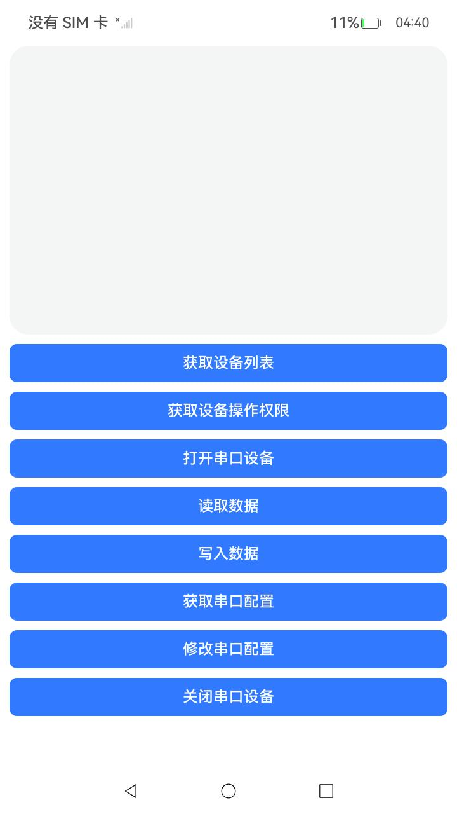

# USBManagerSerialSample

### 介绍

本示例主要展示了USB串口通信管理以及串口配置管理：<br>
1. [USB串口通信管理](https://gitcode.com/openharmony/docs/blob/master/zh-cn/application-dev/basic-services/usb/usbSerial/usbSerial-communication.md)。<br>
2. [USB串口配置管理](https://gitcode.com/openharmony/docs/blob/master/zh-cn/application-dev/basic-services/usb/usbSerial/usbSerial-configuration.md)。

### 效果预览


使用说明

1. 连接一个usb串口外设
2. 点击“获取设备列表”，获取当前串口设备
3. 点击“获取设备操作权限”，弹窗询问是否授权操作权限，点击允许
4. 点击“打开串口设备”，打开当前设备
5. 点击“读取数据”，从串口读数据，需要先从串口发数据。
6. 点击“写入数据”，写数据到串口，写入的数据是Sample示例代码中写死的数据"Hello World"。
7. 点击“获取串口配置”，获取串口配置信息。
8. 点击“修改串口配置”，修改串口配置，串口配置已在Sample示例代码中写死。
9. 点击“关闭串口设备”，关闭当前设备。

### 工程目录

```
entry/src/
|---main
|   |---ets
|   |   |---pages
|   |   |   |---Index.ets                          // 首页
|---ohosTest               
|   |---ets
|   |   |---tests
|   |   |   |---Ability.test.ets                   // 自动化测试用例
```

### 具体实现
* 导入相关模块import { serialManager } from '@kit.BasicServicesKit'。
* 获取设备列表:调用serialManager.getPortList()获取当前连接的所有串口设备。
* 获取设备权限:调用serialManager.requestSerialRight()获取设备权限。
* 打开设备:调用serialManager.open()打开设备。
* 读取数据:异步读取调用serialManager.read()，同步读取调用serialManager.readSync()。
* 读取数据:异步写入调用serialManager.write()，同步读取调用serialManager.writeSync()。
* 串口配置:调用serialManager.getAttribute()获取串口配置，调用serialManager.setAttribute()设置串口配置。
* 关闭设备:调用serialManager.close()关闭设备。

### 相关权限

无相关权限。

### 依赖

不涉及。

### 约束与限制

1. 本示例仅支持标准系统上运行，支持设备：rk3568；
2. 本示例仅支持API20版本SDK，镜像版本号：OpenHarmony 6.0.0.x及之后的版本；
3. 本示例需要使用DevEco Studio 6.0.0 release (Build Version: 6.0.0.858)才可编译运行；

### 下载

如需单独下载本工程，执行如下命令：

```
git init
git config core.sparsecheckout true
echo code/DocsSample/USB/USBManagerSerialSample/ > .git/info/sparse-checkout
git remote add origin https://gitcode.com/openharmony/applications_app_samples.git
git pull origin ***(分支名)
```