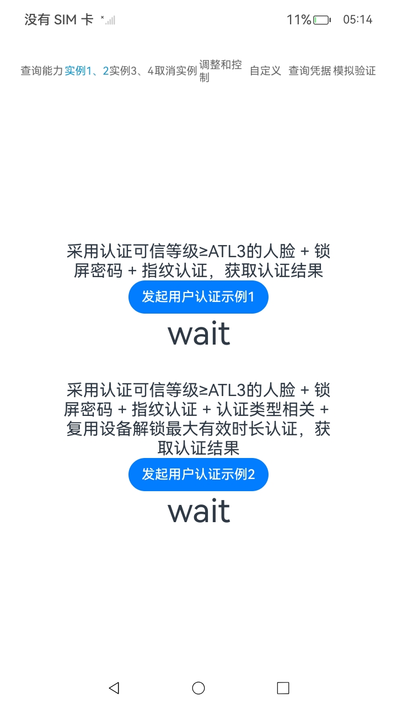

# 用户认证服务

### 介绍

此示例演示了用户认证服务的部分功能，包括查询用户认证功能和凭证，调用用户认证界面等。

### 效果预览

| 首页                                                     | 实例1                                                       | 用户验证窗口                                                 |
| -------------------------------------------------------- | ----------------------------------------------------------- | ------------------------------------------------------------ |
|  |  |  |

使用说明：

1. 在使用前先在“设置-安全与隐私”中设置PIN码以及人脸或指纹验证。
2. 完成设置后在查询能力页面点击查询按钮，如果按钮下方文本显示“Pass”则表示设置成功可以进行接下来的操作。
3. 通过点击上方的其他标签来切换不同的页面，点击按钮可触发验证页面。

### 工程目录

```
\entry\src\main
            │  module.json5					// 配置文件，用于配置权限等信息
            ├─ets
            │  ├─common
            │  │      Logger.ts				// 打印工具类
            │  ├─entryability
            │  ├─entrybackupability
            │  └─pages
            │          Index.ets			// 主页面，代码参考页面
            │          testPage.ets			// 测试用页面具体使用方式见'约束与限制'
            └─resources
                ├─base						// 资源文件,内容为英文
                │  ├─element
                │  ├─media
                │  └─profile
                └─zh_CN
                   └─element                // 资源文件,内容为中文

```

### 具体实现

- 在开发板的设置中配置用户认证方式，然后在`\entry\src\main\module5`文件中添加用户认证权限`ohos.permission.ACCESS_BIOMETRIC`。
- 将示例代码中的内容封装成函数。
- 设置多个`TabContent`组件来区分不同功能，将不同的函数功能绑定到 各个`TabContent `页面的各个`Button`上。
- 在每个按钮的上方设置一个 `Text` 文本，用于说明按钮的功能。
- 在按钮的下方设置另一个 `Text` 文本，在点击按钮后显示功能是否正常。

### 相关权限

[ohos.permission.ACCESS_BIOMETRIC](https://gitee.com/openharmony/docs/blob/OpenHarmony-5.0.0-Release/zh-cn/application-dev/security/AccessToken/permissions-for-all.md#ohospermissionaccess_biometric)

### 依赖

不涉及。

### 约束与限制

1.本示例仅支持标准系统上运行，支持设备：华为手机。

2.HarmonyOS系统：HarmonyOS 5.1.0 Release及以上。

3.HarmonyOS SDK版本：HarmonyOS 5.1.0 Release及以上。

4.本示例为Stage模型，支持API18版本SDK。

5.本示例需要使用DevEco Studio Release（5.0.5.306）及以上版本才可编译运行。

6.HH-SCDAYU200开发套件不支持生物特征识别，建议将认证方式更改为个人识别码（PIN），并确保在切换自定义功能时采用至少两种身份验证方法。

7.自动化测试中非自动化的相关测试点需要手动输入密码或手动录入人脸或指纹。

8.在运行测试前需要修改启动页面为`testPage`，具体修改方式为：将`src/main/ets/entryability/EntryAbility.ets`中的`windowStage.loadContent('pages/Index', ...)`修改为`windowStage.loadContent('pages/testPage', ...)` 。

### 下载

如需单独下载本工程，执行如下命令：

```
git init
git config core.sparsecheckout true
echo UserAuthentication > .git/info/sparse-checkout
git remote add origin https://gitee.com/harmonyos_samples/guide-snippets.git
git pull origin master
```

