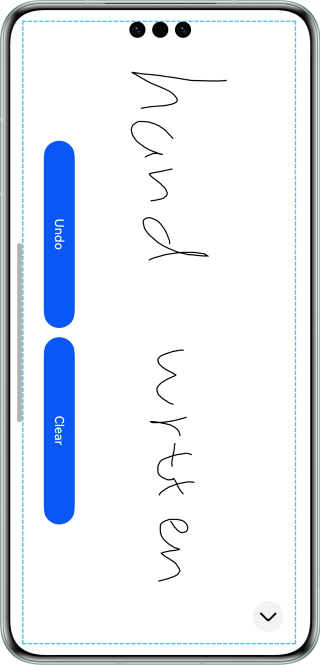

# Handwritten Drawing and Saving Images

### Overview

This sample uses **Pen** and **Path** of the Drawing module in conjunction with the **NodeContainer** component to implement the handwritten drawing feature. It also uses the **packToFile** and **packing** APIs of the Image module to save the content drawn on the handwriting board as an image.

### Preview



### How to Use

1. Handwrite within the dashed area. Touch the **Undo** button to undo the last drawing, and touch the **Clear** button to clear the drawing.
2. Touch the arrow to go to the preview page.
3. On the preview page, touch the buttons to save the content drawn as an image and write it into a file. The save path is displayed.

### How to Implement

1. Create the child class **MyNodeController** of NodeController to obtain the root RenderNode and the width and height of the bound **NodeContainer** component.
2. Create the child class **MyRenderNode** of RenderNode, initialize the pen, and draw a path.
3. Use the **currentNode** variable to store the node that is being drawn, and use the **nodeCount** variable to record the number of mounted nodes.
4. Create a custom node container component **NodeContainer** to receive the **MyNodeController** instance and mount the custom rendering node to the component, thereby implementing custom drawing.
5. In the **onTouch** callback function of the **NodeContainer** component, when the finger presses down, a new node is created and mounted to the root RenderNode, and **nodeCount** is incremented by 1. As the finger moves, the **path** object in the node is updated to draw the trajectory, and the node is re-rendered.
6. In the root RenderNode, use the **getChild** method to obtain the last mounted child node, and the **removeChild** method to remove the last child node.
7. In the root RenderNode, use the **clearChildren** method to clear all child nodes, reset the canvas, and set **nodeCount** to **0**.
8. Use **componentSnapshot.get** to obtain the PixelMap object of the **NodeContainer** component.
9. Use **packToFile()** and **packing()** of the Image module to save the obtained PixelMap object as an image.

###   Project Directory

```
├──entry/src/main/ets                        // ets code
│  ├──constants
│  │  └──CommonConstants.ets                  // Common constants 
│  ├──entryability
│  │  └──EntryAbility.ets       
│  ├──model
│  │  └──RenderNodeModel.ets                  // MyRenderNode class
│  └──pages
│     ├──SavePages.ets                        // Preview and save page
│     └──Index.ets                            // Draw page
└──entry/src/main/resources                   // Static resources
```

### Reference

1. Drawing module
2. NodeController.
3. Self-rendering node RenderNode
4. Image processing
5. FileIo file management

### Constraints

1. The sample app is supported only on Huawei phones running the standard system.
2. The HarmonyOS version must be HarmonyOS 5.0.5 Release or later.
3. The DevEco Studio version must be DevEco Studio 5.0.5 Release or later.
4. The HarmonyOS SDK version must be HarmonyOS 5.0.5 Release SDK or later.
