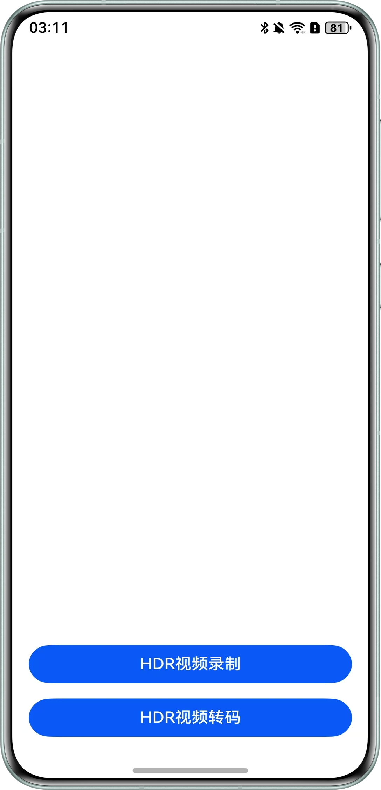
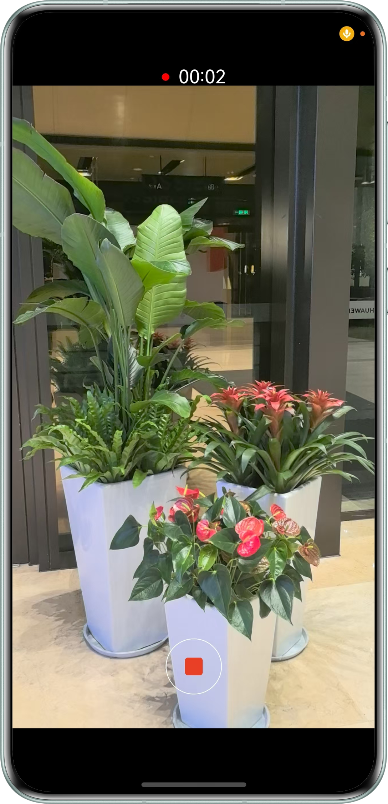
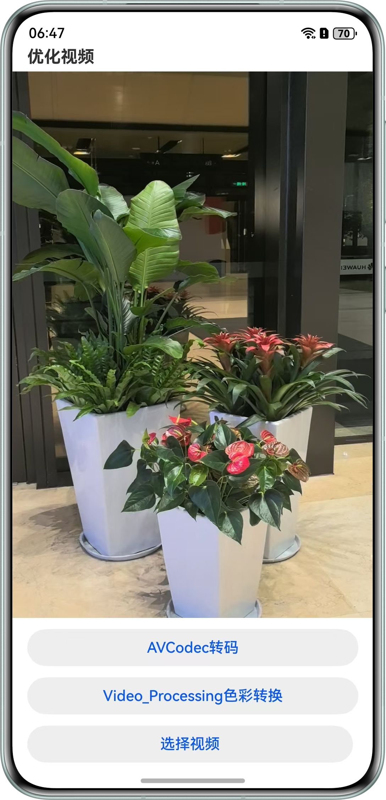
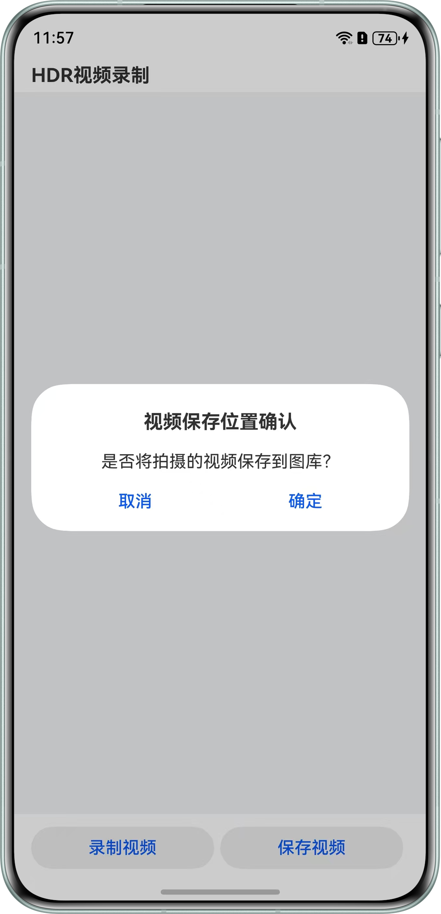

# HDR转码SDR

## 项目简介

本示例基于Surface模式实现高效视频编解码，支持HDR视频录制及HDR转SDR转码功能，通过硬件加速和色彩空间优化技术，提升视频质量处理效率。

## 效果图预览

| 首页                                                  | 录制页                                         |
|-----------------------------------------------------|---------------------------------------------|
|  |   |

| 转码页                                                     | 保存弹窗                                                 |
|---------------------------------------------------------|------------------------------------------------------|
|  |  | 

## 使用说明

1. 打开应用，点击HDR视频录制，选择Recorder或AVCodec封装方法。
2. 点击录制视频，完成录制后返回，点击视频播放或暂停视频。
3. 点击保存视频，确认保存。
4. 返回首页，点击HDR视频转码。
5. 点击屏幕选择视频，点击AVCodec或Video_Processing进行SDR转码并送显。

## 工程目录

```
├──entry/src/main/cpp                   // Native层
│  ├──CMakeLists.txt                    // 编译入口
│  ├──capbilities                       // 接口能力实现
│  ├──AudioCapturer.cpp                 // 音频采集实现
│  ├──AudioEncoder.cpp                  // 音频编码实现
│  ├──Demuxer.cpp                       // 解封装实现
│  ├──Muxer.cpp                         // 封装实现
│  ├──AudioDecoder.cpp                  // 转码音频解码实现
│  ├──Demuxer.cpp                       // 转码解封装实现
│  │  ├──VideoDecoder.cpp               // 转码视频解码实现
│  │  ├──VideoEncoder.cpp               // 视频编码实现
│  │  └──include                        // 接口能力定义
│  ├──common                            // 公共模块
│  │  ├──SampleCallback.cpp             // 编解码回调实现
│  │  ├──SampleCallback.h               // 编解码回调定义
│  │  ├──SampleInfo.h                   // 公共类
│  │  └──dfx                            // 日志实现
│  ├──render                            // 送显模块
│  │  ├──ProcessingPluginManager.cpp    // 送显模块管理实现
│  │  ├──ProcessingPluginRender.cpp     // 送显模块逻辑实现
│  │  └──include                        // 送显模块接口定义
│  ├──sample
│  │  ├──player                          // 转码播放接口
│  │  │  ├──Player.cpp                   // 转码播放接口实现
│  │  │  ├──Player.h                     // 转码播放接口定义
│  │  │  ├──PlayerNative.cpp             // 转码接口调用入口
│  │  │  └──PlayerNative.h               // 调用入口定义
│  │  └──recorder                        // 录制接口
│  │     ├──Recorder.cpp                 // 录制功能接口实现
│  │     ├──Recorder.h                   // 录制功能接口定义
│  │     ├──RecorderNative.cpp           // 录制接口调用入口
│  │     └──RecorderNative.h             // 调用入口定义
│  └──types                              // Native层暴露上来的接口
│     ├──libplayer                       // 转码播放模块暴露给UI层的接口
│     └──librecorder                     // 录制模块暴露给UI层的接口
├── ets                                  // UI层
│   ├──common                            // 公共模块
│   │   ├──CommonConstants.ets           // 参数常量
│   │   └──utils                         // 公共工具类
│   │       ├──DateTimeUtils.ets         // 时间工具类
│   │       ├──FileUtil.ets              // 文件工具类
│   │       ├──PermissionsUtils.ets      // 申请权限类
│   │       └──VideoOperationUtils.ets   // 保存文件类
│   ├──controller                        // 控制模块
│   │   ├──AVCodecController.ets         // AVcodec控制类
│   │   ├──AvPlayerController.ets        // AVplayer播放类
│   │   └──RecordController.ets          // Recorder录制类
│   ├──entryability                      // 应用入口函数
│   │   └──EntryAbility.ets
│   ├──entrybackupability
│   │   └──EntryBackupAbility.ets
│   ├──model
│   │   └──CameraDateModel.ets           // 相机参数数据类
│   ├──pages
│   │   ├──CameraPage.ets                // 相机录制页
│   │   ├──Index.ets                     // 首页
│   │   ├──Recording.ets                 // 视频录制页
│   │   └──Transcode.ets                 // 视频转码页面
│   └──view                              // 组件模块
│       ├──MultiStatusButton.ets         // 多选框组件
│       └──SaveDialog.ets                // 保存弹窗
├──module.json5                          // 模块配置信息
└──resources                             // 静态资源文件
```

## 具体实现

视频录制：

1. 通过cameraInput,获取相机采集数据，创建相机输入。
2. 创建previewOutput，获取预览输出流，通过XComponent的surfaceId连接，送显XComponent。
3. 通过surfaceId创建录像输出流VideoOutput输出到文件中。
4. 基于Recorder方法具体实现都封装在[RecordController.ets](./entry/src/main/ets/controller/RecordController.ets)，基于AVCodec方法具体实现都封装在[AVCodecController.ets](./entry/src/main/ets/controller/AVCodecController.ets)

视频转码：

1. 用户成功选择文件后，调用playNative转码的接口。
2. 开始转码前，调用init函数初始化解封装器、封装器、编码器、解码器。同时保存上下文参数。
3. 调用Start函数开始解码，开启解码线程包括输入子线程和输出子线程对视频数据进行解码。
4. 在输入子线程中，使用解封装后的bufferInfo，调用解码的PushInputData接口将帧buffer、index存入输入队列中。在输出子线程中，把上一步的帧信息储存为bufferInfo后，pop出队，调用FreeOutputData接口后，就会送显并释放buffer。

## 相关权限

允许应用使用相机：ohos.permission.CAMERA。  
允许应用使用麦克风：ohos.permission.MICROPHONE。  
允许应用写入用户媒体文件：ohos.permission.WRITE_MEDIA。

## 约束与限制

1.本示例仅支持标准系统上运行，支持设备：华为手机。

2.HarmonyOS系统：HarmonyOS 6.0.0 Release及以上。

3.DevEco Studio版本：DevEco Studio 6.0.0 Release及以上。

4.HarmonyOS SDK版本：HarmonyOS 6.0.0 Release SDK及以上。