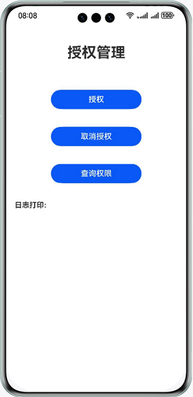

# 华为运动健康服务

## 介绍

本示例展示了使用华为运动健康数据服务提供的授权管理，数据源管理，运动健康采样数据、锻炼记录、健康记录的管理，运动联动服务。

需要使用华为运动健康数据服务接口 **@kit.HealthServiceKit**。

## 效果预览

| **示例应用主页面**                         | **授权管理页面**                         | **数据源管理页面**                        |
|-------------------------------------|------------------------------------|------------------------------------|
|  |  |  | 

| **运动健康采样数据管理页面**                   | **锻炼记录管理页面**                       | **健康记录管理页面**                       |
|------------------------------------|------------------------------------|------------------------------------|
|  |  |  |

| **运动联动页面**                         |
|------------------------------------|
|  |

## Sample工程的配置与使用

### 在DevEco中配置Sample工程的步骤如下

1. [创建项目](https://developer.huawei.com/consumer/cn/doc/app/agc-help-create-project-0000002242804048)及[应用](https://developer.huawei.com/consumer/cn/doc/app/agc-help-create-app-0000002247955506)。
2. [申请运动健康服务](https://developer.huawei.com/consumer/cn/doc/harmonyos-guides/health-apply-0000001770425225)。
3. 打开Sample应用，使用[AppGallery Connect](https://developer.huawei.com/consumer/cn/service/josp/agc/index.html)配置的应用包名替换AppScope\app.json5文件中的bundleName属性值。
4. 使用[AppGallery Connect](https://developer.huawei.com/consumer/cn/service/josp/agc/index.html)配置的应用client_id替换entry\src\main\module.json5文件中的client_id属性值。
5. 生成SHA256应用签名证书指纹并添加到[AppGallery Connect](https://developer.huawei.com/consumer/cn/service/josp/agc/index.html)对应的应用配置中，证书指纹生成请参考Health Service Kit开发指南中开发准备下的配置应用签名证书指纹章节。

#### Sample工程使用说明
1. 运行该 Sample 应用，首先点击"授权管理"按钮，进入授权管理页面，点击"授权"按钮进行登录/授权操作，如果系统账号未登录，会拉起华为账号登录页，用户登录后拉起授权页面，授权完成后，可查询权限和取消授权。
2. 授权成功后，回到主界面，点击"数据源管理"按钮，进入数据源管理页面，点击"插入数据源"按钮，设置应用信息或设备信息，插入数据源，插入成功后返回DataSourceId。每一个运动健康数据必须关联数据源信息，通过DataSourceId进行关联。完成插入操作后可查询与修改数据源。
3. 完成数据源的插入后，回到主界面，分别点击"采样数据管理","锻炼记录管理","健康记录管理"按钮，进入相应的页面，可完成对运动健康采样数据、锻炼记录、健康记录的管理。
4. 回到主界面，点击"运动联动"按钮，进入联动服务页面，点击按钮读取当日三环数据。

## 工程目录
├─entry/src/main/ets         // 代码区  
│ ├─common  
│ │ ├─bean  
│ │ │ ├─AuthManagement.ets                // 授权接口  
│ │ │ ├─DataSourceManagement.ets          // 数据源接口  
│ │ │ ├─ExerciseSequenceManagement.ets    // 锻炼记录接口  
│ │ │ ├─HealthSequenceManagement.ets      // 健康记录接口  
│ │ │ ├─SamplePointManagement.ets         // 采样数据接口  
│ │ │ └─WorkoutManagement.ets             // 联动服务接口  
│ │ ├─utils  
│ │ │ ├─DateUtils.ets                     // 时间工具类  
│ │ │ └─InitUtils.ets                     // 初始化工具类  
│ ├─entryability                
│ │ └─EntryAbility.ets                    // 程序入口类  
│ ├─pages              
│ │ ├─MainIndex.ets                       // 主页面  
│ │ ├─AuthIndex.ets                       // 授权管理页面  
│ │ ├─DataSourceIndex.ets                 // 数据源管理页面  
│ │ ├─HealthSequenceIndex.ets             // 健康记录管理页面  
│ │ ├─SamplePointIndex.ets                // 采样数据管理页面  
│ │ ├─WorkoutIndex.ets                    // 联动服务页面  
│ │ └─ExerciseSequenceIndex.ets           // 锻炼记录管理页面  
└─entry/src/main/resources                // 资源文件目录  

## 具体实现

授权相关功能，参考AuthManagement.ets：
* 使用AuthorizationRequest类型创建授权请求，设置待授权的读数据类型、写数据类型，调用requestAuthorizations方法，拉起登录/授权页面
* 使用AuthorizationRequest类型创建查询权限请求，设置待查询的读数据类型、写数据类型，调用getAuthorizations方法，查询是否具有数据类型权限
* 调用cancelAuthorizations方法，取消授权

数据源管理功能，参考DataSourceManagement.ets：
* 使用DataSourceBase类型创建待请求，调用insertDataSource方法，完成数据源的插入
* 使用updateDataSource方法，修改数据源
* 调用readDataSource方法，通过制定参数，读取数据源

运动健康采样数据、锻炼记录、健康记录，参考SamplePointManagement.ets,ExerciseSequenceManagement.ets,HealthSequenceManagement.ets：
* 构造单条数据或多条数据数组，调用saveData方法完成数据的保存
* 设置数据查询条件，调用readData方法，读取运动健康数据
* 设置删除数据条件，调用deleteData方法，删除运动健康数据
* 指定单条数据或多条数据数组，调用deleteData方法，删除运动健康数据
* 设置聚合查询条件AggregateRequest，调用aggregateData方法，完成聚合查询

联动服务，参考WorkoutManagement.ets：
* 调用readActivityReport方法读取当日三环数据

参考
1. entry\src\main\ets\common\bean\AuthManagement.ets
2. entry\src\main\ets\common\bean\DataSourceManagement.ets
3. entry\src\main\ets\common\bean\SamplePointManagement.ets
4. entry\src\main\ets\common\bean\ExerciseSequenceManagement.ets
5. entry\src\main\ets\common\bean\HealthSequenceManagement.ets 
6. entry\src\main\ets\common\bean\WorkoutManagement.ets

## 依赖

依赖设备具备WIFI能力

## 约束与限制

1. 本示例仅支持标准系统上运行，支持设备：华为手机、华为平板。
2. 首次使用华为运动健康服务前，必须打开运动健康App，同意隐私授权。
3. HarmonyOS系统：HarmonyOS Next Developer Beta1及以上。
4. DevEco Studio版本：DevEco Studio Next Developer Beta1及以上。
5. HarmonyOS SDK版本：HarmonyOS Next Developer Beta1及以上。