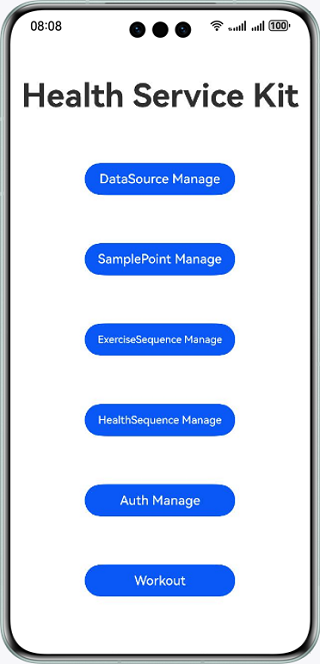

# Huawei Health Service Kit

## Description

This sample shows how to use Huawei Health Service Kit to manage authorization, data sources, fitness and health sampling data, workout records, and health records, and initiate workout linking.

The API to be called in the sample is **@kit.HealthServiceKit**.

## Preview

| **Home Screen**                     | **Authorization Management Screen**                        | **Data Source Management Screen**                       |
|----------------------------------|------------------------------------|------------------------------------|
|  |  |  | 

| **Sampling Data Management Screen**                  | **Workout Record Management Screen**                      | **Health Record Management Screen**                      |
|------------------------------------|------------------------------------|------------------------------------|
|  |  |  |

| **Workout Linking Screen**                        |
|------------------------------------|
|  |

## Configuring and Using the Sample App

### Configuring the Sample App in DevEco Studio

1. In [AppGallery Connect](https://developer.huawei.com/consumer/en/service/josp/agc/index.html), [create a project](https://developer.huawei.com/consumer/en/doc/app/agc-help-createproject-0000001100334664) and under the project, [create an app](https://developer.huawei.com/consumer/en/doc/app/agc-help-createharmonyapp-0000001945392297).
2. [Apply for Huawei Health Service Kit](https://developer.huawei.com/consumer/en/doc/harmonyos-guides/health-apply-0000001770425225).
3. Open the sample app and replace the value of **bundleName** in the **AppScope\app.json5** file with the app package name specified in [AppGallery Connect](https://developer.huawei.com/consumer/en/service/josp/agc/index.html).
4. Replace the value of **client_id** in the **entry\src\main\module.json5** file with the app's **client_id** configured in [AppGallery Connect](https://developer.huawei.com/consumer/en/service/josp/agc/index.html).
5. Generate an SHA-256 signing certificate fingerprint and configure it for the app in [AppGallery Connect](https://developer.huawei.com/consumer/en/service/josp/agc/index.html). For details about how to generate such a fingerprint, go to **Preparations** > **Configuring App Signature Information** in the *Health Service Kit Development Guide*.

#### Using the Sample App
1. Run the sample app. Touch the **Auth** button to access the authorization management screen. Touch **requestAuthorizations** to authorize or log in to the app. If you have not logged in to your device with a HUAWEI ID, the HUAWEI ID log-in screen will display. Log in to your HUAWEI ID, then the app authorization screen will display. After authorizing the app, you'll be able to query the scopes or cancel the authorization.
2. Go back to the home screen. Touch **DataSource** to begin managing data sources. Touch **insertDataSource** to insert a data source that specifies the app or device information. A **DataSourceId** will then be created for the data source. A **DataSourceId** is mandatory for each piece of fitness and health data. You can query and modify the inserted data source.
3. Go back to the home screen. Touch **SamplePoint**, **ExerciseSequence**, and **HealthSequence** to respectively manage fitness and health sampling data, workout records, and health records.
4. Go back to the home screen. Touch**Workout** to access the workout linking screen. Touch the button on the screen to check today's Activity rings data.

## Project Directory
├─entry/src/main/ets         // Code area.  
│ ├─common  
│ │ ├─bean  
│ │ │ ├─AuthManagement.ets               // Authorization API.  
│ │ │ ├─DataSourceManagement.ets        // Data source API.  
│ │ │ ├─ExerciseSequenceManagement.ets  // Exercise record API.  
│ │ │ ├─HealthSequenceManagement.ets    // Health record API.  
│ │ │ ├─WorkoutManagement.ets            // Workout linking API.  
│ │ │ └─SamplePointManagement.ets       // Sampling data API.  
│ │ ├─utils  
│ │ │ ├─InitUtils.ets                    // Initialization utility class.  
│ │ │ └─DateUtils.ets                     // Time utility class.  
│ ├─entryability                
│ │ └─EntryAbility.ets                    // Entry point class.  
│ ├─pages              
│ │ ├─MainIndex.ets                       // Home screen.  
│ │ ├─AuthIndex.ets                       // Authorization management screen.  
│ │ ├─DataSourceIndex.ets                 // Data source management screen.  
│ │ ├─HealthSequenceIndex.ets             // Health record management screen.  
│ │ ├─SamplePointIndex.ets                // Sampling data management screen.  
│ │ ├─WorkoutIndex.ets                    // Workout linking screen.  
│ │ └─ExerciseSequenceIndex.ets           // Workout record management screen.  
└─entry/src/main/resources                // Directory for storing resource files.

## Implementation Details

Implement authorization-related features by referring to **AuthManagement.ets**.
* Call **AuthorizationRequest** to create an authorization request, pass the data types to read and write, and call **requestAuthorizations** to display the log-in/authorization screen.
* Call **AuthorizationRequest** to create a scope query request, pass the data types to read and write, and call **getAuthorizations** to check whether scopes are granted for reading or writing specific types of data.
* Call **cancelAuthorizations** to cancel the authorization.

Implement the data source management feature by referring to **DataSourceManagement.ets**.
* Call **DataSourceBase** to create a request and call **insertDataSource** to insert a data source.
* Call **updateDataSource** to modify the data source.
* Call **readDataSource** to read specific data sources.

Implement the features of managing fitness and health sampling data, workout records, and health records by referring to **SamplePointManagement.ets**, **ExerciseSequenceManagement.ets**, and **HealthSequenceManagement.ets**.
* Construct an array with one or multiple data records and call **saveData** to save the data.
* Set data query conditions and call **readData** to read specific data.
* Set data deletion conditions and call **deleteData** to delete specific data.
* Specify an array with one or multiple data records and call **deleteData** to delete the array.
* Call **AggregateRequest** to set the aggregation query conditions and call **aggregateData** to perform aggregation query.

Implement the workout linking feature by referring to **WorkoutManagement.ets**.
* Call **readActivityReport** to read today's Activity rings data.

Reference
1. entry\src\main\ets\common\bean\AuthManagement.ets
2. entry\src\main\ets\common\bean\DataSourceManagement.ets
3. entry\src\main\ets\common\bean\SamplePointManagement.ets
4. entry\src\main\ets\common\bean\ExerciseSequenceManagement.ets
5. entry\src\main\ets\common\bean\HealthSequenceManagement.ets
6. entry\src\main\ets\common\bean\WorkoutManagement.ets

## Dependency

The device where the sample app runs must support Wi-Fi.

## Constraints

1. This sample code can only run on standard-system devices, which are Huawei phones and tablets.
2. Agree to the privacy policy in the Huawei Health app before you use the Huawei Health Service kit for the first time.
3. HarmonyOS: HarmonyOS NEXT Developer Beta1 or later
4. DevEco Studio: DevEco Studio NEXT Developer Beta1 or later
5. HarmonyOS SDK: HarmonyOS NEXT Developer Beta1 or later
