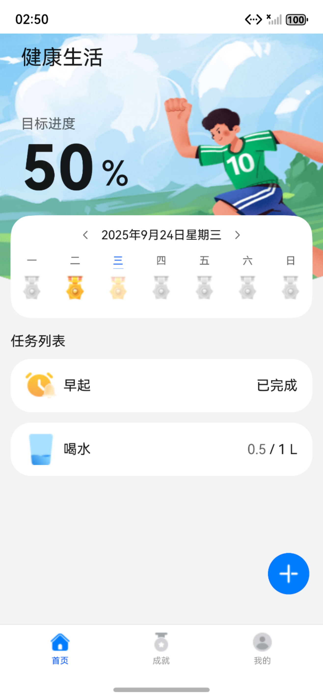
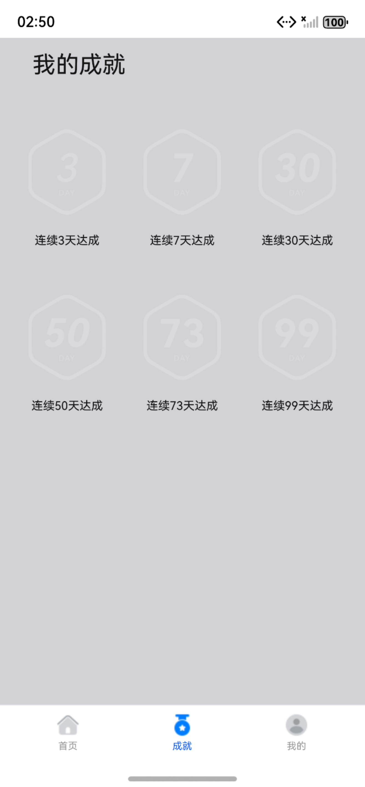
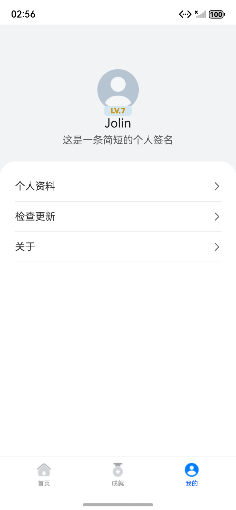
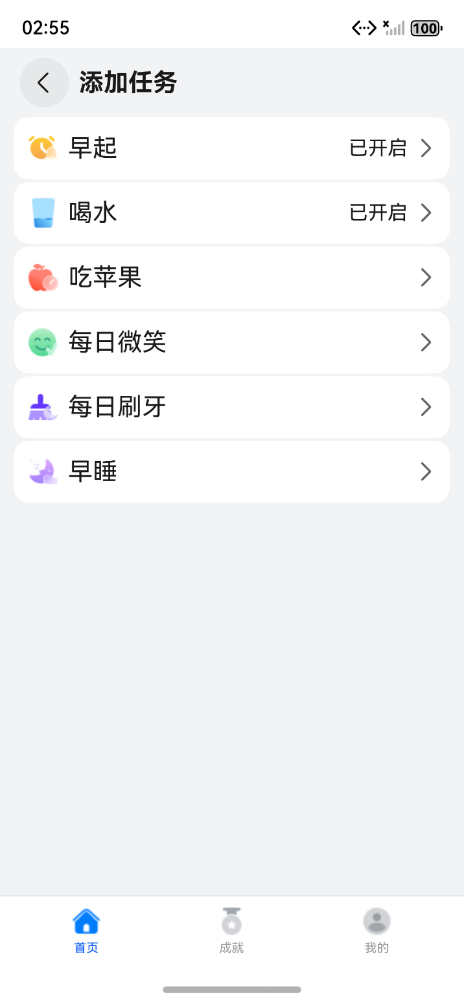
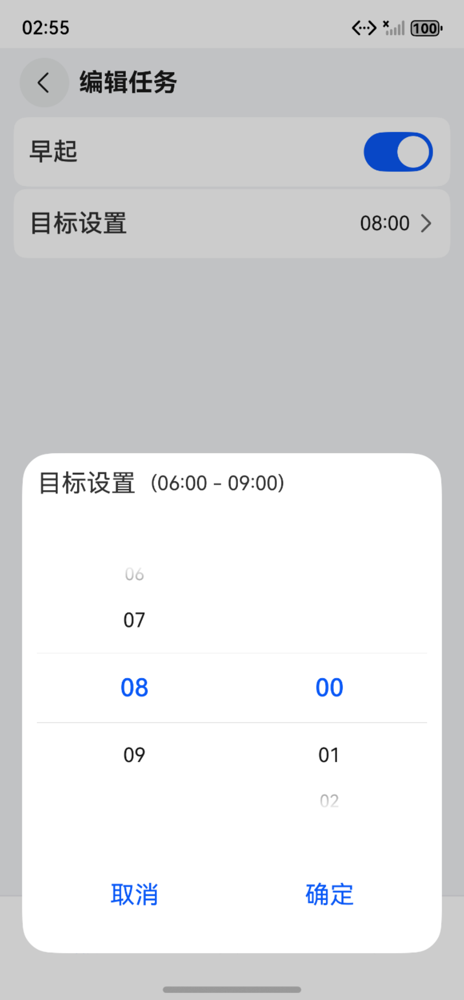
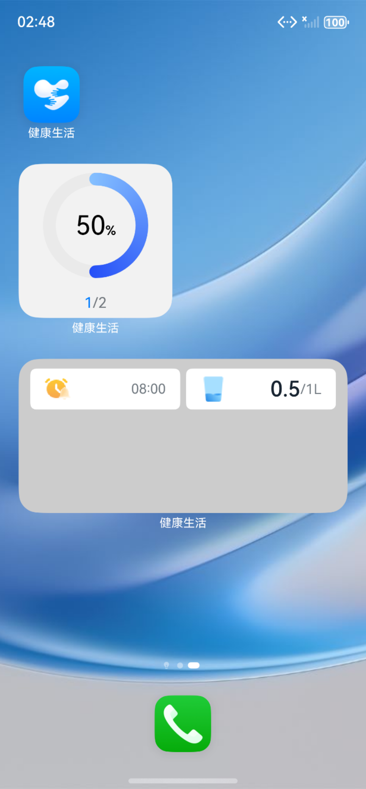

# 健康生活应用

## 项目简介

利用ArkTS声明式开发范式和HarmonyOS的关系型数据库等能力，实现了一个健康生活应用。

## 效果预览

|  |  |  |
|---------------------------------------------------------|---------------------------------------------------------|---------------------------------------------------------|
|  |  |  |

## 使用说明

1. 用户可以创建最多6个健康生活任务（早起，喝水，吃苹果，每日微笑，刷牙，早睡），并设置任务目标。
2. 用户可以在主页面对设置的健康生活任务进行打卡，其中早起、每日微笑、刷牙和早睡只需打卡一次即可完成任务，喝水、吃苹果需要根据任务目标量多次打卡完成。
3. 主页可显示当天的健康生活任务完成进度，当天所有任务都打卡完成后，进度为100%，并且用户的连续打卡天数加一。
4. 当用户连续打卡天数达到3、7、30、50、73、99天时，可以获得相应的成就。成就在获得时会以动画形式弹出，并可以在“成就”页面查看。
5. 用户可以查看以前的健康生活任务完成情况。
6. 打开应用，显示主页面，点击加号添加任务，添加完任务后，任务列表显示所有添加的任务。
7. 应用退出到后台，长按应用，点击服务卡片，选择2x4卡片，添加到桌面，显示已添加任务。
8. 应用退出到后台，长按应用，点击服务卡片，选择2x2卡片，添加到桌面，显示任务完成进度。
9. 点击2x2或2x4元服务卡片，拉起主页面，看到任务列表。
10. 在卡片配置文件中，设置卡片更新时间，更新时间到后，桌面上2x2或2x4卡片会重置第二天任务，需要重新添加。
11. 用户可以设置代理提醒，仅限早起、早睡。

## 工程目录

```
├───common/src/main/ets
│  ├──constants
│  │  ├──CommonConstants.ets                      // 通用常量
│  │  └──RdbConstant.ets                          // RDB常量-数据库相关
│  ├──database
│  │  ├──tables 
│  │  │  ├──DayInfoApi.ets                        // 日期信息-数据库操作API
│  │  │  ├──DayTaskInfoApi.ets                    // 当日任务信息-数据库操作API
│  │  │  ├──FormInfoApi.ets                       // 服务卡片信息-数据库操作API
│  │  │  ├──TableApi.ets                          // 数据库操作API接口
│  │  │  └──TaskInfoApi.ets                       // 任务信息-数据库操作API
│  │  └──RdbUtils.ets                             // 数据库操作通用工具类
│  ├──model
│  │  ├──database
│  │  │  ├──DayInfo.ets                           // 日期信息
│  │  │  ├──DayTaskInfo.ets                       // 当日任务信息
│  │  │  ├──FormInfo.ets                          // 服务卡片信息
│  │  │  └──TaskInfo.ets                          // 任务信息
│  │  ├──ColumnModel.ets                          // 数据库表字段信息
│  │  ├──FormStorageModel.ets                     // 服务卡片数据共享实体
│  │  └──TaskBaseModel.ets                        // 单个任务基础信息
│  └──utils
│     ├──agent
│     │  ├──AgentUtils.ets                        // 代理提醒工具栏
│     │  └──RequestAuthorization.ets              // 配置权限工具类
│     ├──FormUtils.ets                            // 服务卡片工具类
│     ├──PreferencesUtils.ets                     // 用户首选项工具类
│     ├──PromptActionClass.ets                    // 自定义弹窗工具类
│     └──Utils.ets
└──common/src/main/resource

├───healthylife/src/main/ets
│  ├──healthyfileability
│  │  └──HealthylifeAbility.ets                   // 模块入口类
│  ├──model
│  │  ├──AchievementModel.ets                     // 成就信息实体
│  │  └──NavItemModel.ets                         // 应用tab实体
│  ├──pages
│  │  └──HealthyLifePage.ets                      // 应用入口界面
│  ├──viewmodel
│  │  ├──dialog                                   // 自定义弹窗
│  │  │  ├──AchievementDialogParams.ets           // 成就
│  │  │  ├──TargetSettingDialogParams.ets         // 目标任务
│  │  │  └──TaskInfoDialogParams.ets              // 任务信息
│  │  ├──AchievementStore.ets                     // 用户首选项存储用于成就同步
│  │  └──HomeStore.ets                            // 数据库存储用于界面显示
│  └──view
│     ├──dialog                                   // 自定义弹窗
│     │  ├──AchievementDialog.ets                 // 成就
│     │  ├──TargetSettingDialog.ets               // 目标设置
│     │  └──TaskClockCustomDialog.ets             // 打卡界面
│     ├──home
│     │  ├──HomeTopComponent.ets                  // 目标进度组件
│     │  ├──TaskListComponent.ets                 // 任务列表组件
│     │  └──WeekCalendarComponent.ets             // 周视图组件
│     ├──mine
│     │  ├──MineMenuComponent.ets                 // 菜单组件
│     │  └──UserInfoComponent.ets                 // 用户信息组件
│     ├──task
│     │  ├──AddTaskComponent.ets                  // 添加任务组件
│     │  └──EditTaskComponent.ets                 // 编辑任务组件
│     ├──AchievementComponent.ets                 // 成就页面
│     ├──HomeComponent.ets                        // 首页页面
│     └──MineComponent.ets                        // 我的页面
└──common/src/main/resource

├───default/src/main/ets
│  ├──agency
│  │  └──pages
│  │     └──AgencyCard.ets                        // 任务列表-服务卡片
│  ├──defaultformability
│  │  └──DefaultFormAbility.ets                   // 服务卡片入口
│  ├──entryability
│  │  └──EntryAbility.ets                         // 主程序入口
│  ├──pages
│  │  ├──AdvertisingPage.ets                      // 广告界面
│  │  ├──Index.ets                                // 主界面
│  │  └──SplashPage.ets                           // 开始屏幕界面
│  ├──progress
│  │  └──pages
│  │     └──ProgressCard.ets                      // 任务进度-服务卡片      
│  └──view
│     └──UserPrivacyDialog.ets                    // 用户隐私协议弹窗
└──common/src/main/resource
```

## 具体实现

- AppStorage：应用程序中的单例对象，为应用程序范围内的可变状态属性提供中央存储。
- @Observed和@ObjectLink：@Observed适用于类，表示类中的数据变化由UI页面管理；@ObjectLink应用于被@Observed装饰类的对象。
- @Provide和@Consume：@Provide作为数据提供者，可以更新子节点的数据，触发页面渲染。@Consume检测到@Provide数据更新后，会发起当前视图的重新渲染。
- Flex：一个功能强大的容器组件，支持横向布局，竖向布局，子组件均分和流式换行布局。
- List：List是很常用的滚动类容器组件之一，它按照水平或者竖直方向线性排列子组件， List的子组件必须是ListItem，它的宽度默认充满List的宽度。
- TimePicker：TimePicker是选择时间的滑动选择器组件，默认以00:00至23:59的时间区创建滑动选择器。
- Toggle： 组件提供勾选框样式、状态按钮样式及开关样式。
- 关系型数据库：一种基于关系模型来管理数据的数据库。
- 首选项：首选项为应用提供Key-Value键值型的数据处理能力，支持应用持久化轻量级数据，并对其修改和查询。
- ArkTS卡片：卡片框架的运作机制分三大模块：卡片使用方、卡片管理服务和卡片提供方。
  - 卡片使用方：负责卡片的创建、删除、请求更新以及卡片服务通信。
  - 卡片管理服务：负责卡片的周期性刷新、卡片缓存管理、卡片生命周期管理以及卡片使用对象管理。
  - 卡片提供方：提供卡片显示内容的应用，控制卡片的显示内容、控件布局以及控件点击事件。

## 相关权限

允许应用使用后台代理权限:ohos.permission.PUBLISH_AGENT_REMINDER

## 约束与限制
1. 本示例仅支持标准系统上运行，支持设备：华为手机。
2. HarmonyOS系统：HarmonyOS 6.0.0 Release及以上。
3. DevEco Studio版本：DevEco Studio 6.0.0 Release及以上。
4. HarmonyOS SDK版本：HarmonyOS 6.0.0 Release SDK及以上。
